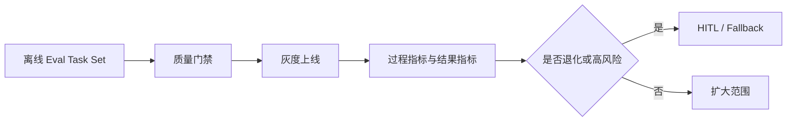

---
kb_id: ai-agent/patterns/agentic-evals-reliability-and-human-override
title: Agentic 质量治理：评估、可靠性、人工接管与降级策略为什么必须与自主执行一起设计
domain: ai-agent
component: agentic-ai
topic: agentic-evals-reliability-human-override
difficulty: advanced
status: reviewed
sidebar_position: 53
version_scope: DeepLearning.AI Agentic AI course page and 实践资料 agentic-ai repository as verified on 2026-04-26
last_verified_at: '2026-04-26'
source_ids:
  - deeplearning-ai-agentic-ai-course
  - practice-agentic-ai
  - practice-agent-tutorial
claim_ids:
  - practice-p2-claim-0001
  - agent-runtime-claim-0006
  - agent-runtime-claim-0007
tags:
  - ai-agent
  - agentic-ai
  - evals
  - reliability
  - hitl
---
## Agentic 真正难的部分，不是让系统多做几步，而是证明这些步骤值得被放到线上
Agentic 系统天生比普通 LLM 应用多一层风险，因为它不仅生成答案，还会选择动作、组织顺序、依赖外部反馈。只要新增一步自主执行，就新增一层失败面。因此评估、人工接管和降级策略不能等到上线后再补，而应和自主执行一起设计。

## 解决什么问题
这一页主要解决三个问题：

1. 如何证明 Agentic 系统比普通问答或固定 Workflow 更可靠，而不是只是更会演示。
2. 哪些任务应该允许自主执行，哪些任务必须降级为固定流程或人工审批。
3. 系统出错时，如何从评估、运行 trace 和人工介入证据中快速定位问题。

## 核心对象
| 对象 | 作用 | 关键观察点 |
| --- | --- | --- |
| Eval Task Set | 固定测试任务集合，覆盖成功、失败、拒答和边界情况 | 场景覆盖率、难度分层 |
| Process Metrics | 评估执行过程是否健康 | 步骤数、错误工具率、重试率 |
| Outcome Metrics | 评估最终结果是否达标 | 成功率、正确率、人工接管率 |
| HITL Gate | 控制高风险场景何时转人工 | 命中规则、审批延迟、驳回率 |
| Fallback Mode | 自主执行失败后的降级形态 | 固定 Workflow、只读模式、人工处理 |

## 执行链路
Agentic 质量治理的基本链路通常是：

1. 用离线 Eval Task Set 先验证 Goal、Planner、Tool、Stop Policy 是否协同正常。
2. 明确哪些信号会触发 HITL，例如高风险工具请求、重复错误、预算耗尽或证据冲突。
3. 上线后持续记录 process metrics 和 outcome metrics，而不是只存最终文本。
4. 当某类任务持续失败时，先降级为 fallback mode，再回头修正 planning、tool policy 或 observation 设计。



## 一致性与容错
Agentic 的可靠性不能只看最终答对没答对，还要看过程是否可信：

1. 如果最终答案正确，但中间多次请求高风险工具且依赖人工兜底，这不能算稳定成功。
2. 如果 Reflection 反复修正但没有新证据输入，即使最终勉强成功，也说明过程存在不可靠路径。
3. 如果某类任务必须依赖人工审批，系统应把 HITL 视为正常状态，而不是失败补救。
4. Fallback 不应把高风险任务悄悄变成低可见度失败，而应明确记录降级原因和接管对象。

## 性能模型
可靠性治理也会影响性能和成本：

1. Eval 过于稀疏，无法发现退化；Eval 过于频繁，则会增加发布成本。
2. 人工接管阈值过低，会导致大量任务排队；过高，又会让高风险动作未经审查直接执行。
3. Fallback 设计不合理时，系统会在失败和重试之间来回震荡，导致时延和成本同时上升。

```yaml
eval_gate:
  min_task_success_rate: 0.8
  max_wrong_tool_request_rate: 0.03
  max_human_escalation_rate: 0.2
hitl_rules:
  - high_risk_write_action
  - repeated_same_error
  - conflicting_observations
fallback_order:
  - fixed_workflow
  - read_only_mode
  - human_only
```

## 生产排障
如果线上表现突然不稳定，可以按下面顺序看：

1. 先看哪类任务的 task success rate、wrong tool rate、human escalation rate 发生明显漂移。
2. 再看这些任务的 trace，确认问题出在 planning、tool policy、observation 质量还是 stop condition。
3. 如果高风险任务开始频繁穿透审批，优先查 autonomy policy 和 HITL gate，而不是先怪模型。
4. 如果成功率下降但人工接管率没变，往往说明 Planner 或 Reflection 自身退化了。

## 样例
下面的评估集示意强调的是“过程和结果一起评估”：

```json
{
  "task_id": "incident-001",
  "goal": "定位服务不可用原因并生成结论",
  "expected_tools": ["search_logs", "read_runbook"],
  "forbidden_tools": ["delete_resource"],
  "needs_human_approval": false,
  "expected_outcome": "root-cause-summary"
}
```

```python
def evaluate_run(run):
    return {
        "task_success": run.final_status == "succeeded",
        "wrong_tool_request": run.requested_forbidden_tool,
        "escalated_to_human": run.human_handoff_count > 0,
        "avg_step_cost": run.total_cost / max(run.steps, 1),
    }
```

## 相邻技术边界
Agentic Eval 不等于普通 Prompt A/B Test。后者多半只比较最终文本；前者必须同时看计划质量、工具使用、停止条件、人工接管和失败恢复。HITL 也不只是一个产品弹窗，而是运行时状态转移和责任划分的一部分。

## 本页结论
Agentic 系统一旦承担真实任务，就必须把评估、可靠性、人工接管和降级策略一起纳入设计。能跑通多步任务只是起点，能证明这些步骤可靠、可审计、可回退，才说明 Agentic 真正具备上线价值。
