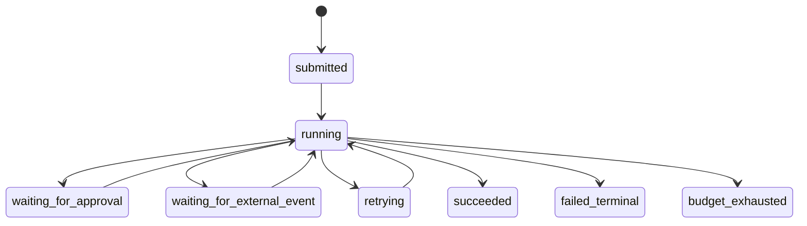

---
kb_id: ai-agent/patterns/agentic-planning-state-machine-and-stop-conditions
title: Agentic 运行时深拆：Planning、State Machine 与 Stop Condition 为什么比“会不会多想一步”更重要
domain: ai-agent
component: agentic-ai
topic: agentic-planning-state-machine-stop-conditions
difficulty: advanced
status: reviewed
sidebar_position: 52
version_scope: DeepLearning.AI Agentic AI course page and 实践资料 agentic-ai repository as verified on 2026-04-26
last_verified_at: '2026-04-26'
source_ids:
  - deeplearning-ai-agentic-ai-course
  - practice-agentic-ai
  - practice-agent-tutorial
  - openai-agents-sdk-tools
claim_ids:
  - practice-p2-claim-0001
  - agent-runtime-claim-0005
  - agent-runtime-claim-0008
tags:
  - ai-agent
  - agentic-ai
  - planning
  - state-machine
  - stop-condition
---
## 真正让 Agentic 链路稳定下来的，往往不是更强的 Planner，而是更严格的状态机和停止合同
很多失败案例都不是因为模型完全不会规划，而是因为系统没有说明“现在处于什么状态、下一步允许做什么、什么时候必须停”。这就是为什么 Agentic 系统要把 planning 放进 state machine 里，而不是把计划当成一段长文本放在 prompt 顶部。

## 解决什么问题
Planning 和状态机页主要解决三类问题：

1. 多步任务里，计划如何随着新 Observation 动态更新，而不是一开始就写死。
2. 系统如何区分 running、waiting_for_approval、waiting_for_external_event、retrying 等不同运行状态。
3. 什么情况下应该停止、降级或转人工，而不是继续让模型自己试。

## 核心对象
| 对象 | 作用 | 判断抓手 |
| --- | --- | --- |
| Plan Draft | 当前阶段的临时计划，不是不可变脚本 | 是否依赖最新 observation |
| State Machine | 定义每个运行状态和可转移条件 | 状态完整性、非法跳转 |
| Budget Counter | 控制 step、时间、token 和成本 | 是否接近预算边界 |
| Progress Signal | 判断本轮是否真的减少不确定性 | 新证据、目标推进量 |
| Stop Condition | 决定结束、暂停、人工升级或失败 | 无进展、风险、预算 |

## 执行链路
一个受控的 Agentic 运行时常见链路如下：

1. `submitted` 状态只完成目标归一化和预算初始化。
2. 进入 `running` 后，Planner 根据最新 Observation 生成本轮 Plan Draft。
3. 如果需要高风险工具，系统切到 `waiting_for_approval`，而不是继续默默推理。
4. 如果依赖外部回调或长任务结果，系统进入 `waiting_for_external_event`。
5. 若错误可恢复，则进入 `retrying` 并消耗预算；否则进入终态。
6. 满足成功条件、预算耗尽或无进展上限时，Stop Condition 触发终止。



## 一致性与容错
没有状态机的 planning 最容易出现两类一致性问题：

1. 工具动作已经提交，但状态仍停留在上一步，恢复后再次执行同一动作。
2. 系统实际上已经进入等待人工或等待回调状态，但模型还在根据旧状态继续规划。

因此设计时要明确：

- 状态转移必须由运行时控制，不能靠模型“口头说明”自己要暂停。
- Plan Draft 必须以最新 Observation 为依据，旧计划只能参考，不能当成强一致事实。
- Stop Condition 必须能识别无进展循环，避免 Planner 和 Reflector 互相加强错误路径。

## 性能模型
State machine 和 stop policy 也是性能控制器：

1. 状态越清晰，越容易在非必要阶段拒绝继续推理，减少无效步骤。
2. 无进展检测越及时，越能阻止“同一工具反复调用”“同一结论反复反思”。
3. 如果 waiting 状态没有被显式建模，系统往往会靠轮询和重复思考补救，造成额外延迟和成本。

```yaml
stop_policy:
  max_steps: 7
  max_seconds: 240
  max_same_tool_retries: 1
  no_progress_rounds: 2
  stop_on:
    - approval_required
    - repeated_same_error
    - no_new_observation
```

## 生产排障
遇到 Agentic 死循环或过度规划时，最有效的排查方式不是先调 prompt，而是先查状态机证据：

1. 当前 run 到底处于什么状态，是否存在非法跳转。
2. 最近三轮 Observation 是否真的引入了新证据。
3. Stop Policy 是否覆盖了无进展、重复错误和预算耗尽。
4. waiting 状态是否被错误地建模成 running，导致系统反复自我尝试。

## 样例
下面的状态记录示意了为什么 planning 必须与状态机绑定：

```json
{
  "run_id": "run_017",
  "state": "waiting_for_approval",
  "step": 4,
  "last_observation": "refund amount exceeds threshold",
  "next_allowed_transition": ["running", "cancelled"],
  "budget": {"remaining_steps": 2}
}
```

```python
def should_stop(state):
    if state["remaining_steps"] <= 0:
        return "budget_exhausted"
    if state["no_progress_rounds"] >= 2:
        return "stop_no_progress"
    if state["status"] in {"waiting_for_approval", "waiting_for_external_event"}:
        return "pause"
    return None
```

## 相邻技术边界
State machine 不是为了把 Agentic 变回固定 Workflow，而是为了给动态规划建立可验证的执行边界。固定 Workflow 提前定义全部节点；Agentic 状态机定义的是“哪些状态存在、哪些转换合法、什么时候必须停”。二者关注点完全不同。

## 本页结论
Agentic 系统的难点不在于 Planner 能不能多想一步，而在于计划是否被状态机和停止合同约束。只有把 Plan Draft、Run State、Budget Counter、Progress Signal 和 Stop Condition 放在一起设计，系统才不会在复杂任务里越跑越长、越跑越偏。
