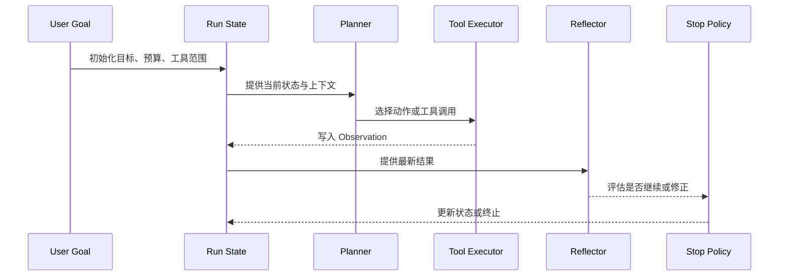

---
kb_id: ai-agent/patterns/agentic-workflows-reflection-tool-use-and-autonomy
title: Agentic Workflows：规划、行动、观察、反思与自主级别为什么必须组成受控闭环
domain: ai-agent
component: agentic-ai
topic: agentic-workflows-reflection-tool-use-autonomy
difficulty: advanced
status: reviewed
sidebar_position: 51
version_scope: DeepLearning.AI Agentic AI course page and 实践资料 agentic-ai repository as verified on 2026-04-26
last_verified_at: '2026-04-26'
source_ids:
  - deeplearning-ai-agentic-ai-course
  - practice-agentic-ai
  - practice-agent-tutorial
  - openai-agents-sdk-tools
claim_ids:
  - practice-p2-claim-0001
  - agent-runtime-claim-0005
  - agent-runtime-claim-0006
tags:
  - ai-agent
  - agentic-ai
  - reflection
  - tool-use
  - autonomy
---
## Agentic 的本质不是“让模型更自由”，而是让系统在更长的任务里仍然可控地前进
很多介绍会把 Agentic AI 描述成“模型能自己规划、自己调用工具、自己完成复杂任务”。这些表述方向没错，但仍然停留在能力展示层。真正决定系统能不能上线的，不是它会不会多做几步，而是每一步是否有状态边界、证据输入、停止条件和恢复策略。Agentic 一旦离开这些约束，就会从“多步执行”滑向“多步失控”。

## 解决什么问题
Agentic Workflow 主要解决的是单轮问答做不到的三类任务：

1. 目标不能一次完成，需要多轮计划、执行、观察和修正。
2. 任务需要调用外部工具或查询环境状态，模型不能只靠参数记忆回答。
3. 执行路径不固定，需要根据中间结果动态调整，而不是预先写死全部步骤。

但它同时也引入新的风险：步骤膨胀、错误动作累积、工具副作用放大，以及“看起来在思考，其实没有新证据”的伪反思循环。

## 核心对象
| 对象 | 作用 | 观察重点 |
| --- | --- | --- |
| Goal | 定义任务目标与成功标准 | 是否可验证、是否过于宽泛 |
| Run State | 保存当前步骤、预算、已知事实和失败历史 | step、budget、最近错误 |
| Planner | 决定下一步做什么 | 是否真的减少不确定性 |
| Tool Executor | 执行外部动作并返回 observation | schema、权限、副作用、超时 |
| Observation | 环境反馈，是下一轮决策依据 | 结构化程度、信息增量 |
| Reflector | 检查结果是否满足目标，是否需要修正 | 是否基于证据而不是空想 |
| Stop Policy | 决定继续、暂停、结束或升级人工 | 停止原因、无进展检测 |
| Autonomy Policy | 约束系统允许的自主级别 | 只读、低风险写、高风险审批 |

## 执行链路
成熟的 Agentic Workflow 往往遵循一条正式的闭环：

1. 任务进入时先定义 Goal、预算、风险级别和允许使用的工具。
2. Planner 基于当前 Run State 决定下一步行动，而不是一开始生成一条长计划后永远不改。
3. Tool Executor 只执行受控动作，并把结果整理为结构化 Observation。
4. Reflector 基于 Observation 检查目标是否推进、是否出现矛盾、是否应该修改计划。
5. Stop Policy 决定继续、等待人工审批、降级为固定 Workflow，还是结束本次运行。



## 一致性与容错
Agentic 系统的容错重点，在于每一步动作和状态变化能否被正确解释：

1. Planner 生成的计划不是事实，只有 Observation 记录的结果才是已发生证据。
2. Tool 副作用不能因为反思认为“上一轮可能失败了”就自动重试，必须结合幂等和审批策略。
3. Reflector 只能根据证据纠偏，不能把没有被工具或环境验证的内容写成新事实。
4. 一旦进入等待人工或等待外部事件状态，系统必须冻结相应上下文边界，避免后台继续做高风险推断。

## 性能模型
Agentic Workflow 的成本通常来自闭环深度，而不是单次模型调用：

1. 计划步骤过细，会让模型在低价值决策上消耗大量 token。
2. 反思频率过高，会把本该一次完成的链路拉成多轮自问自答。
3. 工具调用延迟和失败重试会直接放大总时延。
4. Run State 和 Observation 越积越多，后续每轮上下文装配成本越高。
5. 自主级别越高，治理和审批逻辑越复杂，执行效率会下降。

```yaml
agentic_policy:
  max_steps: 8
  reflect_every_n_steps: 1
  no_progress_limit: 2
  autonomy_level: read_and_low_risk_write
  escalation_rules:
    - high_risk_tool_request
    - repeated_same_error
    - budget_exhausted
```

## 生产排障
Agentic 系统出了问题，首先不要问“模型是不是退化了”，而是先看闭环是否失真：

1. 看 Goal 是否可验证，如果目标本身模糊，后面所有反思都可能是空转。
2. 看 Run State 是否正确记录了步骤、预算和最近错误，避免系统在错误事实上继续推理。
3. 看 Observation 是否真的带来了新证据，还是只回填了一段不能指导下一步的日志。
4. 看 Reflector 是否反复输出类似修正建议却没有引入新外部信息。
5. 看 Stop Policy 是否太宽松，导致系统在无进展状态下继续消耗预算。

## 样例
下面的配置示例表达的是自主级别和停止边界：

```json
{
  "goal": "定位结算任务失败原因并产出摘要",
  "autonomy": "read_and_low_risk_write",
  "limits": {
    "max_steps": 6,
    "max_same_tool_retries": 1,
    "max_seconds": 300
  },
  "require_approval_for": ["refund", "delete", "payment"]
}
```

下面的伪代码展示 Agentic 闭环的最小责任分层：

```python
def run_agentic_loop(goal, tools, state):
    while state["steps"] < state["max_steps"]:
        action = planner(goal, state)
        observation = execute_action(action, tools)
        state = update_state(state, observation)
        decision = reflect_and_check(goal, state)
        if decision in {"done", "handoff", "stop"}:
            return decision, state
    return "budget_exhausted", state
```

## 相邻技术边界
Agentic Workflow 不等于固定 Workflow。固定 Workflow 的核心是路径预先定义，Agentic 的核心是路径根据状态动态变化。它也不等于聊天机器人，因为聊天机器人不一定有正式的工具闭环、状态机和预算控制。它更不等于“模型自己行动”，因为真正行动的是运行时执行层，而不是模型文本本身。

## 本页结论
Agentic AI 的核心不是增加自由度，而是把规划、行动、观察、反思和自主级别放进同一条受控闭环里。只有 Goal、Run State、Tool Executor、Reflector 和 Stop Policy 一起工作，系统才会在多步任务中持续收敛，而不是在更长的链路里持续放大错误。
