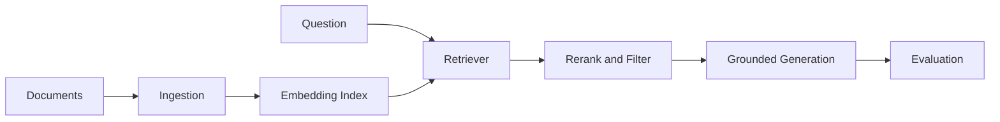

## 一句话定位

RAG 是把检索系统和生成模型组合起来减少无依据生成、增强领域知识和处理私有数据的工程模式。难点是文档治理、召回、排序、证据约束、评估和权限边界。

## 核心对象

- Corpus 是可检索知识集合，需要版本、权限和生命周期。
- Chunk 是检索基本片段，影响召回和上下文质量。
- Embedding 将文本映射到向量空间。
- Retriever 负责召回候选文档。
- Reranker 改善候选排序。
- Evaluator 用数据集和指标判断系统质量。

## 执行链路

1. 文档进入 ingestion pipeline，完成解析、清洗、切分和元数据标注。
2. chunk 计算 embedding 并写入索引。
3. 用户问题经过改写或扩展后进入检索。
4. 系统用向量、BM25 或混合检索召回候选。
5. rerank、过滤和去重后选择证据放入上下文。
6. eval 检查检索命中、答案正确性、引用一致性和拒答表现。

## 保证项与边界

- RAG 增强知识证据和可追溯性，但不能彻底消灭幻觉。
- Embedding 提供语义相似召回，不等于事实正确性判断。
- Chunk 策略影响召回和上下文粒度。
- Eval 需要固定样本和指标，不能只看 demo 感觉。

边界是知识库质量的分水岭。一个组件通常只保证自己负责的语义，端到端正确性还依赖调用方、存储层、计算层、权限系统、重试策略和运维流程共同成立。

## 性能模型

- 质量瓶颈通常在文档解析、chunk、召回覆盖、rerank、权限过滤和提示词约束。
- 延迟来自检索、重排、上下文长度和模型生成。
- 成本受索引规模、embedding 刷新、rerank 模型和 token 影响。

性能分析不要从“调大参数”开始，而要先判断瓶颈位于输入、调度、网络、存储、状态、计算、序列化还是下游系统。任何调优动作都应该先有基线指标，再做单变量变更。

## 状态变化与容量判断

分析 RAG 与 Evaluation 时，要把状态变化拆成四层：控制面状态、数据面状态、元数据状态和外部依赖状态。控制面状态决定谁来调度、谁来提交、谁来恢复；数据面状态决定数据是否已经写入、可见、可重放或可清理；元数据状态决定查询和治理能否正确找到对象；外部依赖状态决定端到端链路是否真的完成。

容量判断不能只看平均值。平均值决定长期资源成本，峰值决定限流和扩容，长尾决定用户体验和故障放大概率。任何组件一旦进入生产，都应该有容量基线、增长趋势、保留策略、失败重试上限和降级方案。

## 治理、安全与变更控制

治理不是上线后的附加项，而是架构的一部分。权限、审计、隔离、保留期、变更记录、回滚策略和人工审批应该在设计阶段就明确。否则系统规模扩大后，会出现无法追踪、无法恢复或无法解释的问题。

对于协议、API、表格式、事务、权限和状态恢复这类内容，必须区分官方保证、实现细节和工程经验。官方保证可以写成明确结论；实现细节要标明版本范围；工程经验只能写成适用条件下的建议。

## 发布前验证路径

发布级知识不能只停留在“讲得通”。每个关键结论都要能被验证：第一，用官方文档或已登记来源确认概念边界；第二，用执行计划、日志、指标或 trace 找到运行证据；第三，用一个失败场景检验恢复路径；第四，用一个容量增长场景检验性能模型；第五，用一个相邻技术对比检验职责边界。

如果某个结论无法被这些方式验证，就不要把它写成绝对判断。更稳妥的写法是说明“在什么配置、什么版本、什么数据规模、什么失败条件下成立”。这能避免知识库变成口号，也能让题库答案具备可追溯性。

## 学习时的核对清单

学习 RAG 与 Evaluation 时至少核对五件事：对象是否讲清、状态是否讲清、链路是否讲清、边界是否讲清、排障证据是否讲清。只要其中一项缺失，回答就容易停在术语层。真正的掌握应该能把一个现象还原成对象状态变化，再把状态变化还原成可观测证据，最后给出有代价说明的处理动作。

还要避免两个极端：一个极端是只背官方定义，无法解释生产问题；另一个极端是只讲经验参数，无法说明为什么有效。发布级知识应该把定义、机制、证据和操作连起来，让读者既知道“是什么”，也知道“为什么这样设计”“什么时候不成立”“出了问题先看哪里”。

因此，每次补充 RAG 与 Evaluation 内容时，都要同时补三类材料：机制图、排障证据和边界说明。机制图帮助理解对象如何协作，排障证据帮助定位真实问题，边界说明帮助避免把组件能力夸大成端到端保证。

## 工程样例

```text
RAG eval = 检索命中率 + 证据覆盖率 + 答案正确率 + 引用一致性 + 拒答正确率
```



## 相邻技术边界

- RAG 不是 Agent，但 Agent 可以调用 RAG 作为工具。
- 向量数据库不是完整 RAG，文档治理和评估同样关键。
- 微调改变模型参数，RAG 动态注入外部知识。

## 知识库到题库的派生方式

下面这些题目应该从本篇知识点派生，而不是脱离知识库单独理解：

1. 为什么 RAG 不是上传文档就结束？
2. chunk 太大或太小分别有什么问题？
3. 向量检索和 BM25 如何互补？
4. 如何评估 RAG 的引用可信度？

复盘时如果答不出对象、链路、状态、边界和排障证据，就说明知识库还没有真正掌握，需要回到对应章节补齐。
