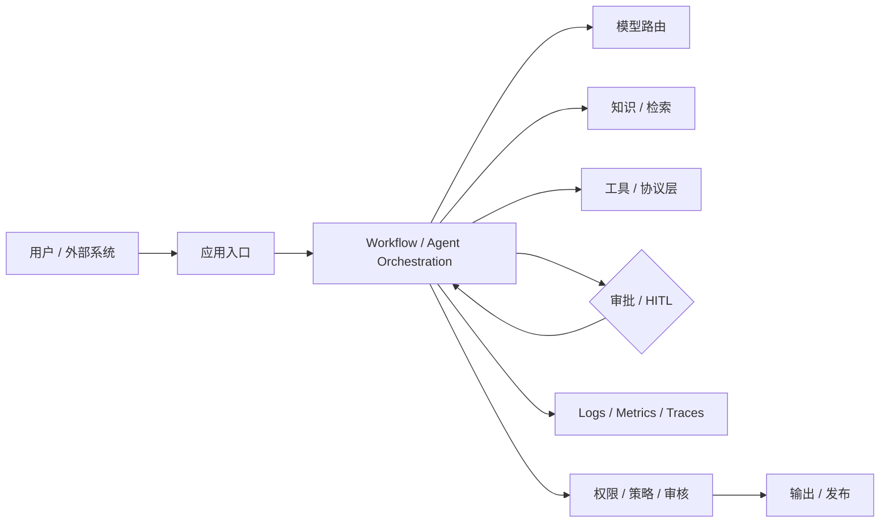

---
kb_id: ai-agent/platforms/ai-application-platform-engineering-practice
title: AI 应用平台工程实践：模型接入、工作流、工具协议、治理与发布为什么必须一起设计
domain: ai-agent
component: agent-platforms
topic: ai-application-platform-engineering-practice
difficulty: advanced
status: reviewed
sidebar_position: 50
version_scope: 实践资料主线化整理与官方平台资料交叉核对，截至 2026-05-12
last_verified_at: '2026-05-12'
source_ids:
  - practice-self-dify
  - practice-handy-ollama
  - practice-coze-ai-assistant
  - practice-llm-protocols-guide
  - practice-mcp-lite-dev
  - practice-anycli
  - practice-vibe-blog
  - practice-smart-dev
  - practice-openclaw-tutorial
  - practice-hand-on-openclaw
  - practice-handy-n8n
  - practice-wow-agent
claim_ids:
  - openai-agents-claim-0001
  - openai-agents-claim-0002
  - openai-agents-claim-0003
  - openai-agents-claim-0004
  - openai-agents-claim-0005
  - openai-agents-claim-0006
  - microsoft-agent-framework-claim-0001
  - microsoft-agent-framework-claim-0002
tags:
  - ai-agent
  - platform
  - workflow
  - governance
  - engineering
---
## AI 应用平台最容易被讲浅，因为很多人只看见“页面搭起来了”，没看见“运行面和治理面”
如果把 AI 应用平台理解成“把模型接到一个网页或工作流编辑器上”，这个答案会非常浅。真正的平台型系统，要同时解决至少五类问题：

- 模型和推理服务如何统一接入。
- 工作流、Agent、工具和知识能力如何被编排。
- 权限、审计、审批和发布如何治理。
- 观测、评估、回滚和成本控制如何落地。
- 本地模型、云模型和企业内系统如何在同一平台里共存。

所以 AI 应用平台的本质，不是某个可视化页面，而是一层把“模型能力”变成“可交付系统”的工程底座。

## 平台到底解决什么
单独的大模型 API 只能回答“生成什么”；但产品系统还需要回答：

- 谁能调用模型。
- 何时调用模型，何时调用工具，何时必须人工审批。
- 结果是否可追踪、可回滚、可复盘。
- 连接企业数据和内网系统时，如何保证权限与隔离。
- 一次应用上线后，如何持续评估、调优和控成本。

平台就是为这些问题存在的。它把调用模型这件事，从单次函数调用升级为一套可治理运行系统。

## 平台型能力应该按哪几层理解
### 模型接入层
负责统一接入云模型、本地模型、代理网关或开源推理服务。关键问题是：

- 能力如何路由。
- 不同模型的成本和性能如何分层。
- 上下文、结构化输出、工具能力是否兼容。

### 工作流与 Agent 层
负责决定任务如何推进：

- 哪些步骤由 workflow 固定。
- 哪些步骤允许 agent 自主决策。
- 哪些环节要人工审批或回退。

### 工具与协议层
负责把外部系统能力标准化暴露给应用：

- 工具 schema 是否稳定。
- MCP 或平台私有协议如何接入。
- 工具副作用、审批点、权限范围如何建模。

### 知识与数据层
负责 RAG、知识库、数据连接和上下文注入。关键问题不是“能不能搜”，而是：

- 哪些内容可见。
- 新鲜度和删除同步如何做。
- 返回证据能否真正支撑答案。

### 观测与评估层
负责 logs、metrics、traces、feedback、offline eval、online monitoring。平台如果没有这层，应用只要一复杂，就会很快失去可控性。

### 治理与发布层
负责：

- 多租户与权限
- 环境隔离
- 版本发布与回滚
- 审批与合规
- 成本预算与配额

这一层才决定平台能不能从 demo 走到企业环境。

## 一条典型平台运行链怎么走
1. 用户请求进入应用入口。
2. 平台根据应用配置选择 workflow、agent 或混合模式。
3. 应用在执行中可能访问知识库、调用工具、路由模型或等待审批。
4. 运行时把状态、日志和 trace 写入观测层。
5. 平台在输出前执行权限、格式、审核和安全策略。
6. 结果发布给用户或外部系统。
7. 反馈、trace 和指标进入后续评估与迭代。



## 工作流和 Agent 应该怎么分工
成熟平台不会把所有逻辑都交给 Agent，也不会把所有步骤都写成死板流程。更常见的做法是：

- 外层 workflow 负责关键主路径、审批点和可恢复状态。
- 内层 agent 负责开放式子任务、工具探索或复杂推理。
- 工具调用通过统一协议层暴露，并附带权限和审计边界。

这也是很多平台型系统最终都会走向的混合架构。

## 本地模型和云模型的权衡
本地模型平台能力很重要，但要讲清边界：

- 本地模型更适合数据敏感、离线、低成本或开发验证场景。
- 云模型通常在能力、工具生态和多模态支持上更强。
- OpenAI-compatible endpoint 可以降低接入成本，但不等于能力等价。
- 平台团队需要做 capability gating，而不是假设所有模型都能互换。

这意味着平台不是“选一个模型”，而是要设计模型分层和路由策略。

## 权限和副作用边界必须前置设计
AI 平台和普通应用平台最大的差异之一，在于它既能读信息，也可能发起动作。因此要明确：

- 哪些工具是只读，哪些工具有副作用。
- 哪些操作必须审批。
- 哪些数据可被模型看到，哪些只能被后端处理。
- 哪些 trace 字段要脱敏。
- 哪些模型或租户不可访问某类资源。

如果这一层没有前置设计，平台越好用，风险越大。

## 性能模型与成本模型怎么看
AI 应用平台的性能瓶颈通常不是单点，而是全链路叠加：

- 模型推理时间
- 检索与重排时间
- 外部工具时延
- 审批等待时间
- trace / eval / guardrail 额外开销

成本也同样是链路成本，而不是单次 token 成本。

### 平台预算样例
```yaml
platform_budget:
  model_latency_ms: 4500
  retrieval_latency_ms: 1200
  tool_latency_ms: 1800
  approval_timeout_minutes: 30
  trace_sampling: "full-for-prod-errors"
  cost_ceiling_per_request: 0.25
```

这个样例强调：平台治理必须同时盯延迟、工具依赖、审批等待和成本上限。

## 生产排障应该怎么做
平台问题建议按这条顺序排：

1. 先分清问题出在入口、编排、模型、检索、工具还是审批层。
2. 再看权限和策略是否在某个边界拦截了请求。
3. 再看 trace 是否能证明慢点和失败点。
4. 最后看是否属于模型能力不匹配、知识过期或工具副作用问题。

这比直接看最终答案是否错误更有效，因为平台故障通常是分层故障。

## 本页结论
AI 应用平台不是“把模型接到页面上”，而是一层把模型接入、工作流、Agent、工具协议、知识检索、观测评估和治理发布组织起来的工程底座。只有把运行面和治理面一起讲，平台型系统的答案才算真正到位。
