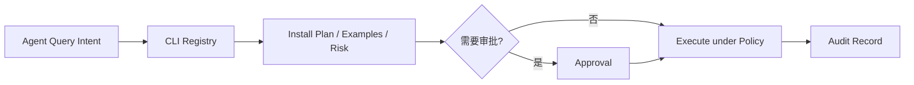

---
kb_id: ai-agent/platforms/anycli-cli-registry-for-agent-tool-use
title: AnyCLI：CLI Agent 真正要解决的不是“让模型更会写命令”，而是把命令行能力变成结构化、可审批、可审计的工具目录
domain: ai-agent
component: cli-agent
topic: anycli-cli-registry-agent-tool-use
difficulty: advanced
status: reviewed
sidebar_position: 7
version_scope: 实践资料 anycli repository, OpenAI Agents SDK docs, and MCP docs as verified on 2026-05-12
last_verified_at: '2026-05-12'
source_ids:
  - practice-anycli
  - openai-agents-sdk-tools
  - mcp-server-concepts
claim_ids:
  - practice-p1-claim-0003
  - practice-p1-claim-0004
tags:
  - ai-agent
  - anycli
  - cli-agent
  - registry
  - dry-run
---
## Agent 调 CLI 的本质问题，不是模型会不会写 shell，而是系统有没有把 CLI 能力正式纳入治理
CLI 对 Agent 非常有吸引力，因为它天然脚本化、覆盖广、输出明确。但它也天然高风险：删文件、跑安装脚本、写环境变量、触发网络调用，都只需要一条命令。AnyCLI 这类注册层的价值，就在于把“模型临时编命令”改造成“Agent 查询结构化工具目录，再按计划执行”。

### 解决什么问题
AnyCLI 这类设计主要解决三类问题：

1. 发现问题：Agent 怎么知道当前环境有哪些 CLI 工具。
2. 理解问题：Agent 怎么知道工具如何安装、如何调用、有什么风险。
3. 执行问题：高风险动作怎么先 dry-run、再审批、再执行。

### 核心对象
| 对象 | 作用 | 观察重点 |
| --- | --- | --- |
| Registry Entry | 描述一个 CLI 工具的结构化能力 | 安装方式、二进制名、示例命令 |
| Install Plan | 描述工具将如何被安装 | 是否 dry-run、是否需要审批 |
| Risk Metadata | 标注风险等级与权限需求 | 文件、网络、环境变量、副作用 |
| Execution Policy | 限制实际执行的环境边界 | 工作目录、超时、输出大小 |
| Audit Record | 记录命令执行事实链 | 谁调用、调用了什么、结果如何 |

### 执行链路
1. Agent 先查询 Registry，找到符合任务意图的 CLI 工具。
2. 再读取结构化元数据，理解命令、参数和风险。
3. 如果工具未安装，先生成 install plan 并默认 dry-run。
4. 审批通过后，Execution Policy 控制真实执行环境。
5. 最终结果进入 audit record，供后续回溯。



### 一致性与容错边界
CLI Agent 里最关键的边界包括：

1. Registry 说明工具存在，不等于所有命令都允许执行。
2. dry-run 说明的是计划，不等于工具已经安装完成。
3. 命令执行失败要区分参数错误、权限错误和环境错误。
4. 有副作用的命令不能一概重试，必须看幂等性与审批状态。

### 性能模型
CLI Agent 的性能成本通常来自：

1. 搜索和理解 Registry 的开销。
2. 安装阶段的额外等待与审批时间。
3. 命令输出过大导致的上下文与传输成本。
4. 过宽的工具目录让模型在选择时更容易犹豫和误选。

```json
{
  "slug": "example-tool",
  "install": {"method": "npm", "dry_run": true},
  "risk": {"filesystem": "read-only", "requires_approval": true},
  "execution_policy": {"timeout_sec": 30, "allow_network": false}
}
```

### 生产排障
CLI Agent 出现问题时，优先查：

1. Registry entry 是否准确反映了真实工具能力。
2. install plan 是否被误执行而不是只做 dry-run。
3. execution policy 是否放开了不该放开的目录或网络权限。
4. audit 里能否看清命令、参数、输出和失败类型。

### 和相邻技术的边界
AnyCLI 更像 CLI 工具目录和安装调度层，MCP 更像工具与上下文暴露协议层，Agent Runtime 则负责最终的权限、审批和执行策略。三者不是替代关系，而是层次不同。

### 为什么 Registry 不能等同于“真实能力”
Registry 记录的是“系统允许 Agent 理解和申请的能力面”，不等于当前主机上任何时刻都真的具备同名二进制、同样权限和同样网络条件。也就是说，Registry 更像受治理的能力目录，而不是对运行环境的无条件承诺。把这层区别说清，才能理解为什么还需要 install plan、execution policy 和审计链补足最后一公里。

能力被登记下来，只代表它可以被审查地接入，不代表它应该被无条件执行。

## 本页结论
CLI Agent 的核心问题不是让模型“更懂 shell”，而是把 CLI 能力转成结构化、可审批、可审计的工具目录。AnyCLI 这一层讲清后，CLI Agent 的安全边界和工程边界才会真正清晰。
