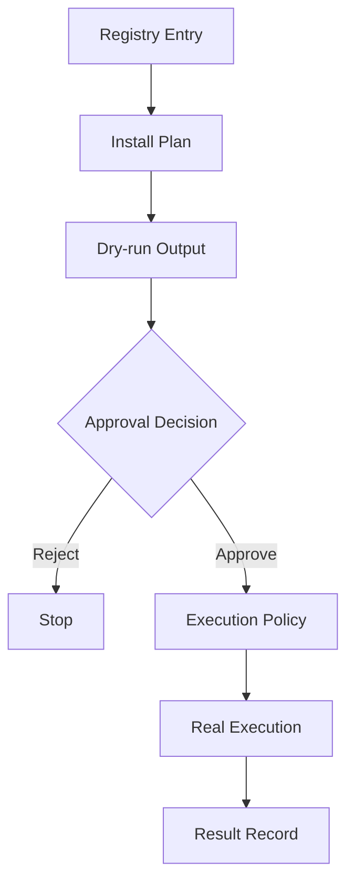

---
kb_id: ai-agent/platforms/anycli-install-plan-dry-run-approval-and-execution-policy
title: AnyCLI 深水区：Install Plan、Dry-run、Approval 和 Execution Policy 为什么必须是四层分开的对象
domain: ai-agent
component: cli-agent
topic: install-plan-dry-run-approval-execution-policy
difficulty: advanced
status: reviewed
sidebar_position: 8
version_scope: 实践资料 anycli repository, OpenAI Agents SDK docs, and MCP docs as verified on 2026-05-12
last_verified_at: '2026-05-12'
source_ids:
  - practice-anycli
  - openai-agents-sdk-tools
  - mcp-server-concepts
claim_ids:
  - practice-p1-claim-0003
  - practice-p1-claim-0004
tags:
  - ai-agent
  - anycli
  - install-plan
  - approval
  - execution-policy
---
## CLI Agent 最容易出事故的，不是某条命令写错，而是“计划”和“执行”没有被正式拆开
很多危险操作并不是发生在真正执行那一刻，而是发生在系统把“能不能做”“打算怎么做”“是否已经批准”“最终在哪个环境执行”这些问题混成一个环节的时候。AnyCLI 这类设计之所以重要，是因为它把 Install Plan、Dry-run、Approval 和 Execution Policy 分成四个正式对象，避免 Agent 直接从意图跳到命令执行。

### 解决什么问题
这套分层主要解决：

1. 安装动作如何先展示计划，而不是直接跑脚本。
2. 高风险命令如何在执行前被人或策略确认。
3. 相同命令在不同工作目录、不同网络权限下会不会导致不同风险。
4. 执行失败后如何知道问题出在计划、审批还是环境。

### 核心对象
| 对象 | 作用 | 关键边界 |
| --- | --- | --- |
| Install Plan | 描述打算执行什么安装步骤 | 只是计划，不是执行结果 |
| Dry-run Output | 展示将要发生的命令与副作用 | 可审查，不改变环境 |
| Approval Decision | 明确是否允许真实执行 | 审批人、审批范围、有效期 |
| Execution Policy | 限制真实执行环境 | 目录、网络、环境变量、超时 |
| Result Record | 记录最终执行事实 | 成功、失败、输出、错误类型 |

### 执行链路
1. Agent 先基于 Registry 生成 Install Plan。
2. Dry-run 输出将要执行的命令和副作用边界。
3. Approval Decision 确认计划是否被允许。
4. Execution Policy 在真实执行时施加环境限制。
5. Result Record 保存执行事实链。



### 一致性与容错边界
这里最需要强调的是：

1. Dry-run 成功不等于真实执行必然成功。
2. Approval 通过也不等于执行环境已经安全，仍要看 Execution Policy。
3. Install Plan 变更后，旧审批不应继续有效。
4. 真实执行失败时，不能简单回溯成“审批错了”，要先区分计划错误还是环境错误。

### 性能模型
这套机制会增加一些时延，但这类时延是安全成本：

1. dry-run 增加一次预检查。
2. approval 引入人工或策略等待。
3. policy enforcement 增加执行前检查开销。
4. result audit 增加记录成本。

相比之下，如果没有这套分层，事故成本通常远高于这些延迟。

```yaml
execution_policy:
  workdir_scope: current_workspace
  allow_network: false
  redact_env_vars: true
  timeout_seconds: 30
  max_output_kb: 256
```

### 生产排障
当 CLI Agent 执行错误时，建议按下面顺序排：

1. 查看 Install Plan 是否本身就错了。
2. 查看 Dry-run 是否已经暴露风险却仍被放行。
3. 查看 Approval Decision 是否过期或范围过宽。
4. 查看 Execution Policy 是否没有限制住目录、网络或环境变量。

### 最小样例
```json
{
  "plan_id": "install-123",
  "dry_run": true,
  "requires_approval": true,
  "policy": {"allow_network": false, "timeout_seconds": 20}
}
```

### 和相邻技术的边界
这页讨论的是 CLI 安装与执行治理，不是通用权限控制理论。CLI 场景的特殊性在于一条命令就能产生很强副作用，因此“计划”和“执行”的分离要更彻底。

也正因为如此，真正成熟的 CLI Agent 不会把 dry-run 仅仅当作用户体验优化，而会把它视为执行前最重要的一次风险显影。

## 本页结论
CLI Agent 想要安全，不能让 Install Plan、Dry-run、Approval 和 Execution Policy 混在一起。把这四层正式拆开，才能让系统在命令真正落地前还有足够多的制动点。
