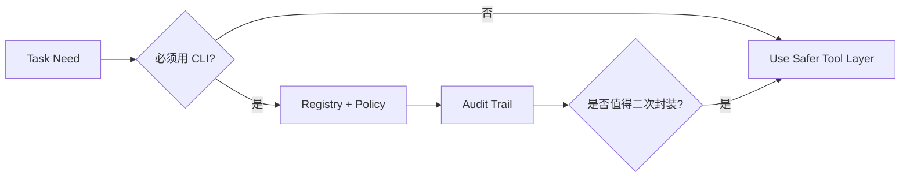

---
kb_id: ai-agent/platforms/anycli-production-security-audit-and-cli-agent-selection-boundary
title: AnyCLI 工程评估：CLI Agent 什么时候值得引入，什么时候应该退回更受限的工具层
domain: ai-agent
component: cli-agent
topic: production-security-audit-selection-boundary
difficulty: advanced
status: reviewed
sidebar_position: 9
version_scope: 实践资料 anycli repository, OpenAI Agents SDK docs, and MCP docs as verified on 2026-05-12
last_verified_at: '2026-05-12'
source_ids:
  - practice-anycli
  - openai-agents-sdk-tools
  - mcp-server-concepts
claim_ids:
  - practice-p1-claim-0003
  - practice-p1-claim-0004
tags:
  - ai-agent
  - anycli
  - security
  - audit
  - selection
---
## 不是所有 Agent 都适合直接连 CLI，真正的分水岭在于副作用风险和审计要求
CLI Agent 的能力很强，但并不意味着它应该被默认接入所有系统。工程上更重要的问题是：当前任务是否真的需要命令行能力，还是应该被包装成更受限的 API / MCP Tool / Hosted Tool。AnyCLI 这类体系真正的选型价值，就在于帮助团队明确 CLI Agent 的适用边界。

### 解决什么问题
这页要解决三类判断：

1. 哪些任务真的需要 CLI 的表达力。
2. 哪些任务虽然能用 CLI，但风险高到更适合受限工具层。
3. 线上要看哪些审计指标，才能知道 CLI Agent 是否开始越界。

### 核心对象
| 对象 | 作用 | 判断信号 |
| --- | --- | --- |
| Tool Surface | CLI 暴露给 Agent 的能力集合 | 是否过宽、是否含危险命令 |
| Side-effect Level | 工具副作用等级 | 读、写、安装、删除、网络 |
| Audit Trail | 记录执行事实和审批链 | 命令、参数、结果、审批人 |
| Risk Threshold | 触发人工或退回 API 化封装的阈值 | 高危命令、频繁失败 |
| Selection Boundary | 判断要不要继续让 Agent 直接连 CLI | 风险、审计、复用性 |

### 执行链路
1. 先判断任务是不是必须依赖系统级命令行能力。
2. 如果必须使用 CLI，再通过 Registry + Policy 暴露最小工具面。
3. 对高风险动作要求审批和完整审计。
4. 如果某类 CLI 调用稳定且重复，优先考虑再封装成更受限的 API 或 MCP tool。



### 一致性与容错边界
CLI Agent 的边界要讲清楚：

1. 一次命令成功不等于这个能力适合长期直接暴露给 Agent。
2. 审计存在不等于风险消失，审计只是可回溯前提。
3. 如果某能力可以通过更小权限的 API 暴露，就不应该长期维持高风险 CLI 入口。
4. 高频失败或高危审批说明当前 Tool Surface 设计可能过宽。

### 性能模型
CLI Agent 的开销不只在执行，还在安全与审计：

1. 审批越多，自动化收益越低。
2. Tool Surface 越宽，模型选择成本越高。
3. 审计记录越多，存储和检索开销越大。
4. 高频 CLI 输出会推高上下文与日志处理成本。

```yaml
cli_agent_selection:
  direct_cli_ok_for:
    - readonly_inspection
    - internal_dev_assistant
  prefer_wrapped_api_for:
    - destructive_actions
    - multi_tenant_services
    - compliance_sensitive_workloads
```

### 生产排障
如果 CLI Agent 越来越难管，建议优先看：

1. Tool Surface 是否已经暴露了过多危险命令。
2. 审批率是否越来越高，说明自动化价值在下降。
3. 是否有一批高频稳定命令应该被重新封装成更小权限工具。
4. 审计里是否频繁出现相同目录、相同环境变量或相同失败模式。

### 最小样例
```python
if command_risk_level(cmd) == "high":
    require_approval(cmd)
if command_is_repeated_and_stable(cmd):
    wrap_as_api_tool(cmd)
```

### 和相邻技术的边界
这页强调的是 CLI Agent 选型，不是反对 CLI。CLI 很强，但越强越需要知道何时应该直接暴露，何时应该收敛成更小权限的工具层。

### 选型边界最好随运行事实动态收紧
很多团队一开始不得不直接开放 CLI，是因为业务还没来得及把能力封装成 API 或 MCP tool。但只要审计已经表明某些命令稳定、高频、参数模式固定，就应该把这些能力逐步抽离出来，沉淀成更小权限、更容易复用的受限工具。这样做的目标不是削弱 Agent，而是把最危险的一层能力不断往下收敛。

## 本页结论
CLI Agent 并不是越早接入越好。真正专业的判断，是知道哪些任务必须依赖 CLI，哪些能力应该被更受限地再次封装，以及如何用审计和风险阈值决定是否继续开放这条高权限入口。
