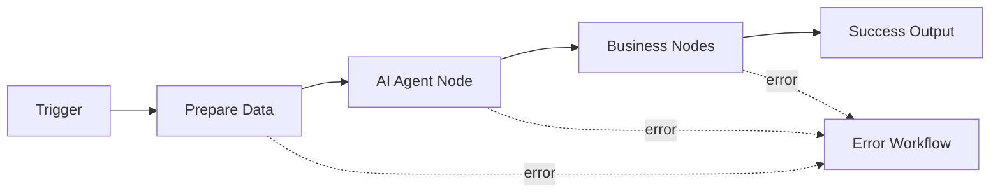

---
kb_id: ai-agent/platforms/n8n-ai-workflow-agent-orchestration
title: n8n AI Workflow：它的本质是事件驱动工作流平台，而不是把所有控制权都交给 Agent
domain: ai-agent
component: n8n
topic: n8n-ai-workflow-agent-orchestration
difficulty: intermediate
status: reviewed
sidebar_position: 4
version_scope: n8n docs and 实践资料 handy-n8n repository as verified on 2026-05-12
last_verified_at: '2026-05-12'
source_ids:
  - n8n-ai-workflow-docs
  - n8n-error-handling-docs
  - n8n-node-creation-docs
  - practice-handy-n8n
claim_ids:
  - practice-p1-claim-0001
  - practice-p1-claim-0002
tags:
  - ai-agent
  - n8n
  - workflow
  - node-orchestration
  - low-code
---
## 理解 n8n，先要把“事件驱动工作流”和“局部 Agent 节点”区分开
很多人第一次接触 n8n，会把它理解成可拖拽的 Agent 平台。这样的说法不算错，但并不准确。n8n 的第一性原理不是“让模型自己决定一切”，而是“用 Trigger 和 Node 显式组织事件驱动工作流，再在局部节点里嵌入模型能力”。只有先把这条主线讲清，后面 Credentials、Expressions、Error Workflow、自定义节点这些对象才会变得有意义。

### 解决什么问题
n8n 主要解决的是业务系统之间的自动化编排问题，而不是先从 Agent runtime 出发。它最擅长的场景通常包括：

1. Webhook 驱动的业务自动化。
2. CRM、数据库、文档、邮件、IM 等系统之间的数据流转。
3. 把 LLM 用作流程中的分类、总结、检索、生成或局部决策节点。
4. 用低代码方式快速搭建内部自动化。

### 核心对象
| 对象 | 作用 | 观察重点 |
| --- | --- | --- |
| Trigger | 定义流程从什么事件开始 | webhook、chat trigger、schedule |
| Node | 承担一个具体步骤 | 输入输出、执行时机 |
| Data Item | 节点之间流转的数据单元 | 字段结构、序列化 |
| Credentials | 管理外部系统凭证 | 最小权限、泄露风险 |
| Expressions | 把上游数据映射成下游参数 | 参数拼装、空字段处理 |
| Error Workflow | 承担失败后的兜底路径 | 重试、通知、补偿 |
| AI Agent Node | 在局部节点中引入模型决策与工具 | prompt、memory、logs |

### 执行链路
一个典型 n8n AI workflow 的链路大致是：

1. Trigger 收到外部事件，例如 Webhook 或聊天输入。
2. 前置 Node 做清洗、鉴权、数据准备。
3. AI Agent Node 在局部做检索、总结、分类或工具式决策。
4. 后续 Node 继续与外部系统交互，例如写库、发通知、更新工单。
5. 如果任一节点失败，Error Workflow 决定是重试、告警、补偿还是人工介入。



### 一致性与容错边界
n8n 的一致性更多来自工作流设计，而不是平台自动事务保证：

1. 节点副作用是否幂等，需要工作流作者自己判断。
2. Error Workflow 只能提供兜底路径，不等于分布式事务。
3. Credentials 只是凭证管理层，不等于细粒度业务授权模型。
4. AI Agent Node 只能作为局部决策能力，不能自动保证全流程语义正确。

### 性能模型
n8n 的性能瓶颈通常来自整条 workflow，而不是单个模型：

1. Trigger 输入量与并发会决定整体吞吐上限。
2. 外部 API 延迟往往比模型延迟更大。
3. 表达式拼装和节点序列化会增加数据路径成本。
4. Error Workflow 设计不当会放大失败成本。

```yaml
workflow_budget:
  trigger_rate_limit: 100_per_minute
  ai_node_timeout_ms: 8000
  external_api_timeout_ms: 3000
  retry_budget: 2
  fail_fast_for_side_effect_nodes: true
```

### 生产排障
排 n8n 问题时，先不要一上来怪模型：

1. 先看 Trigger 有没有稳定把事件转成正确数据。
2. 再看 Expressions 是否把上游字段正确映射到下游参数。
3. 再看 AI Agent Node 输出是否符合下游 Node 预期。
4. 最后再看 Error Workflow 是否把失败路由到了正确路径。

### 最小样例
```json
{
  "trigger": "webhook",
  "nodes": ["normalize_input", "ai_agent", "update_ticket"],
  "error_workflow": "notify_and_retry"
}
```

### 和相邻技术的边界
n8n 与 Dify 的主要差异，在于 n8n 更偏业务系统自动化编排，而 Dify 更偏 LLM 应用平台。与 LangGraph 这类图运行时相比，n8n 更重视集成与低代码，而不是长运行状态机与恢复语义。

## 本页结论
n8n 的本质不是让 Agent 接管整个系统，而是让事件驱动工作流保持主导，再在局部节点中嵌入模型能力。把 Trigger、Node、Credentials、Expressions、Error Workflow 和 AI Agent Node 之间的分工讲清，n8n 的定位就不会再被说浅。
