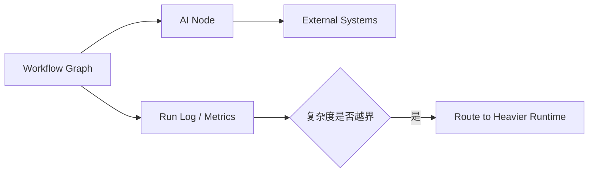

---
kb_id: ai-agent/platforms/n8n-ai-workflow-performance-observability-and-boundary-selection
title: n8n 工程评估：什么时候它是合适的 AI 工作流平台，什么时候应该交给更重的运行时
domain: ai-agent
component: n8n
topic: ai-workflow-performance-observability-boundary-selection
difficulty: advanced
status: reviewed
sidebar_position: 6
version_scope: n8n docs and 实践资料 handy-n8n repository as verified on 2026-05-12
last_verified_at: '2026-05-12'
source_ids:
  - n8n-ai-workflow-docs
  - n8n-error-handling-docs
  - n8n-node-creation-docs
  - practice-handy-n8n
claim_ids:
  - practice-p1-claim-0001
  - practice-p1-claim-0002
tags:
  - ai-agent
  - n8n
  - performance
  - observability
  - selection
---
## n8n 的真正选型边界，不在“能不能做 AI”，而在“谁来主导复杂度”
几乎所有现代工作流平台都能接入模型，但这不意味着它们都适合作为同一种 Agent 运行时。n8n 的价值在于事件驱动、流程显式、系统集成丰富和低代码交付；它的边界在于长运行恢复、复杂多智能体状态机和严格代码级治理通常不是它的天然强项。真正专业的选型，要看复杂度应该由显式 workflow 主导，还是由更重的 Agent runtime 主导。

### 解决什么问题
这页要回答三件事：

1. n8n 适合承接哪些 AI workflow 复杂度。
2. 哪些信号说明它已经接近边界。
3. 哪些指标比“能跑通”更能说明上线质量。

### 核心对象
| 对象 | 作用 | 判断信号 |
| --- | --- | --- |
| Workflow Graph | 显式表达流程路径 | 复杂度是否仍可控 |
| External Integrations | 承接系统集成价值 | API 数量、字段稳定性 |
| Run Log | 提供执行链回放 | 节点级失败定位 |
| Cost Budget | 控制模型和外部 API 成本 | 节点耗时、token、调用次数 |
| Selection Boundary | 判断是否需要更重运行时 | 长任务、恢复、审批、多智能体 |

### 执行链路
1. 工作流图负责显式控制路径和业务边界。
2. AI 节点只承担局部智能处理。
3. Run Log 和节点级指标帮助定位成本与失败。
4. 一旦复杂度超出图式工作流的自然边界，应把开放式子任务转交更重 runtime。



### 一致性与容错边界
n8n 的边界要明确讲：

1. 它强于显式流程，不强于复杂状态恢复。
2. 节点执行成功不代表端到端业务语义已经自动满足。
3. 多系统写入仍需要业务方自己考虑补偿和幂等。
4. 一旦出现大量开放式规划与多轮协作，工作流图会逐渐变得难维护。

### 性能模型
n8n 的关键性能抓手通常是：

1. 节点级耗时，而不是只看整条链总时长。
2. 模型节点和外部 API 节点哪个是慢点。
3. 重试和错误路径是否在吞吐高峰期被放大。
4. trigger 并发和执行队列是否匹配。

```yaml
workflow_observability:
  track:
    - node_latency_p95
    - model_token_cost
    - external_api_error_rate
    - retry_path_frequency
    - trigger_queue_depth
```

### 生产排障
n8n 进入复杂场景后，先看这些信号：

1. 工作流图是不是已经变成难以理解的大网。
2. AI 节点是不是承担了本不该由它承担的主路径控制。
3. 某些节点是不是在反复失败和重试。
4. 是否已经出现需要正式 checkpoint、thread 或多智能体共享状态的需求。

### 最小样例
```python
if workflow_needs_long_running_state_machine(task):
    handoff_to_runtime(task)
else:
    keep_in_n8n(task)
```

### 和相邻技术的边界
n8n 不是不能做 AI，而是它更适合 AI in workflow，而不是 workflow in AI。这个差别听起来很小，但决定了谁来主导整体复杂度。

## 本页结论
n8n 最适合的定位，是事件驱动工作流主导、AI 节点辅助的集成平台。只要把它与更重 Agent runtime 的边界讲清，n8n 的长处和短处都会变得很清楚。
