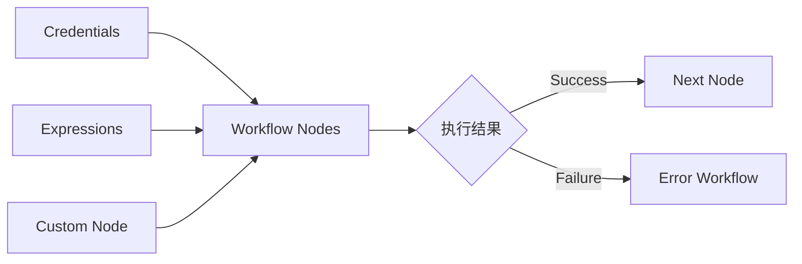

---
kb_id: ai-agent/platforms/n8n-credentials-error-workflow-and-custom-node-governance
title: n8n 深水区：Credentials、Error Workflow 和 Custom Node 为什么决定它能不能进入生产
domain: ai-agent
component: n8n
topic: credentials-error-workflow-custom-node-governance
difficulty: advanced
status: reviewed
sidebar_position: 5
version_scope: n8n docs and 实践资料 handy-n8n repository as verified on 2026-05-12
last_verified_at: '2026-05-12'
source_ids:
  - n8n-ai-workflow-docs
  - n8n-error-handling-docs
  - n8n-node-creation-docs
  - practice-handy-n8n
claim_ids:
  - practice-p1-claim-0001
  - practice-p1-claim-0002
tags:
  - ai-agent
  - n8n
  - credentials
  - error-workflow
  - custom-node
---
## n8n 真正的生产门槛，通常不在拖拽体验，而在凭证治理、失败路径和自定义节点质量
一个 n8n workflow 能跑通，不代表它已经适合生产。真正决定上线质量的，往往是三类基础设施对象：Credentials 是否可管控、Error Workflow 是否能兜底、自定义节点是否具备稳定 contract。它们共同决定系统是“能演示”，还是“能长期运行”。

### 解决什么问题
这页主要解决：

1. 外部系统凭证如何安全接入和分配。
2. 失败后如何分类处理，而不是所有问题都重试。
3. 当内置节点不够用时，自定义节点怎样保持契约稳定。

### 核心对象
| 对象 | 作用 | 关键边界 |
| --- | --- | --- |
| Credentials | 保存外部系统身份与密钥 | 最小权限、暴露范围 |
| Error Workflow | 定义失败后走什么路径 | 重试、告警、补偿、人工 |
| Custom Node | 补足平台原生节点能力 | schema、版本、测试 |
| Expressions | 拼装跨节点参数 | 空值、类型、格式兼容 |
| Logs / Runs | 观察一次 workflow 执行事实链 | 哪个节点失败、失败类型 |

### 执行链路
1. Credentials 为各节点提供外部系统连接身份。
2. 节点执行前通过 Expressions 拼装参数。
3. 节点失败后由 Error Workflow 决定重试、告警或补偿。
4. 如果业务需要自定义能力，则由 Custom Node 以正式 contract 承载。



### 一致性与容错边界
这层要特别讲清：

1. Credentials 解决的是身份注入，不等于业务授权已经做完。
2. Error Workflow 解决的是失败路由，不保证业务补偿一定正确。
3. Custom Node 解决的是能力扩展，但必须自己承担输入输出 schema 和向后兼容责任。
4. 对有副作用的节点，不能把所有错误都交给自动重试器。

### 性能模型
很多 n8n 流程的性能问题都藏在这层：

1. 凭证过多或配置不当，会拖慢外部连接建立。
2. Error Workflow 设计不合理，会把局部失败放大成系统性重试。
3. Custom Node 逻辑过重，会成为整条 workflow 的慢点。
4. Expressions 复杂度过高，会增加调试与执行成本。

```yaml
node_governance:
  credentials_scope: least_privilege
  error_policy:
    retry_only_for: [timeout, transient_http_error]
    do_not_retry_for: [validation_error, permission_denied]
  custom_node:
    schema_versioned: true
```

### 生产排障
如果一个 n8n 流程总是线上出问题，通常优先看：

1. 凭证是不是过期、越权或误用。
2. Error Workflow 是否把终态错误也当成临时错误重试。
3. Custom Node 的输入输出 contract 是否和现有 workflow 版本兼容。
4. Expressions 是否在边缘数据上拼装出了空值或错误字段。

### 最小样例
```json
{
  "node": "update_crm_record",
  "credentials": "crm_service_account",
  "on_error": "alert_ops_and_stop",
  "retryable": false
}
```

### 和相邻技术的边界
这页讨论的是 n8n 的生产治理边界，不是一般性 Agent runtime。与代码框架相比，n8n 的优势是低代码集成；但这不意味着它可以跳过凭证治理、失败分类和扩展节点契约设计。

## 本页结论
n8n 进入生产的关键，不在于工作流是不是画出来了，而在于 Credentials 是否可控、Error Workflow 是否合理、自定义节点是否有稳定 contract。把这三层讲清，n8n 的工程价值才算真正被说到位。
