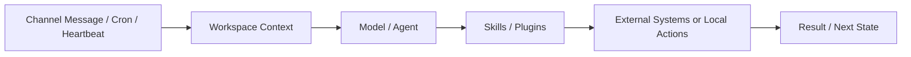

---
kb_id: ai-agent/platforms/openclaw-personal-agent-gateway-and-security-boundaries
title: OpenClaw：它的核心不是“会聊天”，而是把聊天入口、个人工作区、技能和主动任务组织成高权限个人 Agent 网关
domain: ai-agent
component: openclaw
topic: openclaw-personal-agent-gateway
difficulty: advanced
status: reviewed
sidebar_position: 10
version_scope: OpenClaw official site, GitHub repository, security advisory, and 实践资料 OpenClaw tutorials as verified on 2026-05-12
last_verified_at: '2026-05-12'
source_ids:
  - openclaw-site
  - openclaw-github
  - openclaw-security-advisory-ghsa-m3mh-3mpg-37hw
  - practice-openclaw-tutorial
  - practice-hand-on-openclaw
claim_ids:
  - practice-p1-claim-0007
  - practice-p1-claim-0008
tags:
  - ai-agent
  - openclaw
  - personal-agent
  - gateway
  - security
---
## OpenClaw 的真正价值，不在接了多少聊天平台，而在于它把“聊天入口”和“行动能力”连接成了个人 Agent 网关
如果只把 OpenClaw 理解成一个能接 Telegram、飞书、Discord 的聊天机器人，几乎就错过了它最关键的系统定位。OpenClaw 更像一个个人 Agent Gateway：它接收消息、装配个人工作区上下文、调用 skills / plugins、连接外部系统，并能通过定时任务和主动心跳持续工作。也正因为连接面太广，它天然带着高权限风险。

### 解决什么问题
OpenClaw 主要解决的是“个人助手怎样从聊天对话扩展成持续工作的执行系统”这个问题，典型包括：

1. 多聊天渠道接入和统一入口。
2. 工作区、人设、偏好和长期记忆的组织。
3. skills / plugins 作为行动扩展点。
4. cron 与 heartbeat 带来的主动任务能力。
5. 本地上下文与外部系统的协同。

### 核心对象
| 对象 | 作用 | 观察重点 |
| --- | --- | --- |
| Channel | 用户消息入口 | 身份、权限、群聊上下文 |
| Workspace | 保存个人上下文、偏好、工作目录 | 敏感信息、版本、隔离 |
| Persona / Memory | 影响 Agent 行为与长期偏好 | 污染、过期、越权引用 |
| Skills / Plugins | 扩展行动能力 | 来源、权限、副作用 |
| Cron | 承担定时任务 | 重复执行、取消、失败处理 |
| Heartbeat | 承担主动检查与持续运行 | 何时主动、何时等人 |

### 执行链路
1. 用户通过 Channel 发送请求。
2. OpenClaw 在 Workspace 中装配上下文、偏好和历史状态。
3. 模型根据 persona、memory 和 task intent 决定是否调用 skills / plugins。
4. 如果是定时任务或主动任务，Cron / Heartbeat 会在无人触发时启动链路。
5. 执行结果回到聊天入口、工作区或外部系统。



### 一致性与容错边界
OpenClaw 不是安全边界天然完备的平台，必须明确：

1. Channel 提供的是入口身份，不等于所有后续动作都已获业务授权。
2. Workspace 存的是上下文，不等于里面的数据都适合长期复用。
3. Skills / Plugins 能调用动作，不等于这些动作都应该默认自动执行。
4. Cron / Heartbeat 能主动发起任务，不等于任何主动行为都应该被允许。

### 性能模型
OpenClaw 的性能瓶颈很多时候来自环境与扩展层：

1. 多渠道接入会增加消息同步和身份解析成本。
2. Workspace 越大，装配上下文越慢。
3. Skills / Plugins 过多会增加检索与选择成本。
4. Cron / Heartbeat 过于频繁会抬高后台任务负载。

```yaml
personal_agent_runtime:
  channels: [telegram, feishu]
  workspace_scope: user_home_only
  active_skills: [calendar_reader, file_summary]
  heartbeat_interval_minutes: 30
  auto_execute_high_risk_actions: false
```

### 生产排障
OpenClaw 出问题时，建议优先查：

1. 错误是从 Channel 身份混乱开始，还是从 Workspace 上下文污染开始。
2. Skills / Plugins 是否被误授予了过宽权限。
3. Cron / Heartbeat 是否触发了不该自动执行的动作。
4. 是否存在历史 persona / memory 把过时信息继续带入当前任务。

### 和相邻技术的边界
OpenClaw 与通用聊天机器人最大的区别，是它把聊天入口、个人工作区和行动能力真正连接起来；与一般工作流平台不同，它更偏个人助手运行时，而不是企业级显式流程编排。

## 本页结论
OpenClaw 的核心定位是个人 Agent Gateway。真正理解它，就要同时讲清聊天入口、工作区、skills / plugins、cron、heartbeat 和高权限安全边界，而不是只罗列“能接哪些平台”。
