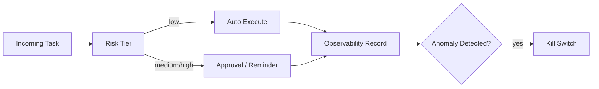

---
kb_id: ai-agent/platforms/openclaw-production-security-observability-and-personal-agent-selection-boundary
title: OpenClaw 工程评估：个人 Agent Gateway 什么时候能安全放权，什么时候必须收回到提醒或审批模式
domain: ai-agent
component: openclaw
topic: production-security-observability-selection-boundary
difficulty: advanced
status: reviewed
sidebar_position: 12
version_scope: OpenClaw official site, GitHub repository, security advisory, and 实践资料 OpenClaw tutorials as verified on 2026-05-12
last_verified_at: '2026-05-12'
source_ids:
  - openclaw-site
  - openclaw-github
  - openclaw-security-advisory-ghsa-m3mh-3mpg-37hw
  - practice-openclaw-tutorial
  - practice-hand-on-openclaw
claim_ids:
  - practice-p1-claim-0007
  - practice-p1-claim-0008
tags:
  - ai-agent
  - openclaw
  - observability
  - security
  - approval
---
## 个人 Agent Gateway 的真正选型边界，不在“会不会干活”，而在“能不能在高权限环境里可控地干活”
OpenClaw 这类系统最吸引人的地方，是它能把个人上下文和行动能力真正组合起来；最难的地方，也是它太容易进入高权限区域。工程上最关键的判断，不是它会不会做事，而是当前动作是否值得自动执行，还是应该只给提醒、给建议、给审批入口。

### 解决什么问题
这页要回答：

1. 哪些个人助手能力适合自动执行。
2. 哪些能力必须进入审批或只提醒模式。
3. 线上该监控哪些信号来判断系统是否正在越权。

### 核心对象
| 对象 | 作用 | 判断信号 |
| --- | --- | --- |
| Risk Tier | 给动作分风险级别 | 读、写、发消息、转账、删改 |
| Approval Mode | 定义自动执行、待批执行或仅提醒 | 当前动作适配哪种模式 |
| Observability Record | 记录谁触发、做了什么、结果如何 | 越权与误触发排查 |
| Kill Switch | 遇到异常时快速停用能力 | 插件级、任务级、全局级 |
| Selection Boundary | 判断当前系统是否还适合自动化 | 权限强度、误触发成本 |

### 执行链路
1. 请求进入后先根据 Risk Tier 分类。
2. 低风险动作可以在受限环境下自动执行。
3. 中高风险动作切到 Approval Mode 或 Reminder Mode。
4. 结果统一进入 Observability Record。
5. 一旦检测到越权或异常频率升高，Kill Switch 立即关闭对应能力。



### 一致性与容错边界
OpenClaw 的安全边界一定要讲清楚：

1. 自动执行不等于无风险，低风险也要可审计。
2. 审批通过不等于后续状态一定没变，高风险任务要防止批准后环境漂移。
3. Reminder Mode 不是“功能降级失败”，而是高风险场景下更合理的产品选择。
4. Kill Switch 必须足够细粒度，不能只能一刀切关全系统。

### 性能模型
高权限个人 Agent 的性能不只体现在延迟，也体现在治理负载：

1. 审批越多，用户等待越长。
2. 观测记录越细，存储和回放成本越高。
3. 风险分级越保守，自动化收益越低。
4. 但放权越多，一旦出错，修复成本越高。

```yaml
personal_agent_policy:
  auto_execute:
    - summarize_file
    - read_calendar
  approval_required:
    - send_external_message
    - modify_workspace_files
  reminder_only:
    - financial_transfer
    - account_settings_change
```

### 生产排障
如果 OpenClaw 出现越权或误触发，优先查：

1. Risk Tier 是否分错级。
2. Approval Mode 是否被绕过或默认放行。
3. Observability Record 是否足够说明动作来源和执行链。
4. Kill Switch 是否能及时关闭具体插件或任务。

### 最小样例
```python
if risk_tier(action) == "high":
    require_human_approval(action)
elif risk_tier(action) == "critical":
    switch_to_reminder_only(action)
```

### 和相邻技术的边界
这页强调的是个人 Agent Gateway 的放权边界，而不是通用风控理论。OpenClaw 的独特之处在于：个人上下文很深、动作很近、误触发代价很高，因此审批和提醒模式往往不是可选项，而是核心设计点。

## 本页结论
OpenClaw 的真正工程边界，不在于它能不能把任务做完，而在于它能不能在高权限环境里可控地做事。把 Risk Tier、Approval Mode、Observability 和 Kill Switch 讲清，个人 Agent Gateway 的价值与风险才真正对等。
