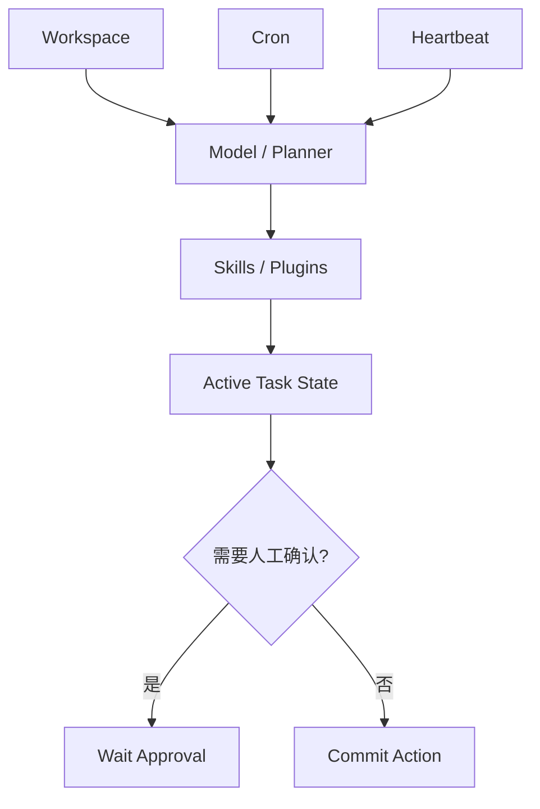

---
kb_id: ai-agent/platforms/openclaw-workspace-skills-plugins-and-active-task-governance
title: OpenClaw 深水区：Workspace、Skills / Plugins、Cron、Heartbeat 为什么必须放进同一套治理模型里
domain: ai-agent
component: openclaw
topic: workspace-skills-plugins-active-task-governance
difficulty: advanced
status: reviewed
sidebar_position: 11
version_scope: OpenClaw official site, GitHub repository, security advisory, and 实践资料 OpenClaw tutorials as verified on 2026-05-12
last_verified_at: '2026-05-12'
source_ids:
  - openclaw-site
  - openclaw-github
  - openclaw-security-advisory-ghsa-m3mh-3mpg-37hw
  - practice-openclaw-tutorial
  - practice-hand-on-openclaw
claim_ids:
  - practice-p1-claim-0007
  - practice-p1-claim-0008
tags:
  - ai-agent
  - openclaw
  - workspace
  - plugins
  - cron
---
## OpenClaw 最危险也最有价值的地方，是它把长期上下文、扩展能力和主动执行都放在了同一个运行时里
很多系统只做被动对话，风险相对可控；但 OpenClaw 这类个人 Agent 平台把 Workspace、Skills / Plugins、Cron 和 Heartbeat 放在同一个系统里之后，能力会大幅增强，治理难度也会同步提升。真正专业的分析，不应只讲“它支持插件和定时任务”，而要讲这些对象为什么必须进入同一套治理模型。

### 解决什么问题
这一层主要回答：

1. Workspace 中哪些内容属于长期有效上下文，哪些只是临时状态。
2. Skills / Plugins 怎样在扩展能力的同时不突破权限边界。
3. Cron / Heartbeat 如何在无人值守时仍保持可控。
4. 主动任务、被动消息和长期记忆怎样共享状态而不相互污染。

### 核心对象
| 对象 | 作用 | 关键边界 |
| --- | --- | --- |
| Workspace | 保存长期上下文和配置 | 目录范围、敏感信息、版本 |
| Skills / Plugins | 扩展外部动作能力 | 来源校验、权限声明、更新策略 |
| Cron Task | 周期性触发任务 | 去重、失效、取消 |
| Heartbeat | 主动检查与巡检 | 触发频率、停止条件 |
| Active Task State | 保存主动任务当前状态 | 是否已执行、是否待审批 |

### 执行链路
1. Workspace 先提供长期上下文与配置。
2. Skills / Plugins 负责把任务转成实际动作。
3. Cron 和 Heartbeat 负责在没有用户消息时触发主动链路。
4. Active Task State 记录任务是否已运行、是否待确认、是否失败待重试。



### 一致性与容错边界
这一层一定要讲明白：

1. Workspace 不能同时承担长期事实、临时状态和敏感缓存而没有分层。
2. Plugin 安装成功不等于动作自动可信，来源和权限都要单独校验。
3. Cron / Heartbeat 触发后要有去重和终止语义，否则会重复执行。
4. 主动任务状态要和聊天消息链路分开保存，避免人工确认丢失。

### 性能模型
OpenClaw 的后台能力也会带来负载成本：

1. Workspace 越大，上下文加载越慢。
2. Skills / Plugins 越多，匹配和选择成本越高。
3. Cron / Heartbeat 越密集，后台任务冲突与重复概率越高。
4. 主动任务状态记录过重，会增加恢复和回放成本。

```json
{
  "workspace_scope": "project_a_only",
  "plugin_requirements": {"signed": true, "least_privilege": true},
  "cron_task": {"schedule": "0 9 * * *", "deduplicate": true},
  "heartbeat": {"interval_minutes": 60, "max_consecutive_failures": 2}
}
```

### 生产排障
排 OpenClaw 的主动任务问题时，建议看：

1. Workspace 里是不是已经混入了不该长期保留的信息。
2. Skills / Plugins 是否版本漂移或权限过宽。
3. Cron / Heartbeat 是否重复触发同一任务。
4. Active Task State 是否丢失审批状态或失败状态。

### 和相邻技术的边界
这一页讲的是 OpenClaw 的主动任务治理，不是一般 Agent 记忆架构。它的特殊性在于：个人上下文、插件扩展和后台任务都在同一个运行时里叠加了。

## 本页结论
OpenClaw 的 Workspace、Skills / Plugins、Cron 和 Heartbeat 不能分开理解。它们共同构成个人 Agent 的长期能力，也共同构成主要风险面；治理模型必须同时覆盖这几层，系统才可能真正可控。
