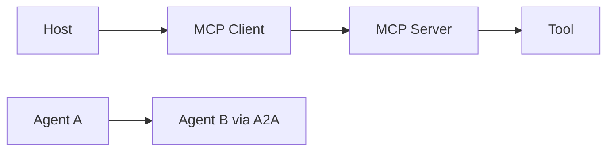

## 一句话定位

MCP 更偏把 AI 应用和外部工具、资源、提示词连接起来，A2A 更偏 Agent 之间发现、通信和任务协作。二者解决的问题层次不同。

## 核心对象

- MCP Host 是用户实际使用的 AI 应用或开发环境。
- MCP Client 维护和 Server 的协议连接。
- MCP Server 暴露 tools、resources 和 prompts。
- Tool 是可执行动作，Resource 是可读上下文，Prompt 是工作流模板。
- A2A Agent Card 描述 Agent 能力和发现信息。
- A2A Task/Message/Artifact 表示任务、消息和产物。

## 执行链路

1. Host 连接 MCP Client。
2. Client 发现 Server 暴露的能力。
3. 模型决定是否调用工具，Host/Client 做权限和参数校验。
4. Server 执行能力并返回结构化结果。
5. A2A 场景下 Agent 根据能力发现另一个 Agent 并提交任务。

## 保证项与边界

- MCP 连接模型应用和外部上下文/工具，不负责全部 Agent 协作。
- A2A 解决 Agent 发现和任务通信，不替代所有工具协议。
- Tool 是可执行动作，需要权限和副作用控制。
- Resource 是可读上下文，不是可执行操作。

边界是知识库质量的分水岭。一个组件通常只保证自己负责的语义，端到端正确性还依赖调用方、存储层、计算层、权限系统、重试策略和运维流程共同成立。

### 为什么 MCP 与 A2A 不能互相替代
MCP 更像“把能力接进来”的协议，A2A 更像“让不同 Agent 找到彼此并协同完成任务”的协议。一个系统可能同时需要二者，但它们解决的问题并不在同一层。把这层差异说清，后续的权限设计、排障路径和性能判断才不会混乱。

## 性能模型

- 瓶颈通常在工具实现、网络、认证、上下文体积和模型调用次数。
- 工具列表过大可能增加模型选择成本和误调用概率。
- 跨 Agent 协作会放大延迟、错误传播和审计复杂度。

性能分析不要从“调大参数”开始，而要先判断瓶颈位于输入、调度、网络、存储、状态、计算、序列化还是下游系统。任何调优动作都应该先有基线指标，再做单变量变更。

### 评估性能时要分清“单次调用成本”和“协作放大成本”
MCP 侧更多出现的是单次 tool/resource 调用的网络和序列化成本，A2A 侧更容易出现多 Agent 往返、任务切换和产物传递带来的累计延迟。把这两类成本拆开，才知道优化重点究竟应该放在工具实现、协议往返还是任务编排上。

## 状态变化与容量判断

分析 MCP 与 A2A 时，要把状态变化拆成四层：控制面状态、数据面状态、元数据状态和外部依赖状态。控制面状态决定谁来调度、谁来提交、谁来恢复；数据面状态决定数据是否已经写入、可见、可重放或可清理；元数据状态决定查询和治理能否正确找到对象；外部依赖状态决定端到端链路是否真的完成。

容量判断不能只看平均值。平均值决定长期资源成本，峰值决定限流和扩容，长尾决定用户体验和故障放大概率。任何组件一旦进入生产，都应该有容量基线、增长趋势、保留策略、失败重试上限和降级方案。

## 治理、安全与变更控制

治理不是上线后的附加项，而是架构的一部分。权限、审计、隔离、保留期、变更记录、回滚策略和人工审批应该在设计阶段就明确。否则系统规模扩大后，会出现无法追踪、无法恢复或无法解释的问题。

对于协议、API、表格式、事务、权限和状态恢复这类内容，必须区分官方保证、实现细节和工程经验。官方保证可以写成明确结论；实现细节要标明版本范围；工程经验只能写成适用条件下的建议。

## 发布前验证路径

发布级知识不能只停留在“讲得通”。每个关键结论都要能被验证：第一，用官方文档或已登记来源确认概念边界；第二，用执行计划、日志、指标或 trace 找到运行证据；第三，用一个失败场景检验恢复路径；第四，用一个容量增长场景检验性能模型；第五，用一个相邻技术对比检验职责边界。

如果某个结论无法被这些方式验证，就不要把它写成绝对判断。更稳妥的写法是说明“在什么配置、什么版本、什么数据规模、什么失败条件下成立”。这能避免知识库变成口号，也能让题库答案具备可追溯性。

### 发布前验证真正要防的是“边界讲对了，但运行假设没验证”
很多系统在知识层面对 MCP 和 A2A 的职责区分并没有说错，问题出在上线前没有验证权限、重试、长链路超时和失败恢复这些运行层假设。把验证前移，知识页里的边界才会真正变成可落地的工程约束。

## 学习时的核对清单

学习 MCP 与 A2A 时至少核对五件事：对象是否讲清、状态是否讲清、链路是否讲清、边界是否讲清、排障证据是否讲清。只要其中一项缺失，回答就容易停在术语层。真正的掌握应该能把一个现象还原成对象状态变化，再把状态变化还原成可观测证据，最后给出有代价说明的处理动作。

还要避免两个极端：一个极端是只背官方定义，无法解释生产问题；另一个极端是只讲经验参数，无法说明为什么有效。发布级知识应该把定义、机制、证据和操作连起来，让读者既知道“是什么”，也知道“为什么这样设计”“什么时候不成立”“出了问题先看哪里”。

因此，每次补充 MCP 与 A2A 内容时，都要同时补三类材料：机制图、排障证据和边界说明。机制图帮助理解对象如何协作，排障证据帮助定位真实问题，边界说明帮助避免把组件能力夸大成端到端保证。

## 工程样例

```json
{
  "name": "search_orders",
  "description": "按订单号查询订单，只读操作",
  "inputSchema": { "type": "object", "required": ["order_id"] }
}
```



## 相邻技术边界

- MCP 主要解决工具和上下文接入，A2A 主要解决 Agent 间协作。
- 函数调用是模型 API 层能力，MCP 是外部工具生态协议。
- 协议接入不等于生产治理，还需要权限、审计和安全策略。

## 知识库到题库的派生方式

下面这些题目应该从本篇知识点派生，而不是脱离知识库单独理解：

1. MCP 的 Host、Client、Server 如何分工？
2. Tool、Resource、Prompt 为什么不能混淆？
3. A2A 和 MCP 的边界是什么？
4. 如何排查一次失败的 tool call？

复盘时如果答不出对象、链路、状态、边界和排障证据，就说明知识库还没有真正掌握，需要回到对应章节补齐。
