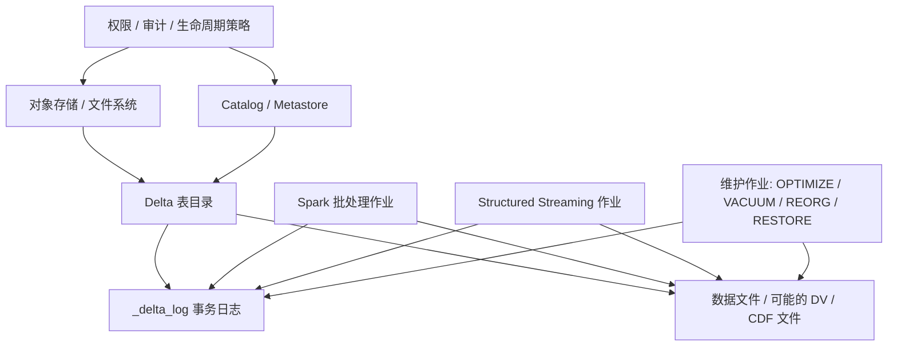

## 先把 Delta 放回整个平台里看
Delta Lake 从来不是孤立运行的单体系统。它总是嵌在一套更大的平台里：底下是对象存储或文件系统，上面是 Spark 等计算引擎，旁边是 Catalog、权限系统、调度平台和维护作业。很多回答之所以不深入，根因不是不会讲 Delta，而是没有把它放到这张完整架构图里。

## Delta 架构里至少有五类角色
| 角色 | 主要职责 | 不能误答成什么 |
| --- | --- | --- |
| 存储层 | 保存日志文件、数据文件和清理后的物理结果 | 不是事务规则本身 |
| Delta 协议层 | 定义日志动作、快照恢复、提交和兼容性规则 | 不是调度平台 |
| 计算引擎 | 扫描、过滤、Join、聚合、执行流批作业 | 不是表状态的真相来源 |
| Catalog / Metastore | 解析表名、表位置和部分管理语义 | 不是所有提交细节的唯一来源 |
| 维护与治理作业 | 做 compaction、vacuum、restore、reorg、审计和升级 | 不是可随意忽略的后台杂活 |

只要这五类角色没有分开，后面讲并发、排障、升级就一定会把责任边界说错。

## 为什么说 Delta 是“表协议层”，不是“数据库实例”
数据库思维容易把一张表背后的所有能力都想成一个封闭黑盒：读写、锁、权限、日志、事务都由一个服务统一掌控。Delta 不是这个模式。它更像一套表协议，把“什么叫一次合法提交、什么叫一个可恢复快照、什么叫兼容的读取客户端”规定清楚，而真正的执行和资源占用由计算引擎完成。

这个差异直接决定了两件事：

1. Delta 的很多能力必须和底层存储及引擎一起看，不能脱离上下文空讲。
2. Delta 的很多风险也来自边界处，比如对象存储权限、Catalog 映射错误、旧客户端访问新特性表、后台维护和前台流作业互相干扰。

## 计算引擎在 Delta 里扮演什么角色
以 Spark 为例，批作业和流作业都会参与 Delta 表的读写，但它们扮演的并不是“真相来源”，而是“协议的执行者”：

- 写入时，作业先根据当前快照决定要新增还是重写哪些文件。
- 然后它按照 Delta 协议准备日志动作，并尝试提交新版本。
- 读取时，它先恢复某个版本的快照，再由执行引擎做扫描、过滤和计算。

因此，面试里如果有人问“Delta 的 ACID 是不是 Spark 保证的”，正确回答应该是：事务语义来自 Delta 的日志协议和并发控制模型，Spark 只是最常见的执行和提交客户端。

## Catalog 的角色不能夸大，也不能忽略
很多团队只在路径表场景下使用 Delta，容易把 Catalog 看成可有可无。但一旦进入生产，多数环境仍然需要 Catalog 或 Metastore 提供：

1. 逻辑表名到物理位置的映射。
2. 表注册、权限治理和审计集成。
3. 多团队共享环境里的命名与管理边界。

同时也不能误以为 Catalog 取代了 `_delta_log`。真正定义表版本历史和文件状态的仍然是事务日志。Catalog 更多负责“我在平台里如何找到这张表、如何管理这张表”，而不是“某个版本到底新增了哪些文件”。

## Open table mode 与 catalog-managed mode 的差异
Delta 的传统模式主要依赖文件系统上的事务日志和对象存储语义。更近一步的 catalog-managed tables，则把部分提交原子性协调交给 Catalog。这个方向的重要意义不在于“换个注册方式”，而在于：

1. 它试图把表级提交和 Catalog 的控制平面更紧地绑在一起。
2. 某些过去很难在纯文件系统语义下完成的能力，例如更强的跨表协调，会更容易实现。
3. 它也意味着平台治理和兼容性的评估面会扩大，不再只是看数据路径和 Spark 版本。

这里要注意边界：这不是对所有传统 Delta 表的默认描述，而是较新的架构模式。回答时必须明确语境，不能把它说成所有 Delta 表天然都具备的能力。

## 并发安全不是“谁先写完文件谁赢”
架构视角下最容易被忽略的一点，是 Delta 的并发安全建立在“提交阶段验证”上，而不是文件级粗暴加锁。多个 writer 可以并行读快照、并行生成新文件，但真正决定是否成功的是提交时能否通过乐观并发校验。这一层是协议与客户端协作完成的，不是对象存储自己帮你完成的。

因此，真正的并发边界要同时满足：

1. 底层存储在 Delta 支持的语义范围内。
2. Writer 使用兼容协议和特性集。
3. 提交侧能够正确检测冲突并回滚失败写入。

## 生产设计里必须明确的边界问题
### 第一，权限边界在哪里
Delta 本身不是鉴权系统。真正的访问控制通常来自对象存储权限、Catalog 权限、计算平台租户边界和审计链路。`_delta_log` 和数据文件都必须受到同等级别保护，否则会出现“能改日志不能改数据”或“能删数据但看不到元数据”的危险状态。

### 第二，资源边界在哪里
OPTIMIZE、VACUUM、流写入、批写入、下游查询都可能同时访问一张表。Delta 不会自动替你解决资源争用；这属于调度平台、资源池和作业编排设计。

### 第三，兼容边界在哪里
协议升级、表特性启用、客户端版本差异、Spark 与 Delta 版本组合，都会改变“这张表现在谁还能安全读写”。架构设计时不能把这些问题留到上线当天才处理。

## 本页结论
Delta Lake 的架构核心不是“一个神奇的表目录”，而是“协议层 + 存储层 + 计算层 + Catalog 层 + 维护治理层”的协作。真正深入到原理的回答，必须能指出每一层各自负责什么、出了问题先看哪一层、哪些能力是 Delta 负责，哪些是外围系统提供。

## 来源与事实边界
本页以 Delta 官方文档、并发控制、版本兼容、Catalog-managed tables 和 FAQ 为边界，总结角色分层与责任边界。关于企业内部权限、调度和成本治理，属于工程落地推导，不是 Delta 协议本身的硬规范。