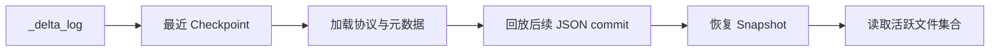

## 先把对象模型答对，后面的机制才不会散
Delta Lake 面试里最常见的问题，不是不会背名词，而是对象模型混乱。很多人把 `_delta_log`、checkpoint、快照、数据文件、历史版本、tombstone 混成一团，最后导致所有题目都只能停留在“有事务日志”这一级。真正可用于排障和设计的理解方式，是把 Delta 的对象拆成“权威状态对象、版本恢复对象、物理数据对象、兼容性对象”四层。

| 对象 | 作用 | 为什么重要 | 常见证据 |
| --- | --- | --- | --- |
| `_delta_log` | 存放事务日志版本与 checkpoint 的目录 | 是表状态的权威入口，不是附属目录 | 对象存储路径、日志版本文件、`_last_checkpoint` |
| JSON commit file | 一个提交版本对应的动作集合 | 体现一次原子提交到底改了什么 | `00000000000000000010.json` |
| Checkpoint | 快照重建的压缩中间点 | 避免每次都从版本 0 重放全部日志 | checkpoint Parquet 文件、`_last_checkpoint` |
| Snapshot | 某个版本下对读者可见的完整表状态 | 读者真正读取的是快照，不是目录 | `versionAsOf`、`timestampAsOf` |
| Protocol | 最低 reader / writer 兼容门槛 | 决定旧客户端能否继续访问表 | `DESCRIBE DETAIL`、日志中的 `protocol` action |
| Metadata | Schema、分区列、表属性等表级定义 | 决定表长什么样，以及怎样解释文件 | 日志中的 `metaData` action |
| AddFile | 新进入快照的活跃文件 | 读者真正会扫描的文件集合来源 | 日志中的 `add` action |
| RemoveFile | 从活跃集合中移除的文件记录 | 决定哪些旧文件已逻辑失效 | 日志中的 `remove` action |
| SetTransaction | 应用级幂等写入标识 | 支撑 `txnAppId` / `txnVersion` 去重语义 | 日志中的 `txn` action |
| CommitInfo | 记录操作类型、参数、指标和用户上下文 | 是历史审计和排障入口 | `DESCRIBE HISTORY` |

## Snapshot 到底由哪些状态组成
协议层给出的定义非常关键：一个 Delta 快照并不只是“当前活跃数据文件列表”。它至少包括协议版本、表元数据、活跃文件、尚未过期的最近 tombstone，以及成功提交过的应用事务标识。这个定义有两个现实含义：

1. 快照是表级状态，而不是单纯的文件清单。
2. 幂等写入、历史清理和读取恢复都依赖快照里不止一种动作类型。

这也是为什么只盯着 Parquet 文件本身，永远解释不清 Delta 的恢复和并发语义。真正的状态在日志里，而数据文件只是快照引用的物理载体。

## 一次提交文件里通常会出现哪些 action
协议里的 action 才是理解 Delta 日志的最小语义单位。最常见的是：

- `protocol`：声明当前表最低读写协议要求。
- `metaData`：声明表 Schema、分区列、配置和描述信息。
- `add`：把一个数据文件加入当前版本的活跃集合。
- `remove`：把一个旧文件标记为失效，但物理删除通常推迟到保留期之后。
- `txn`：记录某个应用事务号是否已经处理过。
- `commitInfo`：给这次提交打上“这是 append、merge、optimize 还是 restore”的上下文标签。

下面这个片段不是完整协议，只是帮助建立心智模型：

~~~json
{"protocol":{"minReaderVersion":1,"minWriterVersion":2}}
{"metaData":{"id":"...","partitionColumns":["dt"],"configuration":{"delta.appendOnly":"true"}}}
{"add":{"path":"part-0000-....parquet","size":1048576,"partitionValues":{"dt":"2026-05-09"}}}
{"commitInfo":{"operation":"WRITE","operationParameters":{"mode":"Append"}}}
~~~

真正排障时，不能只看 `commitInfo`。要把 `add`、`remove`、`txn` 和协议版本一起看，才能判断“到底是新数据进来了，还是只是做了布局重写”。

## Checkpoint 的价值不只是“更快”
很多回答会把 checkpoint 说成“日志太长所以做个快照”。这个表述不算错，但还不够到位。更准确的说法是：checkpoint 把某个时间点之后恢复快照所需的关键信息固化下来，避免每次从最早日志版本重新回放。根据协议，checkpoint 会包含协议、元数据、活跃文件、尚未过期的 remove 记录以及事务标识等内容。

这意味着 checkpoint 直接影响三类事情：

1. 新 reader 初始化快照的成本。
2. 历史日志长期增长后的可恢复性和元数据负担。
3. 日志清理能否在保留边界内安全推进。

因此，checkpoint 问题往往不是孤立的元数据优化问题，而是读取延迟、流消费恢复和历史保留策略的一部分。

## RemoveFile、tombstone 和物理删除不是一回事
`remove` action 只表示某个文件已经不再属于当前活跃快照，不代表这个文件会立刻从对象存储消失。Delta 之所以能支持 time travel 和 stale reader 保护，正是因为逻辑移除和物理删除分离：

1. 提交时先在日志里让旧文件失效。
2. 在保留期内保留这些旧文件，以便历史读取、回滚或慢 reader 继续完成。
3. 之后再由 `VACUUM` 或相关清理策略决定是否物理回收。

这一点如果答不清，就很容易把“表里已经删除”误说成“对象存储里已经没有”。

## Protocol 与 table feature 是长期兼容的总闸门
Delta 早期主要依赖最小 reader / writer version 表达兼容性。新版本引入 table feature 之后，兼容粒度更细，但本质没变：表会显式声明访问它所需的能力，旧客户端如果不支持，就不能假装“尽量读一下”。

这就是为什么列映射、删除向量、默认值、行跟踪这类特性不能只当成功能开关。它们本质上也是兼容性变更。生产环境评估一个特性时，要同时评估三件事：

1. 它会不会抬高最小读写门槛。
2. 访问这张表的所有批处理、流处理和周边工具是否都兼容。
3. 这个升级是否可逆，还是只能前进不能回退。

## 高级行级特性会往对象模型里继续加状态
如果表启用了删除向量，行删除不一定马上重写 Parquet 文件，而是可以先把“哪些行被删了”记录为额外状态；如果启用了行跟踪，表还会为每行记录元数据身份。它们的共同特点是：

1. 都会让“快照 = 数据文件列表”这件事变得更不完整。
2. 都可能引入新的协议要求。
3. 都要求排障时不能只看数据文件数量，还要看特性状态和兼容性。

所以，当题目谈到删除、CDC、细粒度恢复或下游同步时，一定要先确认表有没有启用这些特性。

## 最小观察入口
以下命令足够支撑大多数对象级排障起点：

~~~sql
DESCRIBE DETAIL delta.`s3://warehouse/sales_delta`;
DESCRIBE HISTORY delta.`s3://warehouse/sales_delta`;
SHOW TBLPROPERTIES delta.`s3://warehouse/sales_delta`;
~~~

再配合直接查看 `_delta_log` 目录中的 JSON 和 checkpoint 文件，通常就能判断问题落在协议、元数据、活跃文件集合，还是保留策略。

## 执行链路
要把 Delta 的对象模型讲深，最好把“读快照是怎么恢复出来的”说成一条链：

1. 从 `_delta_log` 目录和 `_last_checkpoint` 找到最近 checkpoint。
2. 先加载 checkpoint 中固化的协议、元数据、活跃文件、tombstone 和事务状态。
3. 再从 checkpoint 之后的 JSON commit file 继续回放新增动作。
4. 最终恢复出某个版本的完整 snapshot，供读者使用。



### 为什么这条链比“看历史版本号”更重要
因为版本号只告诉你“到了哪一版”，并不告诉你“这一版的状态由哪些动作恢复出来”。只有把恢复链讲清楚，才能真正定位 checkpoint、commit、remove、txn 或 protocol 哪一层出问题。

## 一致性与容错
Delta 的一致性与容错边界主要体现在快照恢复和逻辑删除分离：

1. 写入成功的定义是新 commit 成为日志历史的一部分，而不是对象存储里多了文件。
2. 逻辑删除通过 `remove` 进入快照状态，不等于立刻物理回收。
3. checkpoint 让恢复更快，但不会改变快照语义本身。
4. protocol 和 table feature 抬高兼容门槛后，旧客户端可能无法继续安全访问。

### 为什么 Delta 的很多故障都要先回到日志对象看
因为真正的权威状态在 `_delta_log` 中，而不是在数据目录表面形态里。只看 Parquet 文件，很容易把“文件存在”误判成“当前版本可见”，也很容易把兼容性问题误判成数据问题。

## 性能模型
Delta 的性能并不只由数据文件决定，日志对象也会成为关键成本点：

1. checkpoint 频率影响 snapshot 初始化成本。
2. JSON commit 持续增长会抬高恢复和历史分析成本。
3. 删除向量、行跟踪等高级特性会增加快照状态复杂度。
4. VACUUM、OPTIMIZE、checkpoint 与正常写入之间也会相互影响。

### 为什么“日志层健康”也是性能问题
因为读表前必须先恢复 snapshot。如果日志链过长、checkpoint 不合理或特性状态复杂，读取还没真正开始扫数据，就会在元数据恢复阶段先变慢。

## 生产排障
如果用户反馈“同一张表历史版本异常、删除后还能读到、或旧客户端突然不能访问”，建议按对象层次排：

1. 先看 protocol 和 feature 是否发生升级。
2. 再看 checkpoint 与后续 commit 回放是否能恢复出预期 snapshot。
3. 再看 `add` / `remove` / `txn` 的组合是否与预期操作匹配。
4. 最后才检查对象存储中文件的物理残留和清理策略。

### 日志排障样例
```json
{
  "version": 148,
  "protocol_changed": true,
  "checkpoint_used": 140,
  "replayed_json_commits": 8,
  "suspected_root_cause": "reader_incompatible_with_new_feature"
}
```

这个样例说明，很多 Delta 故障不是数据坏了，而是日志状态、恢复链或兼容性边界发生了变化。

## 本页结论
Delta Lake 的核心对象不是“表 + 文件”这么简单，而是一组围绕快照构建的状态动作。真正深入到原理的回答，应该能说清快照由哪些动作恢复出来、逻辑删除和物理删除为什么分离、协议和特性如何影响兼容性，以及为什么 `DESCRIBE HISTORY` 只能看到部分表象而不是全部真相。

## 来源与事实边界
本页以 Delta 协议、Utility、Versioning、Deletion Vector、Row Tracking 和表属性文档为边界，重点解释对象模型及其恢复含义。具体日志字段是否在某个发行版新增扩展，仍应以对应版本的协议文档为准。
