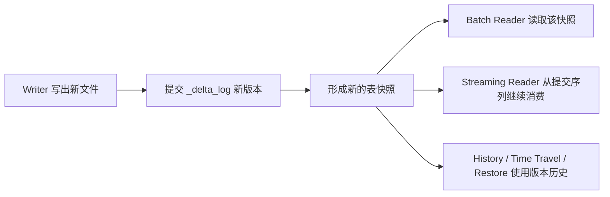

## Delta Lake 解决的是“数据湖上表级正确性”问题
Delta Lake 的官方定位不是查询引擎，而是构建在数据湖之上的开源存储层。它最重要的价值，是把原本散落在对象存储目录里的 Parquet 文件，提升为一张有版本、有提交边界、有 Schema 管理能力的表。只要理解了这一点，很多后续设计与排障问题都会自然变得清楚：Delta 真正管理的不是“文件夹”，而是“某个时刻哪些文件构成表的有效状态”。

如果只把 Delta Lake 理解成“给 Spark 加 ACID”，答案会明显偏浅。更准确的说法是：Delta 用 `_delta_log` 事务日志把版本历史、元数据、活跃文件集合和提交信息固定下来，让批处理和流处理都能围绕同一份表状态工作。

## 它把真相来源从目录结构移到了事务日志
传统数据湖表最脆弱的地方，是读者通常依赖目录扫描推断“哪些文件属于这张表”。这种做法一旦遇到并发写入、失败重试、对象存储列举延迟、Schema 演进或历史回溯，就很容易出错。Delta 的做法是把真相来源收敛到 `_delta_log`：

1. 写入者先准备新的数据文件。
2. 然后提交一个新的日志版本，记录哪些文件新增、哪些文件失效、元数据是否变化。
3. 读取者永远从某个确定的日志版本恢复快照，而不是从“目录里现在碰巧能看到的文件”恢复状态。

这也是 Delta 能提供 time travel、快照隔离和表级并发控制的前提。如果没有这层日志，后面的 ACID、回滚和流式增量语义都无从谈起。

## Delta 自己保证什么，不保证什么
把边界说清，比堆术语更重要。

| Delta Lake 负责保证的内容 | 不应误认为它自动保证的内容 |
| --- | --- |
| 单表级别的原子版本提交 | 跨多张表的全局事务 |
| 读者基于某个已提交快照读取一致状态 | 外部消息、缓存、数据库副作用自动幂等 |
| 通过事务日志和协议版本维护表状态 | 底层对象存储权限、网络、生命周期策略 |
| 通过协议和特性门槛约束读写兼容性 | 所有旧客户端天然支持所有新特性 |

这里最容易被误答的是“Delta 是否支持多表事务”。官方 FAQ 给出的边界非常明确：Delta 的事务保证以单表为单位，不支持传统意义上的多表事务和外键。这意味着如果业务写一张 Delta 表的同时还要更新另一张表或外部系统，补偿、幂等和一致性编排仍然属于上层系统责任。

## 为什么它和 Spark 关系很深，但又不能把两者混为一谈
很多团队第一次接触 Delta，是通过 Spark 读写 `format("delta")`。这会让人误以为 Delta 是 Spark 私有功能。实际上，Spark 只是最常见的执行引擎之一；Delta 自己负责的是表格式、日志协议和状态边界，真正的扫描、Join、Shuffle、任务调度、流式执行仍然由计算引擎承担。

所以排障时必须先分层：

1. 查询慢，是 Spark 计划、Shuffle 或资源问题，还是 Delta 布局问题。
2. 数据不一致，是事务日志提交失败、冲突回滚，还是上层作业重复写入。
3. 流式消费异常，是 Delta 日志保留期、CDF 配置问题，还是 Structured Streaming checkpoint 问题。

只要把“表语义”和“执行引擎语义”混在一起，后面的定位就会一路跑偏。

## 什么时候应该优先考虑 Delta Lake
以下场景最能体现 Delta 的价值：

- 需要在对象存储或数据湖上获得稳定的表级 ACID 语义。
- 同一张表既要支持批处理写入，也要支持流处理读取或增量消费。
- 需要回看历史版本、恢复误删数据、审计写入来源和操作类型。
- 表会持续演进，需要在 Schema、约束、列重命名、删除向量或协议升级之间做长期治理。
- 数据规模足够大，目录扫描、小文件和并发写入已经不再能靠人工约定解决。

相反，如果只是单机临时分析、小规模短生命周期数据，Delta 的收益未必立刻体现。但只要进入多作业并发、对象存储、持续演进和生产治理阶段，Delta 通常会从“锦上添花”变成“平台基础边界”。

## 最容易被忽略的三个硬边界
### 第一，文件存在不等于数据已经可见
写入任务先落数据文件，再提交事务日志。只有日志版本成功提交后，新文件才进入快照。生产环境里看到路径下多了一批 Parquet 文件，并不能直接证明这批数据已经属于表。

### 第二，旧版本可读依赖保留策略
Time travel 不是无限期能力。历史日志和被逻辑删除的旧文件如果被清理，旧版本就可能无法再恢复。`VACUUM`、日志保留和流作业滞后要统一治理，不能只盯着存储成本。

### 第三，新特性经常伴随协议升级
列映射、删除向量、默认值、行跟踪等特性会抬高读写协议要求。升级一张表的能力边界，不只是改一行配置，还会影响所有访问这张表的客户端版本。

## 建议阅读路径
1. 先看 [核心对象与状态切面](./core-objects-state.md)，把 `_delta_log`、checkpoint、快照和 tombstone 的关系理顺。
2. 再看 [写入路径与提交边界](./write-path.md) 和 [读取路径与快照可见性](./read-path.md)，把读写如何串起来搞清楚。
3. 接着看 [一致性、并发控制与事务边界](./consistency-boundaries.md)，把 Delta 真正保证到哪一层说准。
4. 再进入 [Schema 演进、约束与列映射](./schema-evolution-constraints-and-column-mapping.md)、[DML、MERGE 与删除向量](./dml-merge-delete-vectors.md)、[流处理与 CDF](./streaming-and-cdf.md) 这些生产高频专题。
5. 最后结合 [维护服务与长期治理](./maintenance-services.md)、[性能模型](./performance-model.md) 和 [发布质量与校验清单](./release-quality-guide.md) 建立运维视角。

## 本页结论
Delta Lake 的核心不是“一个支持 ACID 的文件格式”，而是“把数据湖文件提升为可版本化、可恢复、可并发治理的表状态系统”。只要回答能围绕事务日志、快照、协议和保留边界展开，就已经进入原理层；如果还停留在“支持 time travel、支持 merge”这种功能罗列，就还没有真正说到 Delta 的骨架。

## 来源与事实边界
本页以 Delta 官方文档、协议、并发控制、版本兼容和 FAQ 为边界，聚焦稳定机制和工程边界。具体客户端默认配置、特定云平台实现和企业内部管控规则，不应被当成 Delta 协议本身的通用事实。
