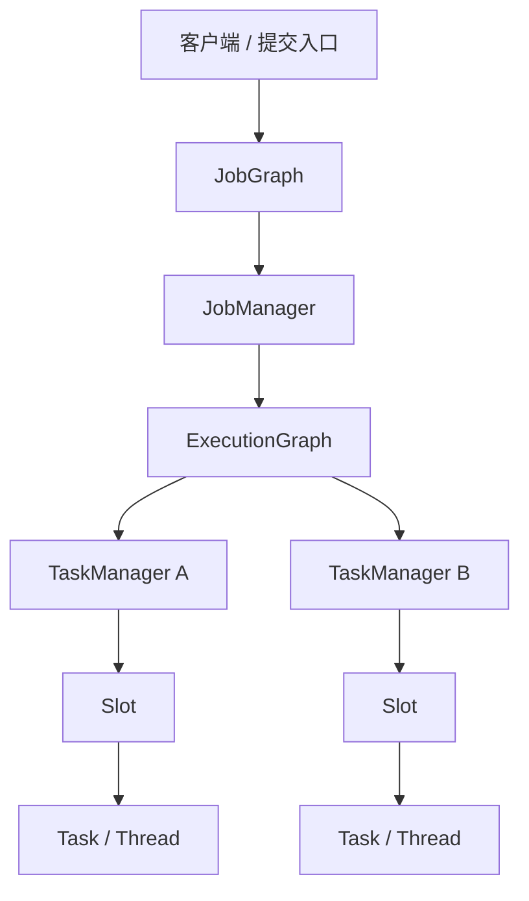

## 先看运行时拓扑
Flink 的架构不是“几台机器 + 一个调度器”这么简单，而是把编排、执行、状态和失败恢复拆成不同角色，再让这些角色在同一条作业图上协作。

## JobManager、TaskManager 和图的转换顺序


这张图的重点不是“谁连着谁”，而是每一层的责任被刻意拆开了：

- `JobGraph` 表示逻辑执行图，还是偏编译期。
- `ExecutionGraph` 表示可调度的运行时图，已经带上执行尝试和并行子任务。
- `JobManager` 负责调度、checkpoint 和恢复协调。
- `TaskManager` 负责真正运行 task，并且把计算结果和状态变化汇报回控制面。

## task、chain、slot 不是同一个概念
| 概念 | 不是 | 是 | 关键误区 |
| --- | --- | --- | --- |
| Task | 不是单个 operator 的别名 | 由一个或多个 chained operator 组成的执行单元 | 以为每个 operator 都一定独占线程 |
| Chaining | 不是随便拼接逻辑 | 减少线程切换和缓冲开销的运行时优化 | 以为 chaining 只是“代码风格” |
| Slot | 不是 CPU 核心 | TaskManager 上的资源调度单元 | 以为 slot 天然等于 CPU 隔离 |
| Pipelined region | 不是整个 job | 因 pipelined 交换连成的最小失败恢复区域 | 以为任意失败都要整图重启 |

## 为什么 slot 不是 CPU 隔离
Flink 允许同一 job 的多个 subtask 共享 slot。这样做的目的，是让一条数据处理链尽量放在更少的 slot 里，减少跨进程和跨线程开销。

- slot 主要隔离 managed memory 和调度边界。
- slot 不提供严格的 CPU 隔离。
- 所以调大 parallelism 不一定自然变快，真正限制常常来自链路长度、shuffle、外部 IO 或共享资源争用。

## 失败恢复为什么不一定重启全图
Flink 的现代失败恢复不是“任意失败都拉起整个 job”，而是尽量重启最小的 pipelined region。

- pipelined 交换把相邻任务连成一个恢复单元。
- 一个 region 出故障时，控制面只需要重启受影响的那一组任务。
- 这样能减少无关 task 的重跑，也减少大作业故障后的恢复面。

## 生产里先看哪几个判断点
1. `parallelism` 是否和 slot 数、共享策略一致。
2. 关键链路是不是被 chain 过度压缩，导致排障时看不出真实瓶颈。
3. 是否存在单个高开销 operator 把整条链路拖慢。
4. 失败是否主要集中在某个 pipelined region，而不是全局资源不足。
5. 是否把 slot 当成 CPU 容器去理解，结果在资源规划上走偏。

## 一个最小映射示意
```text
Source -> Map -> KeyBy -> Window -> Sink
   |        |        |        |
   |        |        |        +-- 可能落在另一个 task / region
   |        |        +----------- 重新分区边界
   |        +-------------------- 常常仍在同一条 chain 里
   +----------------------------- 输入侧入口
```

这类图最值得记住的一点是：`operator` 的数量，不等于 `task` 的数量；`task` 的数量，也不等于 `slot` 的数量。

## 一致的理解顺序
先看 `JobGraph` 怎么被转成 `ExecutionGraph`，再看 `ExecutionGraph` 怎么分配到 `TaskManager` 和 `slot`，最后才看哪个 operator 在这条链里最重。

## 来源与事实边界
本页只使用当前知识库登记的官方 source 和 claim。涉及 failover、slot sharing 或调度默认行为时，应该按当前 Flink 版本的官方文档复核，不把某个版本或某个部署方式的默认行为当成永久规则。

### 来源

`flink-architecture-doc`、`flink-docs-home`、`flink-stateful-stream-processing`、`flink-working-with-state`、`flink-task-failure-recovery`

### 事实声明

`flink-claim-0003`、`flink-claim-0004`、`flink-claim-0005`、`flink-claim-0022`、`flink-claim-0023`、`flink-claim-0024`、`flink-claim-0025`、`flink-claim-0030`
