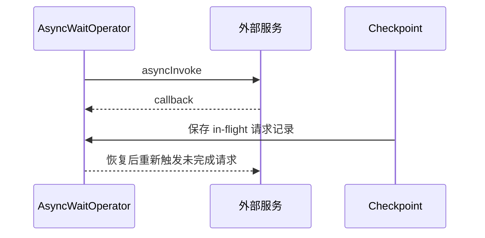

## Async I/O 解决的不是“多开线程”
它解决的是外部访问等待时间太长的问题。同步调用里，一条记录必须等外部系统返回；Async I/O 让一个并行实例同时挂起多个请求，用并发等待换吞吐。

## 两种输出顺序
| 模式 | 特点 | 代价 |
| --- | --- | --- |
| unordered wait | 谁先返回谁先发，延迟低 | 结果顺序不稳定 |
| ordered wait | 保持输入顺序 | 慢请求会挡住后面的快请求 |

event time 启用后，watermark 会形成顺序边界，unordered 也不能无限乱序。

## 为什么不能只靠提高并行度
同步访问外部服务时，提高并行度确实可能提高吞吐，但它会同步放大 task 数、线程数、连接数、网络连接、buffer 和运行时管理开销。Async I/O 的价值在于：一个并行实例内部就可以挂起多个请求，不必为了等待外部系统而把 Flink 拆成大量并行 task。

这也是生产里常见的分水岭：如果瓶颈来自外部服务响应时间，而不是 Flink 算子 CPU，盲目增加 parallelism 往往只是把压力转移到外部服务。

## 请求、回调和 checkpoint


## exactly-once 的关键点
Async I/O 的 operator 会把 in-flight 请求对应的记录放进 checkpoint。恢复时，未完成请求会被重新触发。

这保证的是 Flink 内部状态和算子处理语义，不等于外部服务调用本身天然幂等。外部接口如果有副作用，仍然需要业务幂等键、去重表或事务边界。

## retry 不等于无限重试
Async I/O 支持内置 retry，但必须明确：

- 哪些异常要重试。
- 空结果是否要重试。
- 最多重试几次。
- 超时后是失败、降级还是丢弃。

## timeout 要和外部系统一起设计
timeout 不是随便写一个较大的数。过短会导致正常慢请求被误判失败；过长会让 in-flight 请求堆积，拖慢 checkpoint 和恢复。更合理的做法是把外部服务的 P95、P99 延迟、错误率、限流策略和 Flink checkpoint 间隔一起看。

如果外部服务有强副作用，例如扣减库存、发券、写订单状态，Async I/O 只能保证 Flink operator 自己的恢复一致性，不能替外部接口自动补上业务幂等。

## 最容易写错的地方
- 在 `asyncInvoke` 里阻塞。
- 把 AsyncFunction 当成多线程函数。
- ordered wait 下让慢请求拖住整条链路。
- 没有给外部服务做限流和熔断。

## 排障时怎么判断问题在 Async I/O
1. 看 async operator 的 busy、backpressured 和输出速率。
2. 看外部服务的响应时间和错误率。
3. 看 in-flight 请求数量是否长期接近容量上限。
4. 看 checkpoint duration 是否随外部超时同步拉长。
5. 对比 ordered wait 和 unordered wait 下的延迟分布。

## 一个最小示意
```java
AsyncDataStream.unorderedWait(
    input,
    new EnrichAsyncFunction(client),
    5_000,
    TimeUnit.MILLISECONDS,
    100
);
```

## 来源与事实边界
本页只依赖当前知识库登记的官方 source 和 claim。关于 retry API、DirectExecutor 和 AsyncWaitOperator 链接边界，应以当前 Flink 版本官方文档为准。

### 来源

`flink-async-io`、`flink-docs-home`、`flink-checkpointing`

### 事实声明

`flink-claim-0092`、`flink-claim-0093`、`flink-claim-0094`、`flink-claim-0095`、`flink-claim-0096`、`flink-claim-0097`、`flink-claim-0098`、`flink-claim-0099`、`flink-claim-0100`
