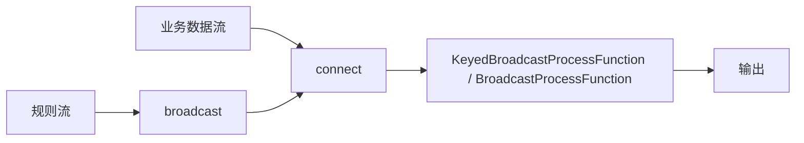

## 它解决什么问题
Broadcast State 适合动态规则流场景：一条主数据流持续到来，另一条规则流广播到所有下游并行实例，每个实例都保存同一份规则。

典型例子是风控规则、告警规则、广告投放规则或小规模维表规则。它的核心价值不是“广播更快”，而是让规则更新和主数据处理在同一个 Flink 作业里完成，避免每条业务数据都去外部系统查规则。

## 拓扑形状


## 读写权限非常关键
- broadcast 侧可以读写 broadcast state。
- 非 broadcast 侧只能读 broadcast state。
- 原因是没有跨 task 通信，只有 broadcast 侧能保证各并行实例都看到同样的规则更新。

这个权限设计会直接影响业务建模。规则更新只能在 broadcast 侧完成，主数据侧只能基于当前本地规则副本做判断。如果主数据侧也能修改规则，每个 subtask 看到的数据不同，就会把规则状态改成不同版本。

## 确定性要求
`processBroadcastElement` 必须在所有并行实例上产生一致的状态更新。不要依赖不同 task 之间的广播事件到达顺序，也不要用本地随机值、当前机器时间或外部不稳定查询来决定规则状态。

更安全的规则流设计方式是：每条规则事件携带规则 ID、版本号、操作类型和完整规则内容。更新逻辑只根据事件内容做确定性覆盖、删除或版本比较，而不是依赖本地环境。

## checkpoint 代价
每个 task 都会 checkpoint 自己的 broadcast state。这样可以避免恢复热点，但状态大小会随并行度放大。

## broadcast state 为什么容易被误用
它很像“把规则发给所有 task”，所以特别容易让人想当然地把大维表、复杂配置、甚至半结构化业务上下文都塞进去。

但 broadcast state 的设计目标不是承载大数据，而是承载“小而确定、每个并行实例都需要同一份”的规则。

如果规则很大，broadcast state 会带来两个直接成本：运行时每个并行实例都要持有规则副本，checkpoint 时每个相关 task 也要写出自己的副本。因此它适合“规则量可控、更新频率可接受”的动态规则，不适合把大规模维表完整塞进广播状态。

## timer 边界
在 KeyedBroadcastProcessFunction 里，timer 只能从 keyed 的非 broadcast 侧注册。broadcast 元素没有 key，因此不能在 broadcast 侧注册 timer。

如果确实需要规则维度的定时过期，通常要把规则过期时间写进 broadcast state，然后在主数据处理时判断规则是否过期，或者设计一条额外的规则删除事件，而不是指望 broadcast 侧直接注册 keyed timer。

## 最小示意
```java
MapStateDescriptor<String, Rule> rules =
    new MapStateDescriptor<>("rules", Types.STRING, TypeInformation.of(Rule.class));

BroadcastStream<Rule> ruleStream = rulesInput.broadcast(rules);
dataStream
    .keyBy(Event::key)
    .connect(ruleStream)
    .process(new RuleMatchFunction());
```

## 版本化规则更稳
动态规则系统最好不要只发“覆盖当前规则”的事件。更稳的事件格式通常包含：

```json
{
  "ruleId": "risk-001",
  "version": 17,
  "op": "UPSERT",
  "payload": {
    "threshold": 1000
  }
}
```

这样每个并行实例都能用同样的规则 ID 和版本号做确定性更新。即使规则事件短暂乱序，也能通过版本比较避免旧规则覆盖新规则。

## 不适合 Broadcast State 的情况
- 规则规模很大，放到每个并行实例都会浪费大量内存。
- 规则更新依赖外部实时查询，无法保证各 task 一致。
- 规则需要按 key 局部更新，不需要全量广播。
- 规则生命周期复杂到需要独立治理、审计和回滚。

## 最后要看什么
如果一个动态规则系统不能保证更新确定性、版本一致性和合理的状态规模，那它更像一个“分布式复制坑”，不是一个稳定的 Broadcast State 方案。

## 来源与事实边界
本页只依赖当前知识库登记的官方 source 和 claim。关于 broadcast state 是否在内存中、checkpoint 放大倍数和 restore 行为，应以当前 Flink 版本官方文档为准。

### 来源

`flink-broadcast-state-pattern`、`flink-docs-home`、`flink-working-with-state`

### 事实声明

`flink-claim-0119`、`flink-claim-0120`、`flink-claim-0121`、`flink-claim-0122`、`flink-claim-0123`、`flink-claim-0124`
