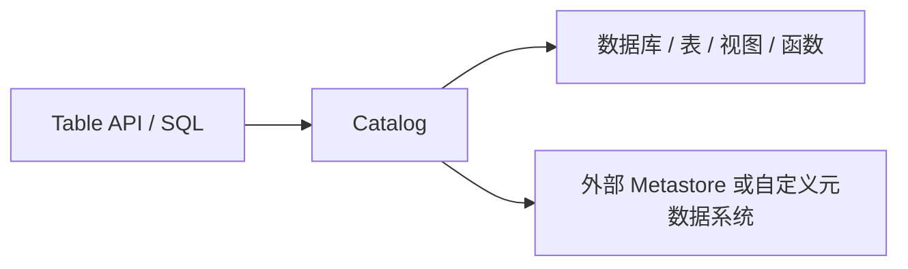

## Catalog 不是“表名列表”
Catalog 在 Flink 里承担的是元数据控制面。它不只存表，还负责数据库、视图、函数、类型信息以及对象解析上下文。

如果只把 catalog 理解成“类似 Hive 里有个库表名”，就会低估它对 SQL 解析、对象路由和外部系统集成的影响。

## 它真正连接了什么

Catalog 是 Table API / SQL 到元数据系统之间的桥。  
查询写的是逻辑名字，但真正落到哪个对象、哪个库、哪个外部系统，要通过 catalog 和 current database 解析。

## 默认 catalog / database 为什么重要
Flink 在解析未限定名字时，会使用 current catalog 和 current database。

这意味着：
- 同一条 SQL，在不同 catalog 上下文里可能解析到不同对象。
- 问题不一定出在 SQL 语句本身，可能出在元数据上下文。
- “表存在但找不到”很多时候是解析上下文错误，不是表真的没建。

## Catalog 的工程意义
Catalog 不只是让 SQL 更方便，它还决定：
- 元数据由谁维护。
- Flink 如何感知外部表。
- 对象名是否能跨系统一致解析。

如果 Catalog 边界没设计清楚，常见问题是：
- 同名对象在不同 catalog 下语义冲突。
- 开发、测试、生产环境解析到不同对象。
- SQL 可以提交，但实际访问了错误的表。

## 和外部 Metastore 的边界
Catalog 可以对接外部元数据系统，但 Flink 不会自动帮你解决所有跨系统一致性问题。

要特别分清：
- 元数据在谁那里是真正权威。
- Flink 看到的是实时元数据还是快照元数据。
- 外部系统变更后，Flink 何时感知。

## 最容易被忽略的地方
- 当前 catalog / database 是查询语义的一部分。
- Catalog 错了，执行计划可能从入口就偏了。
- 元数据问题不等于数据问题，但常常会被误判成数据问题。

### 来源

`flink-table-catalogs`、`flink-docs-home`

### 事实声明

`flink-claim-0130`、`flink-claim-0131`
