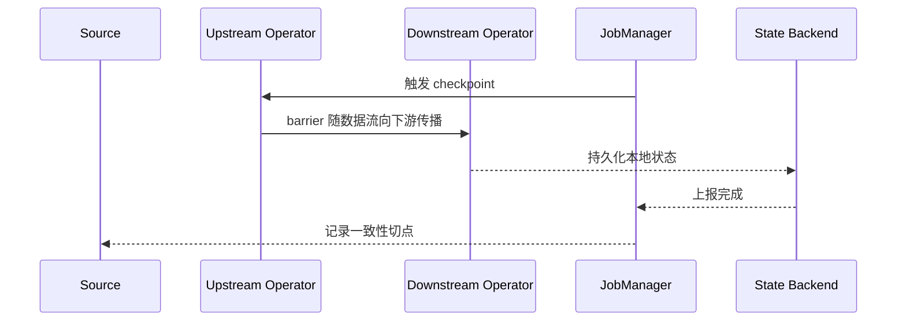

## 这页只回答一个问题
当下游已经堵住、上游还在往前推时，Flink 为什么还能做出有意义的 checkpoint，并且在恢复时仍然把状态和输入位置对齐？

## 先看标准 checkpoint 流程


标准 checkpoint 的关键点不是“把内存拍个照”，而是让 barrier 在数据流里建立一个一致性切点。这个切点和每个 operator 的状态一起保存，恢复时才能回到同一个逻辑时刻。

## 背压为什么会拖慢 checkpoint
背压出现时，最先出问题的常常不是 CPU，而是输出 buffer 不够用。上游 task 由于发不出去数据，只能在等待中积压。

- barrier 需要沿着数据流传播。
- 如果普通数据都被堵住，barrier 也会跟着变慢。
- 结果是 checkpoint duration 增长，alignment time 也可能拉长。

## 取消对齐不是“跳过一致性”
Flink 的 unaligned checkpoint 不是放弃一致性，而是把 in-flight buffer 数据也算进 checkpoint state 里，让 barrier 可以越过被堵住的 buffer。

| 方式 | 主要目标 | 代价 |
| --- | --- | --- |
| aligned checkpoint | 语义直观、状态较小 | 背压下容易被等待拖慢 |
| unaligned checkpoint | 缩短背压下的 checkpoint 时间 | checkpoint state 变大，依赖 in-flight buffer 参与恢复 |

## 这几条规则必须一起记
- 只有 exactly-once checkpoint 才能用 unaligned checkpoint。
- 一次只能有一个 concurrent checkpoint。
- checkpoint timeout 代表超过时间就判失败。
- minimum pause between checkpoints 会限制下一个 checkpoint 的触发节奏。
- externalized checkpoint 是给人工恢复和保留用的，不会像普通 checkpoint 那样失败后自动消失。

## 恢复时到底看什么
恢复不是只看 state 文件。

1. 先看源端能不能回放到 checkpoint 的输入位置。
2. 再看 operator state 和 keyed state 是否都可恢复。
3. 然后看是否存在外部副作用，需要调用方自己保证幂等。
4. 最后看 checkpoint 失败次数、重启策略和 failover 范围。

## 生产诊断的顺序
1. 看 checkpoint duration 是否持续升高。
2. 看 alignment time 是否异常高。
3. 看 state size 是否暴涨。
4. 看 backpressure 是否先从下游开始。
5. 看 source 是否能稳定回放。

## 一个最小理解模型
```text
正常路径：数据 -> barrier -> 状态提交 -> 恢复切点
背压路径：数据排队 -> barrier 延迟 -> checkpoint 变慢
unaligned：把排队中的 buffer 也纳入快照，绕开等待
```

## 样例代码
```java
env.enableCheckpointing(10_000);
env.getCheckpointConfig().setCheckpointTimeout(60_000);
env.getCheckpointConfig().setMinPauseBetweenCheckpoints(5_000);
env.getCheckpointConfig().setTolerableCheckpointFailureNumber(0);
```

这段配置不是“越保守越好”，而是在恢复可靠性、写入开销和连续触发频率之间做平衡。

## 设计取舍
- 你更关心恢复速度时，checkpoint 间隔和 state size 都很重要。
- 你更关心持续吞吐时，要先找背压根因，而不是先盲目缩短 checkpoint interval。
- 你更关心外部可见性时，必须把 sink 提交协议一起看。

## 来源与事实边界
本页只依赖当前知识库登记的官方 source 和 claim。有关 timeout、pause、externalized checkpoint 或 tolerable failure 的默认值，必须以当前 Flink 版本文档为准。

### 来源

`flink-checkpointing`、`flink-checkpointing-under-backpressure`、`flink-docs-home`、`flink-stateful-stream-processing`、`flink-architecture-doc`、`flink-state-backends-ops`

### 事实声明

`flink-claim-0010`、`flink-claim-0011`、`flink-claim-0012`、`flink-claim-0042`、`flink-claim-0043`、`flink-claim-0044`、`flink-claim-0045`、`flink-claim-0006`、`flink-claim-0007`、`flink-claim-0026`
