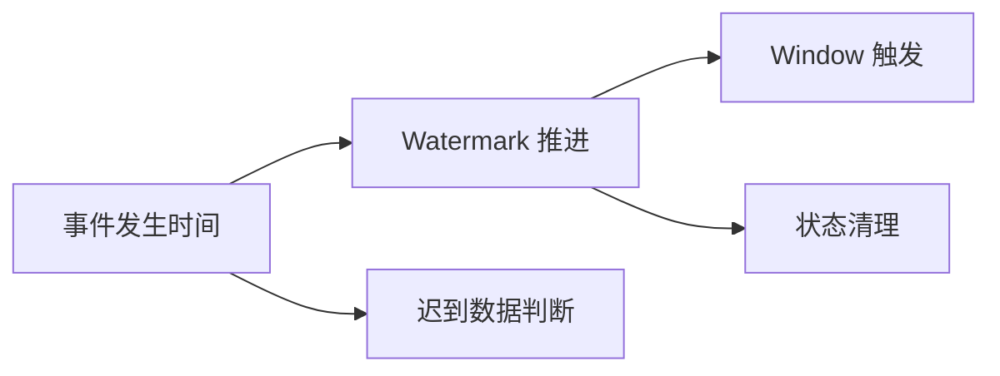

## 一句话先讲明白
Event time 不是机器时间，而是事件真正发生的时间；watermark 是系统对“事件时间已经推进到哪里了”的承诺。

## 事件时间为什么重要
如果只用 processing time，迟到数据、乱序数据和跨源汇聚很容易让结果失真。Flink 用 event time + watermark，把“数据什么时候发生”和“系统什么时候看到它”分开处理。

## 核心关系


## Watermark 真正声明了什么
Watermark(t) 的意思是：事件时间已经推进到 t，通常可以把小于等于 t 的更早事件视为不再期望继续到达。

这不是“绝对不会再来旧数据”的物理保证，而是流处理中用于闭合窗口和清理状态的逻辑边界。

因此，watermark 不是准确性本身，而是准确性和延迟之间的取舍。你允许的乱序越大，结果越稳，但窗口输出越晚；你允许的乱序越小，延迟更低，但迟到数据更容易被丢弃或触发补发。

## 多输入场景为什么容易卡住
多个输入流汇聚时，算子的当前 event time 取决于输入里最慢的那个。

- 一个分区 idle，会让 watermark 不能前进。
- 一个 split 比其他分区慢很多，会把整个下游拖住。
- 所以 event time 排障时，不能只看单个 source，要看最慢路径。

这也是很多“窗口一直不输出”的根因：不是窗口逻辑错了，而是某个输入分区没有继续推进 watermark。尤其在 Kafka 分区数多、部分分区长时间没有数据时，如果没有正确处理 idleness，下游会一直等那个空分区。

## watermark 应该在哪儿生成
源头通常比 source 之后再补更好，因为 source 了解 split、partition、shard 这些分布信息，能生成更准确的 watermark。

这也是为什么 `withIdleness`、source 侧 watermark strategy 和 split 感知很重要。

如果在 source 之后统一补 timestamp 和 watermark，系统已经丢失了一些 source 内部的分片信息，watermark 可能变得更粗糙。对于多 partition source，越靠近源头越容易表达真实的事件时间进展。

## 对齐和 idle 不是同一个问题
watermark alignment 解决的是“快的 split 不要跑太远”，idleness 解决的是“某个 split 长期不再产数据时不要一直拖住整体进度”。

这两个机制经常一起出现，但它们解决的问题不一样：
- alignment 控制偏移幅度。
- idleness 解除空分区阻塞。

## 迟到数据怎么理解
| 状态 | 含义 |
| --- | --- |
| on-time | watermark 还没越过记录时间 |
| late but accepted | watermark 已越过，但仍在 allowed lateness 内 |
| late and dropped | 超过 allowed lateness，不再进窗口 |

## 为什么不能把 watermark 当作绝对时钟
watermark 不是现实世界中“事件真的到此为止”的证明，而是系统对乱序容忍度的声明。它是工程上的逻辑边界，不是物理时间上的真相。

## 最小理解模型
1. 数据到达。
2. watermark 依据观测到的数据向前推进。
3. window 根据 watermark 决定触发。
4. allowed lateness 决定状态还能保留多久。
5. 迟到但没被丢弃的数据可能触发 late firing。

## 生产里看什么
- watermark lag 是否持续扩大。
- 某个 partition / split 是否 idle。
- 下游窗口是否一直不触发。
- 迟到数据是否大量堆积或被丢弃。
- event time 和 processing time 的偏差是否超出预期。

## 常见设计误区
- 用处理时间近似事件时间，却又要求乱序修正。
- watermark 延迟设置过小，导致正常乱序都变成迟到数据。
- watermark 延迟设置过大，导致窗口结果长期不出。
- 多输入 join 时只关注一侧 watermark，忽略最慢输入决定整体进度。
- 把 allowed lateness 当成无限补算能力，导致状态保留时间失控。

## 一段最小代码
```java
WatermarkStrategy<MyEvent> strategy =
    WatermarkStrategy
        .<MyEvent>forBoundedOutOfOrderness(Duration.ofSeconds(5))
        .withIdleness(Duration.ofMinutes(1));
```

## 来源与事实边界
本页只依赖当前知识库登记的官方 source 和 claim。关于 watermark 对齐、idle 检测和多输入事件时间的描述，应以当前 Flink 版本的官方文档为准。

### 来源

`flink-timely-stream-processing`、`flink-generating-watermarks`、`flink-docs-home`、`flink-working-with-state`

### 事实声明

`flink-claim-0013`、`flink-claim-0014`、`flink-claim-0015`、`flink-claim-0016`、`flink-claim-0017`、`flink-claim-0032`、`flink-claim-0033`、`flink-claim-0034`、`flink-claim-0035`、`flink-claim-0036`
