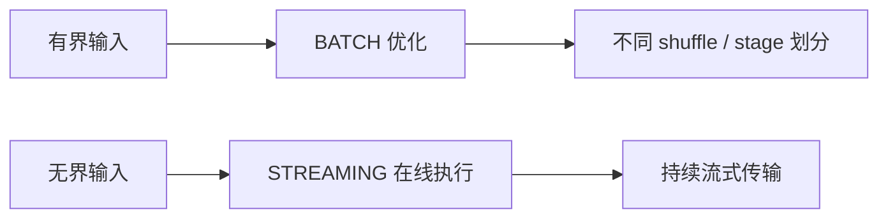

## 这页只看一个轴
同一份 DataStream 程序，在 bounded 和 unbounded 输入下，为什么可以选择不同 runtime mode，以及为什么这会影响调度和 shuffle 方式。

## 三种执行模式
| 模式 | 适用范围 | 说明 |
| --- | --- | --- |
| STREAMING | 有界和无界都能用 | 默认模式，持续在线，网络 shuffle 是 pipelined |
| BATCH | 只适合 bounded job | 可以利用有界性做更多优化 |
| AUTOMATIC | 由系统根据 boundedness 决定 | 适合减少硬编码 |

## boundedness 为什么会改变行为


有界输入意味着系统理论上知道“数据会结束”。这让 BATCH 模式可以把部分执行拆成阶段，使用更适合批计算的调度、join、aggregation 和 shuffle 策略。无界输入没有自然结束点，所以 STREAMING 模式需要所有相关任务持续在线，并通过 pipelined shuffle 把记录持续推给下游。

## 你要记住的语义差别
- bounded input 下，STREAMING 和 BATCH 的最终结果可以一致。
- STREAMING 可能中间不断发增量结果。
- BATCH 更适合把 job 切成阶段顺序执行。
- BATCH 可能采用不同 join / aggregation / shuffle 策略。

这意味着“结果一致”和“运行过程一致”不是一回事。bounded input 上最终结果相同，并不代表中间输出、资源占用、失败恢复范围和下游可见性都相同。

## 提交时应该怎么配
推荐在提交时通过 `execution.runtime-mode` 配，而不是把模式写死在程序里。这样同一个应用更容易在不同场景复用。

## 生产上怎么选
- 流式实时作业：优先 STREAMING。
- 离线或有限输入作业：优先考虑 BATCH。
- 想让一份程序兼容两种部署形态：用 AUTOMATIC 或提交参数控制。

## 切换模式前要验证什么
1. 下游是否依赖中间增量结果。
2. 作业是否包含只适合流式语义的逻辑。
3. source 是否正确声明 boundedness。
4. savepoint、checkpoint 和恢复流程是否仍符合预期。
5. 资源队列是否允许 BATCH 模式阶段化调度带来的峰值变化。

## 和其他引擎的区别不要混淆
Flink 的批流统一不是说所有作业都按同一种运行方式执行，而是同一套 API 和 runtime 可以根据输入有界性选择更合适的执行策略。STREAMING 关心持续低延迟，BATCH 更关心有限数据上的整体效率。

如果把 BATCH 当成“离线版 STREAMING”，就容易忽略阶段化执行、不同 shuffle 和失败恢复边界；如果把 STREAMING 当成“永不结束的批处理”，就容易忽略 watermark、状态清理和持续输出语义。

## 最小检查点
1. 输入是不是 bounded。
2. 结果是否要求持续在线输出。
3. 是否希望批模式的调度和 shuffle 优化。
4. 模式切换后是否会影响下游消费节奏。

## 一个配置示意
```bash
flink run -Dexecution.runtime-mode=BATCH jobs/daily-rebuild.jar
flink run -Dexecution.runtime-mode=STREAMING jobs/realtime-orders.jar
```

## 观察结果是否符合预期
模式切换后，要同时观察输出节奏、资源峰值、checkpoint 或恢复行为、下游写入节奏和作业完成状态。只看最终数据一致，无法判断运行过程是否满足生产要求。

## 来源与事实边界
本页只依赖当前知识库登记的官方 source 和 claim。关于 runtime mode 的默认值、shuffle 细节和 bounded job 优化，应以当前 Flink 版本官方文档为准。

### 来源

`flink-execution-mode`、`flink-docs-home`、`flink-architecture-doc`、`flink-stateful-stream-processing`

### 事实声明

`flink-claim-0112`、`flink-claim-0113`、`flink-claim-0114`、`flink-claim-0115`、`flink-claim-0116`、`flink-claim-0117`、`flink-claim-0118`
