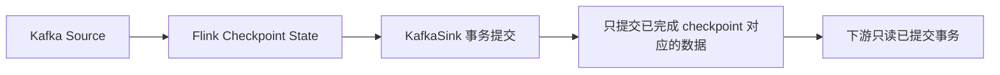

## 这页要拆开两个方向看
Kafka source 解决“从哪儿继续读”，Kafka sink 解决“什么时候安全地写出去”。端到端 exactly-once 不是单边能力，而是 source、Flink state 和 sink 一起配合。

## Source 和 Sink 的职责不同
| 方向 | 关键问题 | 依赖点 |
| --- | --- | --- |
| Source | 读到哪了，失败后从哪恢复 | checkpoint、offset、可回放源 |
| Sink | 写出去时是否能避免重复 | checkpoint、transaction、下游读取语义 |

## Kafka source 的 offset 怎么和 checkpoint 绑定
Kafka source 会在 checkpoint 完成时提交当前消费 offset，这样 checkpoint state 和 broker 上已提交的进度保持一致。

但这不是说“提交 offset 就等于容错完成”：

- 容错仍然靠 Flink 的 checkpoint state。
- committed offset 主要用于展示消费进度和一致性对齐。
- source 自身并不依赖已提交 offset 来完成失败恢复。

## 为什么“提交 offset”不是恢复核心
很多人会把 offset 提交当作 Kafka source 的唯一事实，但在 Flink 里它更像“外部可见的进度标记”。

真正决定恢复点的是 checkpoint 里的 source state。offset 提交只是让外部系统看到“我已经处理到哪里了”，不是让 Flink 自己靠它重建状态。

## Kafka sink 的三种投递语义
| DeliveryGuarantee | 依赖 checkpoint | 说明 |
| --- | --- | --- |
| NONE | 否 | 不保证投递语义 |
| AT_LEAST_ONCE | 是 | 可能重复，但不丢 |
| EXACTLY_ONCE | 是 | 依赖 Kafka transaction 和 checkpoint 协调 |

## exactly-once 真正成立的条件

## 你不能漏掉的配置边界
- `setTransactionalIdPrefix` 必须唯一。
- `transaction.timeout.ms` 要大于最大 checkpoint 时长 + 最大重启时长。
- 下游消费者如果要避免读到未提交数据，需要合适的 `isolation.level`。

## Kafka source 的 idleness 不是自动解决的
如果并行度大于 partition 数，多出来的 source 不会自动“消失”，它们仍可能把 watermark 卡住。

这就是为什么 Kafka 场景里经常同时要看 partition 分布、idle timeout 和 watermark 推进，而不能只看消费 offset。

## source 侧常见坑
- 并行度大于 Kafka partition 数时，不会自动让多出来的 source “变聪明”。
- 如果没有处理 idle 情况，watermark 可能卡住。
- 认为 committed offset 就等于业务最终一致，这是错误的。

## 生产排障顺序
1. 先看 checkpoint 是否稳定完成。
2. 再看 Kafka transaction 是否正常提交。
3. 再看 source offset 和 broker offset 是否对齐。
4. 最后看下游消费者是否读取到了未提交事务。

## 设计上最重要的区别
Kafka source 让“读到哪儿了”可恢复，Kafka sink 让“写出去时是否可重复”可控。两者一起才能撑起端到端语义，单独任何一个都不够。

## 来源与事实边界
本页只依赖当前知识库登记的官方 source 和 claim。关于 connector 保证、transaction timeout 和 offset 提交行为，应以当前 Flink 版本和 Kafka 文档为准。

### 来源

`flink-kafka-connector`、`flink-connector-guarantees`、`flink-checkpointing`、`flink-stateful-stream-processing`、`flink-timely-stream-processing`、`flink-working-with-state`

### 事实声明

`flink-claim-0009`、`flink-claim-0067`、`flink-claim-0068`、`flink-claim-0069`、`flink-claim-0070`、`flink-claim-0071`、`flink-claim-0072`、`flink-claim-0073`、`flink-claim-0074`
