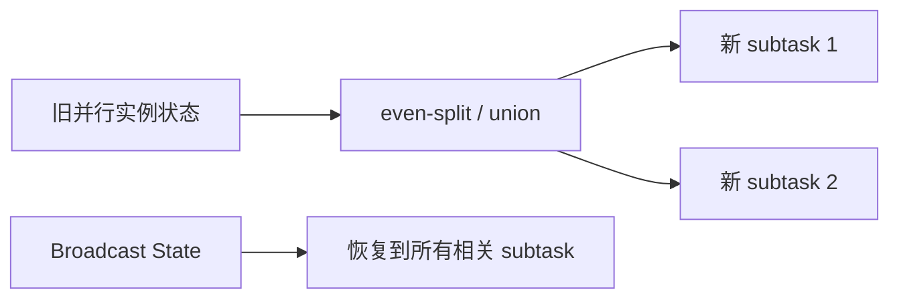

## 和 Keyed State 的根本区别
Operator State 绑定的是算子并行实例，而不是业务 key。它适合 source、sink 或无法按 key 切分的状态。

如果状态天然跟业务 key 绑定，就应该优先考虑 keyed state；如果状态跟某个并行实例的输入分片、待提交数据或本地缓冲绑定，operator state 更自然。

## 这类状态到底在表达什么
Operator state 表达的不是“某个用户的状态”，而是“这个并行实例正在维护的那份工作上下文”。

这通常意味着三种内容：
- 当前读到哪里了。
- 当前有哪些未提交数据。
- 当前实例要恢复多少本地工作。

## 两类状态怎么分工
| 状态 | 绑定对象 | 典型场景 |
| --- | --- | --- |
| Keyed State | key | 用户会话、聚合状态、去重状态 |
| Operator State | subtask | source offset、sink pending commit、非 keyed 缓冲 |
| Broadcast State | 所有下游 subtask 的规则副本 | 动态规则、维表小规则广播 |

## rescale 时怎么分配

operator state 的重分配策略决定了扩缩容后的语义。even-split 更像“把已有工作分摊给新实例”；union 更像“每个新实例都拿到完整列表再自己判断”。两者不能随便替换。

## even-split 和 union 的差别
- even-split 会把 list-style operator state 拆开分给不同并行实例。
- union 会把完整列表发给每个并行实例。
- union 对高基数状态风险很高，可能导致 RPC frame 或内存问题。

## Broadcast State 的特殊边界
Broadcast state 本质上仍属于 operator state，但它服务的是规则广播模式。规则侧需要保证所有并行实例做出同样的状态更新，否则不同 subtask 会用不同规则处理同一类数据。

如果规则流不是全序一致，或者处理逻辑依赖本地时间、随机数、外部查询结果，广播状态就可能在不同并行实例上分叉。分叉后，问题很隐蔽，因为每个 subtask 看起来都“正常处理了规则”。

## Python API 边界
当前知识库登记的事实里明确指出：Python DataStream API 仍不支持 operator state。设计 PyFlink 作业时不能默认把 Java API 能力直接照搬。

## source exactly-once 的细节
有状态 source 如果想要在失败恢复时保证 exactly-once 状态更新，通常要把发出记录和更新状态做成原子操作。否则可能出现“记录发出但状态没记住”或“状态记住但记录没发出”的不一致。

## 为什么它看起来像复制，但不是随便复制
Broadcast state 的本质不是把一份规则“广播到网络里就完事”，而是把这份规则变成每个并行实例都能独立恢复的一致副本。

这意味着：
- 更新必须是确定性的。
- 规则不能依赖 task 本地环境。
- 规则量要控制在可 checkpoint、可恢复的范围内。

## 生产检查
1. operator state 是否真的无法按 key 建模。
2. union state 的元素数量是否会随时间增长。
3. broadcast state 是否会随并行度放大到不可接受。
4. Python DataStream API 是否满足所需状态能力。
5. source 的发数和记状态是否具备原子性。

## 一个 source 状态例子
自定义 source 读取外部分片时，operator state 可以保存“当前 subtask 负责哪些 split、每个 split 读到哪里”。扩缩容后，这些 split 状态需要重新分配给新的 subtask。

如果使用 even-split，每个 subtask 拿一部分 split；如果使用 union，每个 subtask 都拿到完整 split 列表，再由业务逻辑自己决定负责哪一部分。后者灵活，但状态列表大时风险更高。

## 和 broadcast state 的关系
Broadcast state 是 operator state 的特殊模式。它不是为大状态扩展设计的，而是为“每个并行实例都需要同一份小规则”设计的。把大规模维表塞进 broadcast state，通常会把内存和 checkpoint 成本一起放大。

## 来源与事实边界
本页只依赖当前知识库登记的官方 source 和 claim。关于 operator state 的重分配方式、Python API 能力和 source 原子性，应以当前 Flink 版本官方文档为准。

### 来源

`flink-working-with-state`、`flink-docs-home`、`flink-stateful-stream-processing`

### 事实声明

`flink-claim-0020`、`flink-claim-0021`、`flink-claim-0037`、`flink-claim-0038`、`flink-claim-0039`、`flink-claim-0040`、`flink-claim-0041`
