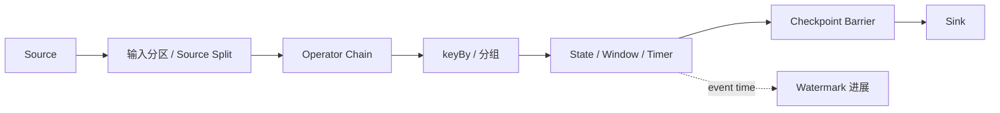

## 先把一句话说透
Flink 不是“把流搬过来处理一下”的引擎，而是把持续到来的数据放进一个可恢复、可观测、可重分配的算子图里。它真正关心的是四件事：记录怎么进入图、状态放在哪、事件时间怎么前进、失败后怎么回到一致点。

## 它适合解决什么，不适合替谁做什么
Flink 适合做有状态流处理、事件时间计算、窗口聚合、动态规则匹配和需要可恢复语义的实时计算。它不负责长期存储，不直接替代消息队列，也不替代元数据治理或业务事务系统。

- 计算边界：负责算子执行、状态维护和一致性恢复。
- 数据边界：依赖 source 和 sink 提供可回放、可提交或可落盘的外部能力。
- 事务边界：端到端 exactly-once 不是“Flink 自己一句话就完成”，而是 source、state、sink 一起配合的结果。
- 运维边界：资源、版本、目录和权限问题通常不在 Flink 运行时内部解决。

## 这条链路里谁在负责什么
| 层 | 关注点 | 典型对象 |
| --- | --- | --- |
| 控制面 | 谁在编排、调度和恢复 | JobManager、ExecutionGraph |
| 执行面 | 谁在消费、转换和写出 | TaskManager、Task、Operator |
| 状态面 | 谁保存业务上下文 | Keyed State、Operator State、Checkpoint |
| 时间面 | 谁决定事件是否已经“足够晚” | Watermark、Window、Timer |

## 一条记录如何穿过系统


这张图要读出两个事实：

1. 逻辑数据流和恢复切点是两条不同的线。记录继续往前走，checkpoint barrier 负责切出一致点。
2. 状态和事件时间会一起影响结果。窗口不是靠系统当前时间自动闭合，而是靠 watermark 推进和状态触发条件共同决定。

## 为什么状态和时间必须放在同一张图里
Flink 的状态不是一个孤立缓存，而是和 key group、watermark、window、checkpoint 绑定在一起的。

- keyed state 的放置方式决定 rescale 时怎么搬。
- watermark 的推进速度决定窗口什么时候能发结果。
- checkpoint 的切点决定失败后从哪里恢复。
- source 能否回放决定这些语义能否完整落地。

## 最容易混淆的三件事
- `cache` 不是持久化保证，它只是性能优化。
- `checkpoint` 不是人工迁移工具，它主要服务失败恢复。
- `savepoint` 不是自动容错的核心路径，它主要服务人工升级和迁移。

## 你应该看什么证据
- Flink Web UI 里的 job graph、checkpoint 和 backpressure。
- source/sink 侧是否具备回放、提交或幂等写入能力。
- state size、checkpoint duration、alignment time、watermark lag。
- JobManager 和 TaskManager 的日志、错误栈和重试痕迹。

## 最小可运行示例
```java
StreamExecutionEnvironment env = StreamExecutionEnvironment.getExecutionEnvironment();
env.enableCheckpointing(10_000);

DataStream<String> input = env.fromElements("a", "b", "a");
input
    .map(v -> v.toUpperCase())
    .keyBy(v -> v)
    .countWindow(2)
    .reduce((left, right) -> left)
    .print();

env.execute("flink-overview-demo");
```

## 一句话检查点
如果你只记一件事：Flink 的关键不在“算”，而在“算的同时还能回到一致点、还能恢复状态、还能把时间语义说清楚”。

## 来源与事实边界
本页只依赖当前知识库登记的官方 source 和 claim。涉及默认值、兼容性和参数行为时，应以当前 Flink 版本的官方文档和运行时配置为准，不把某个版本的默认值直接外推到所有版本。

### 来源

`flink-docs-home`、`flink-stateful-stream-processing`、`flink-timely-stream-processing`、`flink-working-with-state`、`flink-checkpointing`、`flink-checkpointing-under-backpressure`、`flink-architecture-doc`、`flink-state-backends-ops`

### 事实声明

`flink-claim-0001`、`flink-claim-0002`、`flink-claim-0003`、`flink-claim-0004`、`flink-claim-0005`、`flink-claim-0006`、`flink-claim-0007`、`flink-claim-0008`、`flink-claim-0009`、`flink-claim-0013`、`flink-claim-0022`、`flink-claim-0023`、`flink-claim-0024`、`flink-claim-0025`
