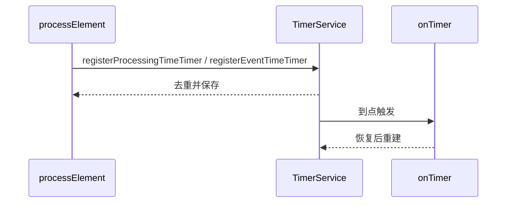

## 这页讲的是低层控制权
ProcessFunction 适合处理窗口 API 够不到、但又必须保留 keyed state 和 timer 的场景。它不是默认推荐的业务首选，而是“你真的需要自己掌控什么时候发、什么时候查状态、什么时候补逻辑”时才用。

很多人把 ProcessFunction 当成“万能自定义算子”，这会让作业越来越难维护。更准确的使用原则是：高层 API 能表达时优先用高层 API；只有需要访问 timer、side output、当前 key 或更细粒度状态控制时，再下沉到 ProcessFunction。

## KeyedProcessFunction 比普通 ProcessFunction 多了什么
- 能拿到当前 key。
- 能在 onTimer 里做 keyed 逻辑。
- 更适合 keyed 维度的定时控制、超时处理、补偿和轻量规则驱动逻辑。

## TimerService 的行为


TimerService 同时支持 processing-time timer 和 event-time timer。processing-time timer 由机器时间推进，event-time timer 由 watermark 推进。两者适用场景不同：前者适合真实等待超时，后者适合事件时间语义下的窗口、会话和业务时间边界。

## 你必须知道的三件事
1. timer 会被 checkpoint。
2. 恢复或从 savepoint 恢复时 timer 也会回来。
3. timer 太多会增加 checkpoint 开销。

恢复后的 processing-time timer 还有一个容易被忽略的行为：如果它本应在恢复前就触发，恢复后可能立即触发。因此，onTimer 逻辑必须是可重复执行、可恢复后继续执行的业务逻辑，不能假设触发时间一定精确等于原本机器时间。

## 什么时候说明你不该再往下用它
- 逻辑已经复杂到需要管理大量 timer。
- 状态和超时规则开始像一个小调度器。
- 你其实是在手写窗口、手写 join、手写状态生命周期。

如果你发现自己在 ProcessFunction 里维护窗口起止时间、迟到数据、聚合结果和清理 timer，通常应该重新评估是否能用 Window API 或 CEP 等更高层抽象。低层控制权很强，但也意味着更多正确性责任落在业务代码上。

## 减少 timer 压力的方法
- 降低时间粒度。
- 合并相近的触发时刻。
- 用更高层的窗口或事件时间语义替代大量手工 timer。

## 排障时怎么判断 timer 过多
1. checkpoint duration 随状态和 timer 数一起增长。
2. 单个 subtask state size 明显高于其他 subtask。
3. onTimer 执行耗时高，导致后续记录处理被拖慢。
4. key 分布倾斜导致某些 key 挂了大量 timer。
5. 恢复后大量过期 processing-time timer 立即触发，造成短时尖峰。

## 一个最小示意
```java
public void processElement(MyEvent value, Context ctx, Collector<String> out) {
    ctx.timerService().registerEventTimeTimer(value.getExpireTs());
}
```

## 来源与事实边界
本页只依赖当前知识库登记的官方 source 和 claim。关于 timer 恢复、去重和触发时序，应以当前 Flink 版本官方文档为准。

### 来源

`flink-process-function`、`flink-working-with-state`、`flink-stateful-stream-processing`、`flink-timely-stream-processing`

### 事实声明

`flink-claim-0062`、`flink-claim-0063`、`flink-claim-0064`、`flink-claim-0065`、`flink-claim-0066`
