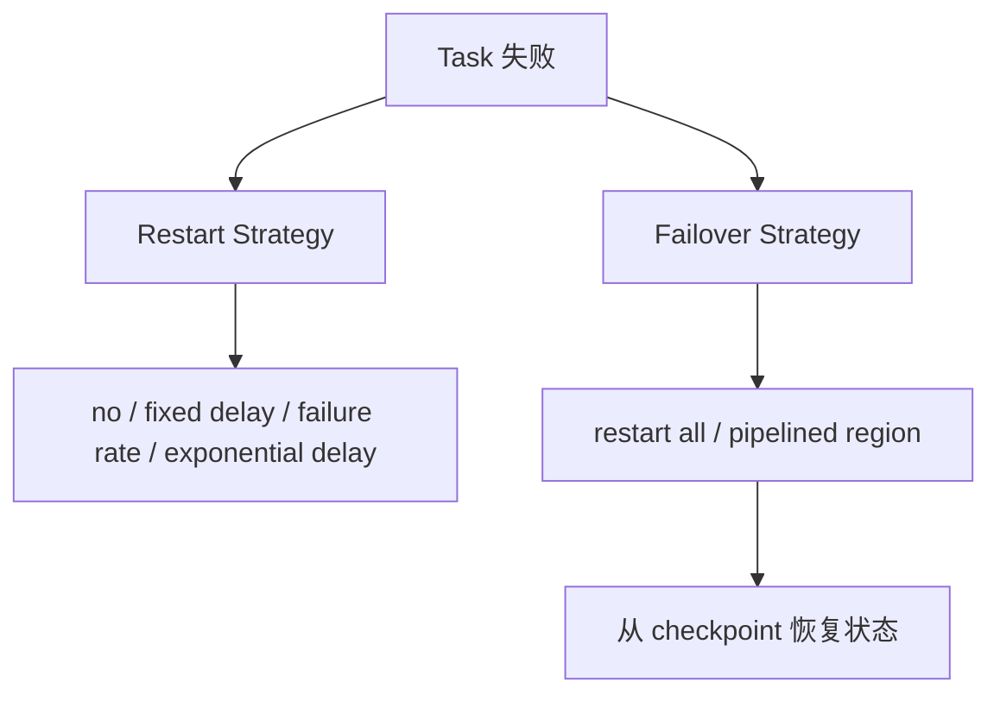

## 重启策略和 failover 策略不是一回事
重启策略回答“失败后要不要重试、怎么重试”；failover 策略回答“需要重启哪些 task”。

这两个维度要一起看。重启策略很宽松，但 failover 范围很大，仍然可能造成长时间不可用；failover 范围很小，但重启次数太少，也可能让短暂抖动直接变成作业失败。

## 两条决策线

## 默认行为要看 checkpoint
如果没有启用 checkpoint，Flink 默认不使用 restart strategy。如果启用了 checkpoint 但用户没有配置 restart strategy，当前知识库登记的事实是使用 exponential delay restart。

## pipelined region 为什么重要
pipelined region 是通过 pipelined data exchange 连在一起的一组 task。失败恢复时，Flink 可以重启失败 task 所在 region，以及为了结果一致性必须一起恢复的上下游 region，而不一定重启整个 job。

batch data exchange 会形成 region 边界，而 pipelined exchange 会把任务连在一起。理解这个边界，有助于解释为什么有些失败只影响局部，而有些失败会带动一大片 operator 一起重启。

## 什么时候还是会影响很大
- 故障点靠近 source 或 sink。
- region 之间依赖复杂。
- 上游 result partition 不可用。
- checkpoint 本身不稳定。
- 外部系统写入没有幂等或事务边界。

## 常见恢复策略
| 策略 | 适用倾向 |
| --- | --- |
| no restart | 希望失败后立即暴露问题 |
| fixed delay | 失败可能短暂抖动，重试间隔固定 |
| failure rate | 限制一段时间内失败频率 |
| exponential delay | 对连续失败逐步拉大重试间隔 |

## savepoint 恢复必须关注 uid
Savepoint 依赖 operator identifier 匹配。生产作业里，给 stateful operator 手工设置 `uid(String)` 是非常重要的工程习惯，否则升级或改图后可能恢复不到原状态。

## canonical 和 native savepoint
canonical format 更重视跨 backend 可移植性；native format 可能触发和恢复更快，但更依赖具体 backend。选择时要把升级路径和恢复速度一起看。

## 生产验证
1. 主动杀掉一个 TaskManager，观察 failover 范围。
2. 制造短暂外部系统不可用，验证 restart strategy。
3. 从 savepoint 恢复一次，验证 uid 和状态兼容。
4. 检查失败后 sink 是否重复写。
5. 检查恢复后 watermark、checkpoint 和 offset 是否继续推进。

## 设计上的底线
重启策略不能替代容量规划，failover 策略也不能替代幂等设计。一个作业能自动拉起，只说明运行时愿意继续尝试，不说明业务结果一定正确。真正的恢复闭环要同时验证状态恢复、输入回放、输出提交和告警通知。

## 来源与事实边界
本页只依赖当前知识库登记的官方 source 和 claim。关于默认重启策略、region failover 范围和 savepoint 格式，应以当前 Flink 版本官方文档为准。

### 来源

`flink-task-failure-recovery`、`flink-savepoints`、`flink-docs-home`

### 事实声明

`flink-claim-0029`、`flink-claim-0030`、`flink-claim-0046`、`flink-claim-0047`、`flink-claim-0048`、`flink-claim-0049`、`flink-claim-0050`、`flink-claim-0051`、`flink-claim-0052`
