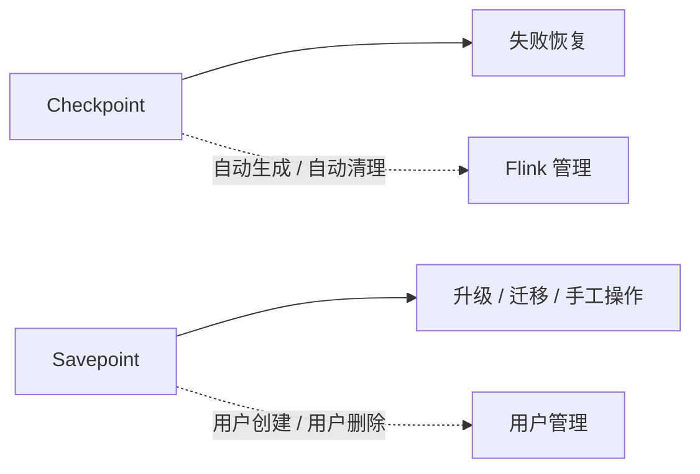

## 这页要解决什么
要回答的是：Flint 状态到底放哪、怎么持久化、怎么恢复、什么时候该用 savepoint 而不是 checkpoint。

## 两种 state backend 的差别
| Backend | 状态放哪里 | 适合什么 |
| --- | --- | --- |
| HashMapStateBackend | Java heap | 小状态、追求速度、内存足够 |
| EmbeddedRocksDBStateBackend | 本地磁盘 | 大状态、需要更强扩展性 |

它们不是“谁更好”，而是“性能优先”与“可扩展性优先”的取舍。

HashMapStateBackend 的优势是访问快，但状态对象占用 JVM heap，状态规模和 GC 压力需要谨慎控制。EmbeddedRocksDBStateBackend 能把更大状态放到本地磁盘，但访问会引入序列化和本地存储开销。

## checkpoint 和 savepoint 不是一回事


## 恢复链路怎么走
1. 从 checkpoint 或 savepoint 读回 state。
2. 恢复 keyed state、operator state 和 timer 等运行时状态。
3. 按输入位置重放数据。
4. 继续处理并输出结果。

恢复时间通常不只由状态大小决定，还受 checkpoint 存储吞吐、本地磁盘、网络、并行度、source 回放速度和外部 sink 状态影响。大状态作业要把恢复演练作为上线前必做项。

## 生产里最容易搞错的边界
- checkpoint 是恢复用，不是人工升级主工具。
- savepoint 是人控操作用，不是日常自动容错主路径。
- state backend 是状态存储机制，不是业务数据湖。
- restart strategy 决定失败后怎么起，不等于 state 怎么恢复。

## 你真正要判断的不是“能不能恢复”
而是：

1. 恢复后业务语义是否一致。
2. 恢复路径是否被外部系统拖住。
3. state size 是否大到影响 checkpoint 和恢复时间。
4. savepoint 是否与 schema 变更兼容。

## 什么时候优先看 RocksDB
- state 很大。
- 不能让 heap 被状态撑爆。
- 希望把大部分状态压力转移到本地磁盘。

## savepoint 适合哪些操作
- 有状态作业升级。
- 修改并行度或部署拓扑。
- 迁移到新集群。
- 做版本回滚前的保护点。
- 在兼容范围内进行 state schema 演进。

## 不适合用 savepoint 掩盖的问题
如果 checkpoint 长期失败、state 规模失控、source 无法回放或 sink 不幂等，savepoint 只能帮助人工迁移，不能修好运行时一致性问题。

## 状态后端选择检查
1. 状态规模是否能放进 JVM heap。
2. GC 是否已经影响处理延迟。
3. checkpoint 写出是否成为瓶颈。
4. 本地磁盘和远端 checkpoint 存储是否可靠。
5. 恢复时间是否满足业务目标。

## 恢复演练建议
生产前至少做三类演练：从最近 checkpoint 自动恢复，从 savepoint 手工恢复，以及变更并行度后的恢复。演练结果要记录状态大小、恢复耗时、source 回放量和下游是否重复写。

## 一段最小配置
```java
env.setStateBackend(new EmbeddedRocksDBStateBackend());
env.enableCheckpointing(10_000);
```

## 来源与事实边界
本页只依赖当前知识库登记的官方 source 和 claim。关于 savepoint 的兼容性、native 格式和恢复行为，应以当前 Flink 版本的官方文档为准。

### 来源

`flink-state-backends-ops`、`flink-savepoints`、`flink-checkpoints-vs-savepoints`、`flink-task-failure-recovery`、`flink-docs-home`、`flink-stateful-stream-processing`

### 事实声明

`flink-claim-0026`、`flink-claim-0027`、`flink-claim-0028`、`flink-claim-0029`、`flink-claim-0030`
