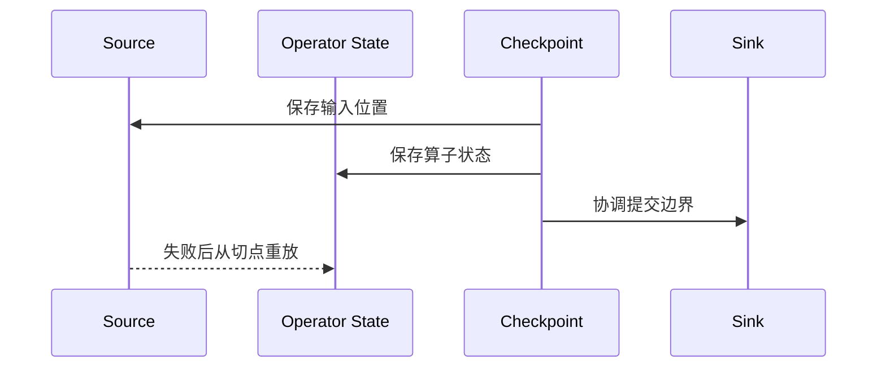

## Exactly-once 不是一个开关
Flink 的 exactly-once 语义建立在三件事上：输入位置可回放、operator state 可恢复、输出提交能和 checkpoint 对齐。

所以说 “Flink 开了 exactly-once” 只说了一半。更完整的问题应该是：source 是否能回放、Flink state 是否能恢复、sink 是否能按 checkpoint 原子提交或幂等写入。

## 恢复模型


## source 必须能回放
如果 source 无法回到 checkpoint 时记录的位置，Flink 内部再完整的 state 也无法还原同一条逻辑数据流。

这也是为什么消息队列、文件源、日志系统和数据库 CDC 的可回放能力很关键。不能回放的 source 即使能跑，也很难在失败后提供严格一致语义。

## 一致性真正落在哪
| 层次 | 需要满足什么 | 失败时会坏在哪里 |
| --- | --- | --- |
| 输入层 | source 能回放到一致切点 | 丢数据或重复读 |
| 状态层 | operator state 和 keyed state 可恢复 | 计算上下文断裂 |
| 输出层 | sink 能跟 checkpoint 对齐提交 | 重复写、半提交或脏结果 |

这也是为什么 exactly-once 不是“状态恢复成功”就结束了。状态恢复只是中间步骤，真正的端到端语义还要看输出是否和恢复边界一致。

## checkpoint interval 是取舍
checkpoint 间隔短，失败后需要重放的数据少，但运行期开销更高。间隔长，运行期更轻，但恢复时要重放更多数据。

配置 checkpoint 时还要看 timeout、最小间隔、可容忍失败次数、state backend 写出能力和外部存储吞吐。一个稳定的 checkpoint 配置不是只看 interval，而是能长期完成、恢复时间可接受、并且不会把正常处理压垮。

## checkpoint 失败后不只是“再试一次”
当 checkpoint 失败时，真正要判断的是失败来源：
- barrier 被背压卡住。
- state 太大，写出过慢。
- source 无法回放到一致位置。
- sink 提交过慢或事务过期。

如果只把 checkpoint 失败理解成“重试次数不够”，很容易把根因掩盖掉。checkpoint 失败是恢复链路的症状，不是唯一问题本身。

## unaligned checkpoint 的定位
背压下，unaligned checkpoint 可以让 barrier 不再被堵住的 buffer 严重拖慢，但它会把 in-flight buffer 也纳入 checkpoint state。它是背压下的恢复优化，不是替代排查背压根因的万能按钮。

## 什么时候要谨慎启用 unaligned
- 作业经常在高背压下触发 checkpoint 超时。
- 你更在意恢复连续性而不是快照体积。
- 你能接受 in-flight 数据进入 checkpoint 增大状态量。

如果问题根因是 sink 太慢或算子设计不合理，unaligned 只是把症状向后推，不会让链路本身变健康。

## 端到端语义的边界
- Flink 内部 exactly-once：状态和输入位置一致恢复。
- 端到端 exactly-once：source 和 sink 也要参与 checkpoint 或具备对应事务能力。
- 外部副作用：如果 sink 或外部服务不能幂等，仍然可能重复产生业务影响。

## 排障时怎么拆
1. 如果状态恢复后结果重复，先看 sink 是否幂等或事务化。
2. 如果恢复后丢数据，先看 source 是否能回放到记录位置。
3. 如果 checkpoint 经常失败，先看 state size、背压和 checkpoint 存储。
4. 如果开启 unaligned 后 state 变大，检查 in-flight buffer 是否被大量纳入快照。

## 设计时的底线
不要把 exactly-once 写成单个配置项。生产方案里至少要写清楚：source 的回放边界、checkpoint 存储位置、state backend、sink 提交方式、失败重启策略和人工恢复入口。任何一环缺失，端到端语义都可能只停留在 Flink 内部。

## 最小配置示意
```java
env.enableCheckpointing(10_000);
env.getCheckpointConfig().setCheckpointingMode(CheckpointingMode.EXACTLY_ONCE);
```

## 来源与事实边界
本页只依赖当前知识库登记的官方 source 和 claim。关于 checkpointing mode、unaligned checkpoint 和 source/sink 保证，应以当前 Flink 版本官方文档为准。

### 来源

`flink-stateful-stream-processing`、`flink-working-with-state`、`flink-checkpointing`、`flink-checkpointing-under-backpressure`

### 事实声明

`flink-claim-0003`、`flink-claim-0004`、`flink-claim-0005`、`flink-claim-0006`、`flink-claim-0007`、`flink-claim-0008`、`flink-claim-0009`、`flink-claim-0010`、`flink-claim-0011`、`flink-claim-0012`
