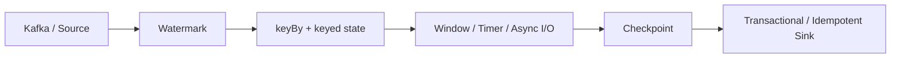

## 设计 Flink 作业先问五个问题
1. 输入是有界还是无界。
2. 是否要求 event time 正确。
3. state 会不会持续增长。
4. sink 是否能参与端到端一致性。
5. 失败恢复目标是秒级、分钟级还是可人工介入。

## 典型架构链路

## 场景一：订单实时聚合
关键取舍：

- keyBy 字段决定状态分布。
- watermark 决定窗口何时输出。
- allowed lateness 决定迟到订单是否还能补算。
- sink 是否支持幂等决定恢复后是否会重复写。

## 场景二：动态规则匹配
关键取舍：

- 规则量小且需要全局可见时用 broadcast state。
- 规则更新逻辑必须确定性。
- 规则状态大小会随并行度放大。
- 规则变更如果影响历史状态，需要额外迁移方案。

## 场景三：外部维表异步补充
关键取舍：

- 同步调用会拖慢整条链路。
- unordered wait 延迟低但顺序不稳定。
- ordered wait 保顺序但慢请求会放大延迟。
- 外部服务失败要有 timeout、retry、限流和降级策略。

## 场景四：大状态长周期作业
关键取舍：

- RocksDB 更适合大状态，但访问成本更高。
- checkpoint interval 影响运行期开销和恢复重放量。
- savepoint 用于升级迁移，不能替代稳定 checkpoint。
- TTL 和 schema evolution 要提前规划。

## 统一检查清单
- source 可回放吗。
- state backend 和状态规模匹配吗。
- watermark 是否会因为 idle partition 卡住。
- checkpoint 能在稳定时间内完成吗。
- failover 范围是否可接受。
- sink 是否幂等或事务化。

## 设计时不要只画数据流
Flink 系统设计至少要同时画三条线：

1. 数据线：source 到 sink 的记录路径。
2. 状态线：keyed state、operator state、broadcast state 的生命周期。
3. 恢复线：checkpoint、savepoint、source replay、sink commit 的一致性边界。

只画数据线，会漏掉最关键的生产问题：失败后从哪里恢复、状态怎么迁移、下游能不能承受重复。

## 验证设计是否可落地
设计评审时可以要求给出三类证据：压测指标、故障演练结果和恢复路径。没有证据的“可以 exactly-once”“可以扩容”“可以低延迟”，都只能算假设。

## 常见错误方案
- 只设计实时链路，没有设计回放和补数链路。
- 只关注平均延迟，没有关注 checkpoint 和恢复耗时。
- 只说 Kafka 到 Flink 到 Kafka，却没有说明 offset、事务和下游读取隔离。
- 只画 operator，不说明 state backend、key 分布和 watermark 策略。

## 来源与事实边界
本页只依赖当前知识库登记的官方 source 和 claim。系统设计案例是基于官方机制的组合解读，不把某个集群的经验值当成跨版本事实。

### 来源

`flink-stateful-stream-processing`、`flink-timely-stream-processing`、`flink-generating-watermarks`、`flink-checkpoints-vs-savepoints`、`flink-task-failure-recovery`、`flink-docs-home`、`flink-working-with-state`、`flink-checkpointing`

### 事实声明

`flink-claim-0004`、`flink-claim-0008`、`flink-claim-0011`、`flink-claim-0015`、`flink-claim-0017`、`flink-claim-0027`、`flink-claim-0029`、`flink-claim-0030`
