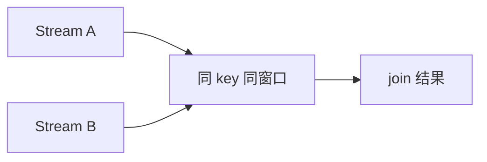

## 两类 join 的问题不一样
Window join 把两条流放进同一个窗口里匹配；interval join 用一条记录的时间戳去另一条流里找相对时间范围内的记录。

选择哪一种，取决于业务关系是“同一窗口内发生”还是“围绕某个事件前后发生”。比如同一固定窗口内订单和支付匹配，更像 window join；下单后在业务约定时间范围内支付成功，更像 interval join。

## Window Join
Window join 像 inner join：只有两侧都有同 key 且落在同一窗口的元素，才会输出。未匹配元素不会输出。

Window join 的本质是“同一时间桶内的关联”。它依赖窗口边界和 watermark 来决定什么时候可以认为这个桶已经收齐到足够稳定。



Window join 的状态生命周期主要受窗口和 watermark 控制。窗口越大、乱序越大、allowed lateness 越长，状态保留时间越长。如果业务只需要一侧补另一侧的短时间匹配，interval join 往往更贴近语义。

## Interval Join
Interval join 的判断形式是：右侧事件时间在左侧事件时间加上下界和上界形成的区间内。

```text
b.timestamp in [a.timestamp + lowerBound, a.timestamp + upperBound]
```

当前知识库登记的事实里，interval join 只支持 inner join，并且只支持 event time。

这意味着 interval join 不能直接表达 left outer join、right outer join 或 processing-time join。需要 outer 语义时，通常要通过状态和 timer 自己补未匹配输出，但这也会把正确性、清理和迟到处理责任交给业务代码。

## 为什么 interval join 更像事件关系
它不是在找“同一个窗口里一起到达的东西”，而是在找“围绕某个主事件前后一定时间范围内发生的东西”。

所以它更适合订单-支付、告警-确认、点击-转化这类前后关联，而不是简单的固定时间桶聚合。

## 输出时间戳
- window join 的输出元素时间戳是窗口内最大可用时间戳。
- interval join 传给 ProcessJoinFunction 的匹配结果使用两侧输入元素中较大的时间戳。

## 生产设计要看什么
1. join 两侧是否都按同一个 key 对齐。
2. watermark 是否能推动状态清理。
3. interval 范围是否过宽，导致状态保留过多。
4. 是否需要 outer join 语义，如果需要就不能直接用当前 interval join 假设。

## 状态压力怎么估算
join 的状态压力取决于两侧输入速率、key 分布、时间范围和 watermark 推进速度。interval 范围越宽，需要等待匹配的历史记录越多；watermark 推进越慢，已经不可能匹配的数据越晚清理。生产设计时不要只写 join 条件，要估算单位时间每个 key 会保留多少记录。

## 设计时最关键的不是语法，而是边界
- 如果你要的是窗口级别的对账，优先考虑 window join。
- 如果你要的是相对时间范围内的关联，优先考虑 interval join。
- 如果你要的是未匹配输出，就要额外设计状态和超时逻辑。

## 常见错误
- 把 interval join 当成任意时间条件 join。
- 忽略只支持 event time 的边界。
- 忘记两侧必须 keyed。
- 下游需要未匹配记录，却用了只输出匹配结果的 inner join。
- watermark 卡住后只看 join 逻辑，不看上游分区是否 idle。

## 调试入口
调试 join 问题时，先看两侧输入速率和 watermark，再看 key 分布和状态大小。很多“join 不上”的问题不是 join 条件写错，而是两侧事件时间没有进入同一可匹配范围，或者其中一侧 watermark 停滞导致状态迟迟不能清理。

## 下游结果建模
join 结果通常要包含业务 key、两侧事件 ID、两侧事件时间和匹配窗口或区间信息。这样下游才能区分“真的没有匹配”“匹配还在等待 watermark 推进”“匹配结果已经输出”。如果只输出拼接后的业务字段，排障时很难判断到底是数据缺失、时间范围不重叠，还是 watermark 推进问题。

## 选择建议
如果业务天然按固定时间桶汇总，再匹配同一个桶内的两侧事件，window join 更直接。如果业务是围绕一条主事件寻找前后范围内的另一条事件，interval join 更贴近语义。如果业务需要未匹配记录输出，就要额外设计状态和 timer，不能把当前 inner join 行为当成 outer join。

## 来源与事实边界
本页只依赖当前知识库登记的官方 source 和 claim。关于 join 类型、时间戳分配和 event-time 限制，应以当前 Flink 版本官方文档为准。

### 来源

`flink-joining`、`flink-windows`、`flink-timely-stream-processing`

### 事实声明

`flink-claim-0101`、`flink-claim-0102`、`flink-claim-0103`、`flink-claim-0104`、`flink-claim-0105`、`flink-claim-0106`
