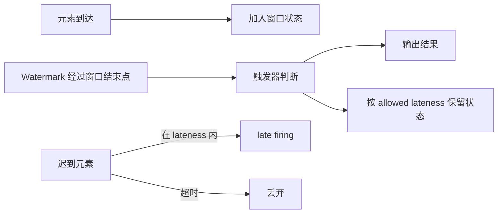

## 窗口到底在等什么
Window 不是“时间到了自动出结果”，而是先收集属于同一窗口的元素，再由 trigger 决定什么时候发射结果、什么时候清理状态。

窗口状态从第一个元素到达时创建，时间窗口通常在窗口结束时间加 allowed lateness 之后被清理。这个生命周期决定了窗口作业的状态规模。

## 触发器和允许迟到的关系
- trigger 决定何时 `FIRE`。
- `allowed lateness` 决定窗口状态还能保留多久。
- late firing 允许迟到但仍被接受的数据重新触发输出。

## 关键语义

## 这几个概念不能混
| 概念 | 作用 |
| --- | --- |
| WindowAssigner | 决定元素去哪一个窗口 |
| Trigger | 决定什么时候发 |
| Evictor | 决定发之前/之后要不要踢掉部分元素 |
| allowed lateness | 决定晚到多久还算可接受 |

高层看，WindowAssigner 决定“放哪”，Trigger 决定“何时发”，Evictor 决定“发前后去掉谁”，allowed lateness 决定“状态再等多久”。这四个点任何一个理解错，都会导致结果延迟、状态膨胀或迟到数据处理错误。

## 为什么 evictor 代价高
Evictor 会让预聚合失效，导致元素必须先进入窗口逻辑再由 evictor 处理，状态和开销都会变大。

## 什么时候会出现 late firing
- watermark 已经过了窗口结束点。
- 但元素还在 allowed lateness 内到达。
- 这时窗口可能再次被触发输出新的结果。

late firing 对下游有要求。下游如果只接受追加结果，可能无法表达“同一个窗口结果被更新”；下游如果支持 upsert 或覆盖，就更容易承接补发结果。

## 最小理解顺序
1. 先看窗口如何分组。
2. 再看 trigger 什么时候 fire。
3. 再看 watermark 是否已经越过结束边界。
4. 最后看 allowed lateness 是否还允许补发。

## 生产调参边界
- allowed lateness 设为 0，延迟低但迟到数据直接被丢弃。
- allowed lateness 设太大，状态保留时间和补发压力都会上升。
- 使用 ProcessWindowFunction 可以拿到窗口上下文，但单独使用时可能需要缓存所有窗口元素。
- 增量聚合能降低状态压力，但如果还需要窗口元信息，可以和 ProcessWindowFunction 组合。

## 下游可见性要提前设计
如果窗口结果可能 late firing，下游就要能识别同一个窗口的多次输出。常见方式是用窗口开始时间、窗口结束时间和业务 key 组成结果主键，让下游按主键更新，而不是把每次输出都当成一条全新的最终结果。

## 来源与事实边界
本页只依赖当前知识库登记的官方 source 和 claim。有关 trigger 默认行为、允许迟到时的状态保留和 evictor 的代价，应以当前 Flink 版本官方文档为准。

### 来源

`flink-windows`、`flink-docs-home`、`flink-stateful-stream-processing`、`flink-timely-stream-processing`、`flink-working-with-state`

### 事实声明

`flink-claim-0053`、`flink-claim-0054`、`flink-claim-0055`、`flink-claim-0056`、`flink-claim-0057`、`flink-claim-0058`、`flink-claim-0059`、`flink-claim-0060`、`flink-claim-0061`
