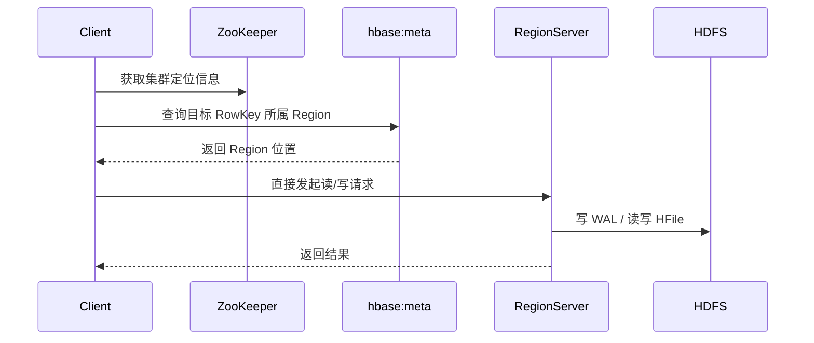

---
kb_id: bigdata/hbase/architecture-and-roles
title: HBase 架构分层与角色协作
description: 解释 HBase 控制面、数据面、元数据面和底层存储面如何分工，以及 HMaster、RegionServer、客户端和 HDFS 的协作链路。
domain: bigdata
component: hbase
topic: architecture-and-roles
difficulty: intermediate
status: reviewed
sidebar_position: 3
version_scope: HBase official docs as verified on 2026-05-09
last_verified_at: '2026-05-09'
source_ids:
  - hbase-architecture-docs
  - hbase-architecture-overview
  - hbase-client-architecture
  - hbase-catalog-tables
  - hbase-regionserver-docs
  - hbase-regions-docs
claim_ids:
  - bigdata-hbase-claim-0002
  - bigdata-hbase-claim-0003
  - bigdata-hbase-claim-0005
  - bigdata-hbase-claim-0014
  - bigdata-hbase-claim-0021
tags:
  - hbase
  - architecture
  - hmaster
  - regionserver
  - knowledge-base
---
## 先按层理解 HBase，而不是按名词理解 HBase
HBase 的真实架构不是“一个 Master + 多个 Worker”这么简单。更准确的分法是四层：

1. 控制面：`HMaster` 负责 Region 分配、均衡、集群管理和部分元数据协调。
2. 数据面：`RegionServer` 负责真正的读写请求处理。
3. 元数据面：`hbase:meta`、客户端本地缓存等决定请求如何找到正确的 Region。
4. 底层存储面：HDFS 承载 WAL、HFile 等物理文件。

只要四层分清，就不容易把“谁负责管理”和“谁在主路径上提供数据”混淆。

## 为什么正常读写不经过 `HMaster`
这是 HBase 和很多初学者直觉相反的地方。`HMaster` 当然很重要，但它不是点查和写入的主通道。正常情况下，客户端在完成元数据定位后，会直接访问目标 `RegionServer`。

这么设计的好处是：

- 避免所有请求都经过中心节点，减少瓶颈。
- 让数据面可以横向扩展。
- 让 Master 故障主要影响管理和重新分配，不必然立刻阻断已经稳定运行的读写流量。

因此，回答“为什么 HMaster 不是单点读写瓶颈”时，核心不是说“有高可用”，而是说“它根本不在稳定数据面的主路径上”。

## `RegionServer` 为什么是 HBase 的真实工作核心
真正处理业务流量的是 `RegionServer`。它承担：

- 接收 Get、Put、Delete、Scan。
- 维护多个 Region 的运行态。
- 追加 WAL。
- 管理 MemStore 与 flush。
- 从 HFile 和 BlockCache 返回结果。
- 执行 compaction 等维护任务。

所以当线上出现写慢、读抖动、热点、缓存命中率下降、compaction backlog 等问题时，本质上往往都要落到某些 RegionServer 的资源与负载状态上分析。

## 元数据层不是一个“文件”，而是一条路由链
很多人把 `hbase:meta` 当成一个概念词背下来，但在架构里它真正的意义是“客户端如何知道目标 Region 在哪”。

一条完整的路由链通常是：

1. 客户端通过 ZooKeeper 获取基础启动信息。
2. 客户端找到 `hbase:meta` 的位置。
3. 查询目标 RowKey 对应哪个 Region。
4. 将 Region 位置缓存到本地。
5. 后续直接访问对应 `RegionServer`。

因此，元数据面的问题往往表现为请求初次定位慢、缓存失效后重试增多、Region 迁移期间短暂抖动，而不是纯粹的磁盘 IO 问题。

## HDFS 在 HBase 架构中的角色
HDFS 不是 HBase 的“附属品”，而是底层持久化依赖。它负责保存：

- WAL 日志文件。
- HFile 数据文件。
- 一些快照、恢复或后台维护需要的物理对象。

但 HDFS 不知道表、行、列族和版本这些 HBase 语义。也就是说：

- HDFS 负责“文件可靠存着”。
- HBase 负责“这些文件如何构成一张在线表”。

这个边界如果讲清楚，很多恢复题就更容易回答：HDFS 还在，不代表 HBase 表状态自动完整；HBase 管理逻辑异常，也不是简单看 HDFS 空间就能定位的。

## 一个请求在各角色之间如何推进

这条链里有两个常见误区：

- 误区一：以为每次请求都经过 Master。实际不是。
- 误区二：以为客户端只认 RegionServer，不需要元数据面。实际第一次定位和迁移后的刷新都依赖元数据链路。

## 角色失效时的影响差异
| 角色 | 故障影响 |
| --- | --- |
| HMaster | Region 分配、均衡、管理动作受影响；已稳定分配的部分数据读写未必立即全部中断 |
| RegionServer | 该节点上的 Region 读写中断，需要重新分配并恢复 |
| `hbase:meta` 路由异常 | 新请求或缓存失效后的请求定位异常 |
| HDFS | 持久化层异常会直接影响 WAL / HFile 的可靠性和可访问性 |

这也是为什么 HBase 排障时一定要先判断故障层面：控制面、数据面、元数据面还是底层存储面。

## 本页结论
HBase 的架构优势不在“组件多”，而在“角色边界清楚”：Master 管理、RegionServer 服务、客户端自带路由能力、HDFS 提供持久化。只要回答能把这几层职责和请求链路说清，就已经比单纯背名词深入很多。
