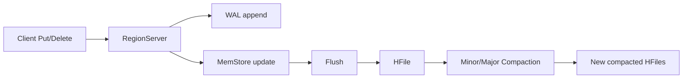

---
kb_id: bigdata/hbase/core-objects-state
title: HBase 核心对象与状态所有权
description: 解释 HBase 中哪些对象承载权威状态，哪些对象只是缓存或中间态，以及这些状态如何在 Region、WAL、MemStore 和 HFile 之间迁移。
domain: bigdata
component: hbase
topic: core-objects-state
difficulty: intermediate
status: reviewed
sidebar_position: 2
version_scope: HBase official docs as verified on 2026-05-09
last_verified_at: '2026-05-09'
source_ids:
  - hbase-architecture-overview
  - hbase-client-architecture
  - hbase-catalog-tables
  - hbase-regionserver-docs
  - hbase-datamodel
  - hbase-acid-semantics
claim_ids:
  - bigdata-hbase-claim-0002
  - bigdata-hbase-claim-0003
  - bigdata-hbase-claim-0004
  - bigdata-hbase-claim-0005
  - bigdata-hbase-claim-0006
  - bigdata-hbase-claim-0013
tags:
  - hbase
  - core-objects
  - state
  - wal
  - memstore
  - knowledge-base
---
## 先分清“逻辑对象”和“物理状态”
HBase 最容易学乱的地方，是把 Table、Region、Row、WAL、MemStore、HFile 都当成同一层面的东西。实际上它们分别属于不同层：

- `Table`、`RowKey`、`Column Family`、`Cell Version` 属于逻辑数据模型。
- `Region`、`RegionServer`、`HMaster` 属于服务与分片组织模型。
- `WAL`、`MemStore`、`HFile`、`BlockCache` 属于物理读写状态模型。

理解 HBase，关键不在背对象名，而在回答“这个对象拥有哪种状态、状态什么时候变化、失败后靠什么恢复”。

## 核心对象一览
| 对象 | 本质角色 | 是否承载权威状态 | 典型问题 |
| --- | --- | --- | --- |
| Table | 用户看到的逻辑表 | 是 | 这张表有哪些列族、版本和 TTL 规则 |
| RowKey | 排序与路由主轴 | 是 | 请求会落到哪个 Region，扫描是否连续 |
| Column Family | 物理存储分组 | 是 | 是否把冷热字段错误混存，导致 IO 放大 |
| Region | `RowKey` 连续区间的服务单元 | 是 | 是否过热、是否过多、是否需要 split |
| RegionServer | 承载多个 Region 的数据面服务进程 | 否，更多是运行主体 | 某台节点是否热点、是否 flush / compaction 积压 |
| HMaster | 管理面协调者 | 否，主要管理元信息与分配 | Region 分配是否异常，集群是否稳定 |
| WAL | 写前日志 | 是，未 flush 数据恢复的依据 | 写延迟是否高，故障后能否 replay |
| MemStore | 内存写缓冲 | 否，中间态 | 是否顶满导致 flush 压力 |
| HFile | 刷盘后的持久化数据文件 | 是 | 文件过多、版本过多、compaction 是否滞后 |
| BlockCache | 读缓存 | 否，缓存态 | 命中率是否过低，读放大是否明显 |

## 逻辑状态如何映射成物理状态
用户看到的是“某一行某一列的当前值和历史版本”，但 HBase 内部不是直接维护一个行对象，而是把逻辑状态分散到多个地方：

1. 最新写入先进入 `WAL` 与 `MemStore`。
2. 刷盘后，数据进入 `HFile`，成为长期持久化状态。
3. 删除不是立刻真的把旧值从所有文件里擦掉，而是先写删除标记，等后续 compaction 重写文件时再清理。
4. 读取时，系统要把 `MemStore`、缓存和多个 `HFile` 的可见结果合并起来，才能形成客户端看到的最终视图。

所以“某一行当前值是什么”不是单点存储出来的，而是一次读路径计算出来的结果。这也是为什么版本数、删除标记和 HFile 数量会直接影响读延迟。

## `Region` 是 HBase 里最关键的状态归属边界
在 HBase 里，很多机制都围绕 Region 展开：

- 路由：客户端最终是根据 RowKey 找到目标 Region。
- 调度：Region 被分配给某个 RegionServer。
- 热点：热点本质上常常是热点 Region，而不是抽象的“表变慢”。
- split：当 Region 长大到一定程度，会被切成更小的 RowKey 区间。
- 故障恢复：RegionServer 宕机后，要重新分配 Region，并依赖 WAL 恢复未刷盘数据。

因此，分析 HBase 问题时，比起抽象地说“表慢了”，更有价值的说法是“某个 Region 是否过热、是否过多 HFile、是否处在 compaction backlog 中”。

## `WAL`、`MemStore`、`HFile` 各自解决什么问题
### `WAL`
`WAL` 的职责不是加速，而是保证写入在节点故障时可恢复。只要写入已经完成了日志持久化，即使后面节点宕机，也可以通过 replay 把尚未 flush 的状态重新恢复出来。

### `MemStore`
`MemStore` 解决的是“不能每条写都立刻改磁盘有序文件”的问题。它让写请求先进入内存缓冲，积累到一定程度再批量刷盘，因此写吞吐可以明显提升。但它只是中间态，不是最终持久化结果。

### `HFile`
`HFile` 是 HBase 最终长期持久化的有序文件格式。一个 Region 可以同时拥有多个 `HFile`，读取时可能要跨多个文件做合并判断。文件越多、版本越多、删除标记越多，读放大通常越明显，于是需要 compaction 持续整理。

## `BlockCache` 不是正确性组件，而是延迟组件
`BlockCache` 经常和 WAL、MemStore 一起被提到，但角色完全不同。它不提供持久化，也不定义一致性边界；它只是在读路径上缓存热数据块或索引块，以减少磁盘 IO。

所以：

- `BlockCache` 命中率差，会让查询变慢。
- `BlockCache` 丢失，不会导致数据丢失。
- 调 `BlockCache` 是性能调优，不是数据修复。

## 一个典型状态迁移链

这条链路里，最值得面试中说清的是两个边界：

- 写成功的语义边界在服务端完成 WAL + 内存更新之后，而不是 flush 之后。
- 物理文件的整理是后台维护动作，不应该和逻辑写入完成混为一谈。

## 观察这些对象时应该看什么证据
| 对象 | 最应该看的证据 |
| --- | --- |
| Region | 热点分布、Region 数量、split 历史 |
| RegionServer | flush、compaction、WAL latency、RPC 延迟 |
| WAL | sync latency、恢复 replay 情况 |
| MemStore | 内存占用、flush pressure |
| HFile | 文件数量、大小分布、版本膨胀 |
| BlockCache | hit ratio、eviction、热块是否集中 |

## 本页结论
HBase 的核心对象不是并列的术语清单，而是一组有明确状态分工的层次结构。只要能回答“状态先在哪里、再去哪里、谁负责恢复、谁只负责加速”，就已经真正理解了 HBase 的内部骨架。
