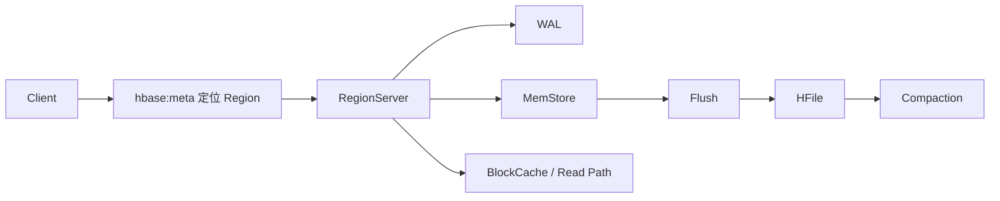

---
kb_id: bigdata/hbase/overview
title: HBase 整体定位与技术边界
description: 从在线服务存储、RowKey 模型、Region 架构、HDFS 依赖和事务边界理解 HBase 的真实定位。
domain: bigdata
component: hbase
topic: overview
difficulty: intermediate
status: reviewed
sidebar_position: 1
version_scope: HBase official docs as verified on 2026-05-09
last_verified_at: '2026-05-09'
source_ids:
  - hbase-book
  - hbase-architecture-docs
  - hbase-architecture-overview
  - hbase-datamodel
  - hbase-schema-design
  - hbase-acid-semantics
claim_ids:
  - bigdata-hbase-claim-0001
  - bigdata-hbase-claim-0002
  - bigdata-hbase-claim-0007
  - bigdata-hbase-claim-0009
  - bigdata-hbase-claim-0018
  - bigdata-hbase-claim-0021
tags:
  - hbase
  - overview
  - rowkey
  - storage
  - knowledge-base
  - production
---
## HBase 的本质是“面向 RowKey 的在线分布式表存储”
HBase 不是通用 SQL 数仓，也不是对象存储上的表格式，更不是消息系统。它的核心价值，在于把超大规模、稀疏、列族化的数据组织成一张张可以按 `RowKey` 低延迟随机读写的分布式表，并且天然支持按键有序的范围扫描。

如果一句话想说准 HBase，可以这样概括：它把表数据切成多个按 `RowKey` 连续区间管理的 `Region`，由不同 `RegionServer` 提供服务；写入先落 `WAL` 和 `MemStore`，再刷到 `HFile`；读取围绕 `MemStore`、`BlockCache` 和磁盘文件展开。只要这个主链路说准，后面的架构、性能、故障和选型问题就都能落到因果链上。

## 它解决的不是“任意查询”，而是“已知键模型下的在线访问”
很多人第一次学 HBase 会把它和 Hive、ClickHouse、Elasticsearch 混在一起。更稳的理解方式是先看它解决的核心问题：

1. 数据量很大，单机存不下，必须横向切分。
2. 访问延迟要求比离线数仓低，不能每次都靠大扫描。
3. 数据模式是稀疏表，列并不总是齐全，列簇存储比固定行式更划算。
4. 应用读写常常能围绕主键或主键前缀展开。

如果业务问题本身不满足这些前提，比如主要是多维聚合、任意字段过滤、复杂 Join 或事务型跨行更新，那么 HBase 往往就不是最合适的主存储。

## 真正决定 HBase 上限的，不是“有没有分布式”，而是 `RowKey` 模型
HBase 是按 `RowKey` 排序存储的，Region 也是按照 `RowKey` 连续区间切分。于是 `RowKey` 不只是一个业务主键，而是同时决定：

- 写入会落到哪个 Region。
- 负载会打到哪个 RegionServer。
- 扫描能不能顺序命中连续数据。
- 是否会形成热点。
- 是否能通过前缀扫描减少大量无效读取。

这就是为什么 HBase 的性能设计通常先问“主访问模式是什么”，而不是先问“机器多少台”。如果 `RowKey` 本身是单调递增且没有打散机制，大量写流量可能长期落到最新尾部 Region，整个集群还没到容量上限，单个热点节点就先顶满了。

## HBase 与相邻系统的边界必须说清
| 系统 | 主要职责 | 与 HBase 的边界 |
| --- | --- | --- |
| HDFS | 提供底层分布式持久化存储 | HBase 依赖 HDFS 存放 WAL、HFile 等物理数据，但 HDFS 不提供 HBase 的表模型与随机访问索引 |
| Hive / Trino | SQL 分析与元数据访问层 | 可以读取 HBase 数据或与之集成，但不改变 HBase 作为在线主键存储的本质 |
| ClickHouse | 分析型列式数据库 | 强项是大扫描和聚合，不以在线主键写入模型为核心 |
| Kafka | 事件流日志系统 | 强项是顺序追加与消费组，不负责按 RowKey 查询表状态 |
| Delta / Iceberg | 数据湖表格式 | 强项是表级快照治理与分析引擎兼容，不是在线 Serving Store |

边界讲不清，面试里就很容易把“HBase 适合什么”答成“大数据都能做”。

## HBase 不是没有一致性，而是只在它声明的边界内保证一致性
HBase 最关键的一条语义不是“强事务”，而是“行级原子性”。也就是说：

- 同一行上的一次 mutation 是原子的。
- `checkAndMutate` 这类条件更新能力也是围绕单行实现的。
- 它不提供通用的跨多行、跨多表事务模型。

这也是为什么 HBase 很适合账户画像、设备画像、时序特征、订单明细索引、风控特征表这类“围绕主键组织状态”的服务型数据，而不适合作为复杂 OLTP 关系库的直接替代。

## 一个最小真实链路

这张图的重点不在“对象名”，而在顺序关系：请求先路由到正确 Region，再进入读写路径；写成功与否的语义边界在 WAL 与服务端处理链；物理文件布局则由 flush 和 compaction 持续演化。

## 什么时候应该优先考虑 HBase
更适合选 HBase 的典型场景：

- 明确存在按主键或主键前缀访问的高频请求。
- 需要在线随机写入，而不是只做离线批量追加。
- 表很大、列稀疏、不同业务字段更新频率不一致。
- 接受围绕键模型做建模，不追求通用 SQL 交互体验。

不适合优先选 HBase 的典型场景：

- 分析型查询远多于点查。
- 主要是复杂聚合、排序和多表关联。
- 业务无法稳定定义 `RowKey` 模型。
- 需要强多行事务。

## 建议阅读路径
1. 先看 [核心对象与状态所有权](./core-objects-state.md)，理解 `Region`、`WAL`、`MemStore`、`HFile` 的角色。
2. 再看 [架构分层与角色协作](./architecture-and-roles.md) 和 [元数据与状态管理](./metadata-state.md)，把 `hbase:meta`、客户端定位和主从边界理清。
3. 然后进入 [写入路径](./write-path.md)、[读取路径](./read-path.md) 和 [一致性边界](./consistency-boundaries.md)。
4. 最后再学习 [分区布局](./partition-layout.md)、[性能模型](./performance-model.md)、[运维与排障](./observability.md) 等生产专题。

## 本页结论
HBase 的核心不是“分布式存储”四个字，而是“围绕 `RowKey` 组织在线表状态”。只要回答里能把 `RowKey`、`Region`、`RegionServer`、`WAL/MemStore/HFile`、行级原子性和选型边界串成一条链，就已经进入原理层；如果只是罗列术语，还没有真正理解 HBase。
