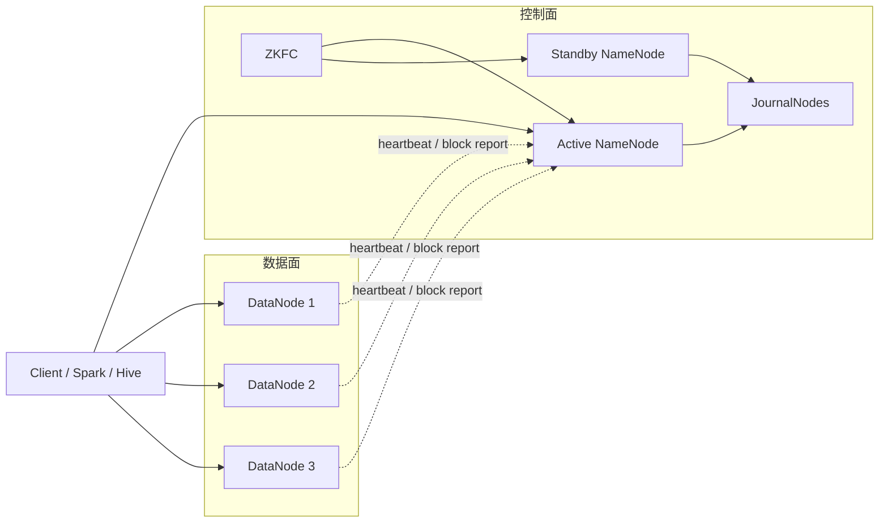

## 先把控制面和数据面分开，HDFS 的架构才不会混乱

HDFS 的经典架构并不复杂，但很容易被讲浅。真正需要分清的是：谁管理命名空间，谁保存真实字节，谁决定副本布局，谁负责故障切换，谁只是做 checkpoint。只要把这些角色混在一起，后面的读写链路、一致性和排障都会变形。

最核心的划分是两层：

- 控制面：NameNode 及其高可用协作组件，负责元数据、状态机和协调。
- 数据面：DataNode 与客户端之间的数据传输，负责真实 block 的读写、复制和落盘。

## 角色表面上很多，真正需要抓住的是状态所有权

| 角色 | 主要职责 | 它不负责什么 | 失效后首先影响什么 |
| --- | --- | --- | --- |
| NameNode | 维护 namespace、文件到 block 的映射、复制因子、权限、元数据变更日志 | 不保存真实文件字节 | 元数据服务、创建/打开/rename 等命名空间操作 |
| DataNode | 存储 block replica，处理客户端读写，请求复制或删除 block | 不理解完整文件语义，不决定全局副本策略 | 路径局部可用性、局部吞吐和副本健康 |
| Client | 请求元数据、建立读写链路、驱动 pipeline | 不保存权威元数据 | 单次请求是否能继续推进 |
| Active NameNode | 当前接受客户端写请求并推进 edits 的主节点 | 不是所有 NameNode 都能同时写 | 全集群写入、元数据更新 |
| Standby NameNode | 持续跟随 Active 的 edits，准备接管 | 正常情况下不对外承担写主职责 | HA 切换窗口、故障接管速度 |
| JournalNode | 在 QJM 中保存 shared edits，支撑 Active/Standby 一致 | 不提供客户端文件读写 | NameNode HA 的 edits 共识链路 |
| ZKFC | 结合 ZooKeeper 监测与触发自动 failover | 不负责业务数据复制 | 自动故障切换能力 |
| Secondary NameNode / Checkpoint Node | 周期性做 checkpoint，控制 FsImage 与 EditLog 合并成本 | 不是热备 NameNode | NameNode 重启恢复时间 |
| Backup Node | 维护内存中的命名空间副本并参与 checkpoint | 不等于现代 HA 主备切换方案 | 元数据备份与 checkpoint 效率 |

## NameNode 的职责，不是“保存所有数据”，而是保存所有解释数据的数据

官方架构文档里最重要的一句之一是：The NameNode is the arbitrator and repository for all HDFS metadata。也就是说，NameNode 保存的是：

- 目录树和文件名。
- 文件包含哪些 block。
- 每个 block 当前有哪些副本位置。
- 文件副本数、权限、配额等属性。
- 每一次元数据变更对应的 EditLog 记录。

所以，NameNode 的“重”不在磁盘吞吐，而在状态权威性。它一旦不可用，哪怕 DataNode 上的 block 文件还在，客户端也很难继续安全地按文件语义访问这些 block。

## DataNode 的职责，是把 block 当作本地文件来管理

DataNode 不理解完整的 HDFS 文件结构，它保存的是一个个 block 对应的本地文件和相关校验信息。官方架构文档明确说明，DataNode stores each block of HDFS data in a separate file in its local file system。

DataNode 平时做三类事：

1. 服务客户端读请求和写请求。
2. 通过 Heartbeat 告诉 NameNode“我还活着”。
3. 通过 Blockreport 告诉 NameNode“我现在持有哪些 block”。

也正因为如此，DataNode 失效后的首要问题不是“元数据丢了”，而是某些 block 的副本数下降、局部数据不可达或吞吐下降；后续是否需要补副本，由 NameNode 根据全局状态来决定。

## 客户端为什么必须先找 NameNode，再直连 DataNode

很多人在描述 HDFS 架构时会漏掉客户端的重要性。实际上，客户端是控制面和数据面之间的桥：

- 读文件时，客户端先向 NameNode 取 `LocatedBlocks` 风格的位置信息，再按距离优先选择 DataNode 读取。
- 写文件时，客户端先向 NameNode 申请创建文件和分配 block，再建立 DataNode pipeline 逐跳写入。

因此，客户端不是被动调用者，而是读写链路的组织者。它需要理解当前 Active NameNode 是谁、当前 block 应写到哪些 DataNode、pipeline 失败后如何重建，以及何时调用 `hflush()`、`hsync()`、`close()` 来推动可见性和持久化边界。

## “NameNode 不转发数据” 是 HDFS 架构最关键的扩展点

官方设计文档明确指出：user data never flows through the NameNode。这个事实非常关键，因为它解释了为什么 NameNode 可以集中做元数据裁决，而不至于成为所有数据流量的单点网络瓶颈。

这条边界带来两个直接后果：

- NameNode 的瓶颈通常体现在内存、GC、RPC、编辑日志和元数据操作，而不是海量文件内容传输。
- DataNode、客户端和网络拓扑才是顺序扫描、大批量写入、跨机架复制时的数据面瓶颈中心。

## HDFS HA 讲不清楚，架构题基本就不算过关

在没有 HA 的时代，单个 NameNode 是典型单点。QJM 模式下，HDFS 通过 Active/Standby NameNode、JournalNode 和 ZKFC 减轻这个问题：

- Active NameNode 负责处理元数据写请求，并把 edits 写入 JournalNodes。
- Standby NameNode 从 shared edits 中持续同步并应用这些变更，保持接近最新的命名空间状态。
- ZKFC 负责健康检查和自动 failover 协调。

这里有两个容易讲错的点。

### 只有一个 NameNode 能作为 edits 写入者

QJM 文档明确说明，使用 Quorum Journal Manager 时，同一时刻只允许一个 NameNode 对 JournalNodes 写入 shared edits。这个约束的意义是防止两个主同时推进元数据日志，从而破坏文件系统一致性。

### 有了 QJM 也仍然需要 fencing

QJM 文档同时强调，即便只有一个 NameNode 能继续写 JournalNodes，旧 Active 在某些故障时仍可能短暂对外提供过时读服务。因此，生产上仍建议配置 fencing。也就是说，QJM 解决的是“共享 edits 不被双写破坏”，不是“所有陈旧服务风险自动消失”。

## Secondary NameNode 不是 HA 方案，这个边界一定要说准

用户指南对 Secondary NameNode 的定义很清楚：它的主要作用是周期性合并 fsimage 和 edits，控制 NameNode 启动时的恢复成本。它不是热备，不承担主备切换职责，也不能替代 Active/Standby + JournalNode + ZKFC 的 HA 方案。

如果把 Secondary NameNode 说成“备用 NameNode”，会直接暴露对 HDFS 架构理解不扎实。更准确的说法应该是：

- Secondary NameNode / Checkpoint Node 解决 checkpoint 问题。
- Active / Standby NameNode 解决高可用接管问题。
- JournalNode + fencing 解决 shared edits 与 split-brain 风险问题。

## Backup Node 和 Checkpoint Node 也别混进 HA 主线里

用户指南还区分了 Checkpoint Node 和 Backup Node：

- Checkpoint Node 周期性下载 fsimage 和 edits，合并后上传新的镜像。
- Backup Node 除了 checkpoint，还会接收 edits 流并在内存里维护最新命名空间副本。

这两个角色都和“元数据恢复效率”有关，但它们不是今天生产中最常见的 HDFS HA 主线答案。回答架构题时，应先讲 NameNode、DataNode、Client、HA 组件；只有在元数据恢复和 checkpoint 话题下，再单独展开 Secondary / Checkpoint / Backup 的区别。

## 架构排障时，先判断故障属于哪一层

面对“HDFS 读不到”“HDFS 很慢”“NameNode 切不过去”这类问题，先分层能少走很多弯路：

- 如果是创建、rename、权限、目录操作失败，先看 NameNode 和命名空间层。
- 如果是读取慢、吞吐低、局部 block 失败，先看 DataNode、磁盘、网络和副本布局。
- 如果是 HA 切换异常，先看 Active/Standby 状态、JournalNode、ZKFC 和 fencing 配置。
- 如果是重启恢复慢，先看 checkpoint、FsImage、EditLog 长度和小文件规模。

## 来源与事实边界

### 来源

`hadoop-hdfs-design`、`hadoop-hdfs-ha-qjm`、`hadoop-hdfs-user-guide`、`hadoop-hdfs-permissions`、`hadoop-hdfs-default-config`

### 事实声明

`bigdata-hdfs-claim-0002`、`bigdata-hdfs-claim-0003`、`bigdata-hdfs-claim-0013`、`bigdata-hdfs-claim-0001`、`bigdata-hdfs-claim-0004`、`bigdata-hdfs-claim-0005`、`bigdata-hdfs-claim-0006`、`bigdata-hdfs-claim-0007`、`bigdata-hdfs-claim-0008`、`bigdata-hdfs-claim-0009`
