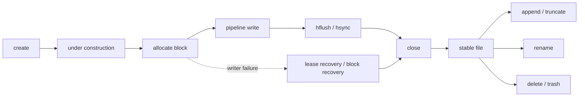

---
kb_id: bigdata/hdfs/lifecycle
title: HDFS 生命周期与状态演进
description: 解释 HDFS 生命周期与状态演进的核心对象、执行链路、状态边界、性能模型和生产排障方法。
domain: bigdata
component: hdfs
topic: lifecycle
difficulty: intermediate
status: reviewed
sidebar_position: 11
version_scope: Apache Hadoop 3.3.5 stable HDFS docs as verified on 2026-04-28
last_verified_at: '2026-04-28'
source_ids:
  - hadoop-hdfs-design
  - hadoop-hdfs-user-guide
  - hadoop-hdfs-permissions
  - hadoop-hdfs-ha-qjm
  - hadoop-hdfs-default-config
claim_ids:
  - bigdata-hdfs-claim-0017
  - bigdata-hdfs-claim-0011
  - bigdata-hdfs-claim-0001
  - bigdata-hdfs-claim-0002
  - bigdata-hdfs-claim-0003
  - bigdata-hdfs-claim-0004
  - bigdata-hdfs-claim-0005
  - bigdata-hdfs-claim-0006
  - bigdata-hdfs-claim-0007
  - bigdata-hdfs-claim-0008
tags:
  - bigdata
  - hdfs
  - lifecycle
  - knowledge-base
  - production
---
## HDFS 的生命周期，最好沿着“文件状态”与“block 状态”两条线同时看

单看 API 名称，很难真正看清 HDFS 的状态演进。更可靠的方式，是把文件从创建到删除的过程拆成两条并行主线：

- 文件语义主线：create、append、close、rename、delete。
- block 管理主线：分配、写入、副本汇报、完成、欠副本修复、回收。



## 1. create 不是“立刻把全部数据写完”，而是先建立命名空间入口

客户端发起创建文件请求时，第一步并不是把文件内容推给 DataNode，而是由 NameNode 在命名空间里创建这个路径，并建立写入期的状态约束。此时文件已经作为 namespace 对象存在，但它还处于 under construction 阶段，后续 block 是否已经完全稳定，要看写入推进到哪一步。

这说明，HDFS 中文件的“存在”与“数据已经稳定可用”是两个不同层面的状态：

- 路径可能已经存在。
- 最后一个 block 仍可能在写。
- 元数据长度和真实可见数据长度也可能暂时不同步。

## 2. block 分配与 pipeline 建立，是写入生命周期真正开始的地方

当客户端本地缓冲累计到需要落 HDFS block 时，才会向 NameNode 申请 block，并拿到一组目标 DataNode。随后客户端建立 pipeline，把数据按链路推送给多个 DataNode 完成副本写入。

这里的关键不是“写到三台机器”这么简单，而是：

- block 是 HDFS 的基本分配单位。
- pipeline 是同一块数据形成多个 replica 的数据面机制。
- 副本布局同时受复制因子、机架感知和当前节点状态影响。

文件生命周期因此天然是分段推进的：一个文件可能前面多个 block 已经完全稳定，只有最后一个 block 还在写。

## 3. open 文件与 closed 文件不是同一种状态对象

HDFS 生命周期里最重要的一条边界就是 `close()`。在 `close()` 之前，文件仍可能：

- 持有 lease。
- 拥有 under construction 的最后一个 block。
- 存在“数据对新 reader 可见，但元数据长度还未完全对齐”的窗口。

而在 `close()` 之后，官方文件系统输出流规范要求：文件元数据必须与内容一致，`getFileStatus(path)` 返回的长度和修改时间应体现最终结果。这也是为什么 HDFS 的很多讨论都会强调“close 后可见边界”和“close 前的写入期行为要单独分析”。

## 4. `hflush()`、`hsync()`、`close()` 把生命周期切成了三个不同层次

从生命周期角度看，这三个动作不是同义词：

- `hflush()`：把客户端缓冲区的数据同步出去，新的 reader 应该能看到这些数据，但不等于一定已经持久化到最终存储设备。
- `hsync()`：在 `hflush()` 可见性的基础上，进一步提供持久化语义。
- `close()`：完成剩余数据推进并最终同步元数据，使文件从“写入态”进入“稳定态”。

官方 Hadoop 文件系统输出流规范还特别指出：HDFS 在文件写入过程中，元数据长度可能落后于已经可见的数据长度；直到 `close()` 后，文件元数据才必须与内容完全一致。

这就是为什么很多上层系统会把“是否已 close”作为判断结果是否真正提交完成的重要边界。

## 5. append 不是随便继续写，而是重新进入受控写入态

现代 HDFS 支持对已关闭文件做 append，但 append 的含义是“继续在文件尾部追加内容”，不是任意位置更新。重新 append 后，文件会再次进入受控写入态，最后一个 block 可能重新变成 under construction 或触发新的 block 分配。

因此，append 的正确理解应该是：

- 它打破了最早版本“绝对只写一次”的严格表述。
- 但它并没有把 HDFS 变成通用随机更新文件系统。
- 它仍然遵循单写者和尾部追加的约束。

## 6. writer 异常退出时，生命周期不会自动变成“已经成功”

如果客户端写到一半崩溃、网络断开或长时间失去 lease，系统需要进入 lease recovery / block recovery 流程。官方源码实现中，恢复逻辑会立即回收当前 lease，并推动文件从未稳定状态向可关闭状态收敛；under construction 的最后一个 block 可能进入 `UNDER_RECOVERY`。

这个阶段的重点不是“补副本”，而是“先把最后一个 block 的真实边界和有效版本确认下来”。否则，系统无法安全判断文件究竟写到了哪里，以及旧 writer 是否还可能继续污染结果。

## 7. rename、delete、setReplication 属于不同类型的生命周期事件

### rename 是命名空间生命周期事件

`rename` 首先是 NameNode 上的元数据操作。它改变路径关系，但不意味着底层数据一定发生大规模搬运。理解这点很重要，因为很多上层作业把 `rename` 当成发布步骤，本质上是利用它的命名空间切换语义。

### delete 是命名空间删除先发生，空间回收后发生

架构文档和用户指南都指出，删除文件后，关联 block 的空间释放并不一定瞬时反映为可用空间增加。也就是说：

- 删除路径时，命名空间关系先改变。
- block 回收和最终可用空间增加可能存在时间延迟。
- 使用 Trash 时，路径还可能先进入 `.Trash`，并不是立刻永久消失。

### `setReplication` 是目标状态变化，物理动作异步完成

当复制因子增加或减少时，NameNode 会先更新“目标副本数”这条元数据，再在后续 heartbeat 驱动下安排 DataNode 复制或删除多余副本。因此，`setReplication` 调用完成不等于数据面已经瞬时收敛完毕。

## 8. DataNode 的 decommission 也是生命周期，而不是简单关机

用户指南明确说明，`dfsadmin -refreshNodes` 会让 NameNode 重新读取允许接入和待下线节点列表；待下线的 DataNode 只有在其上 block 已按照复制策略被复制到其他节点后，才会真正完成 decommission。并且，完成 decommission 的节点不会自动关机，只是不再被选作新副本写入目标。

这意味着节点下线本身也有一个生命周期：

1. 标记待下线。
2. 补齐其上 block 的目标副本布局。
3. 进入已下线状态。
4. 停止承担新的写入放置职责。

## 9. NameNode 重启后的生命周期，会重新经过 Safemode

重启不是简单恢复进程，而是新一轮状态重建：加载 `FsImage`、回放 `EditLog`、等待 DataNodes 上报 block，然后进入退出 Safemode 的判断流程。只有当足够多 block 被确认可用后，NameNode 才会退出 Safemode 并开始处理欠副本等修复任务。

因此，在生产上看到“重启后系统还不能写”时，先不要急着判断为故障，很可能只是元数据生命周期正处于 Safemode 阶段。

## 一个最小观察序列

下面这组命令不是为了炫命令，而是帮助你把生命周期状态和观测结果对应起来：

```bash
hdfs dfs -mkdir -p /tmp/hdfs-lifecycle-demo
hdfs dfs -put local-1.txt /tmp/hdfs-lifecycle-demo/events.log
hdfs dfs -appendToFile local-2.txt /tmp/hdfs-lifecycle-demo/events.log
hdfs fsck /tmp/hdfs-lifecycle-demo/events.log -files -blocks -locations
hdfs dfs -mv /tmp/hdfs-lifecycle-demo/events.log /tmp/hdfs-lifecycle-demo/events.log.done
hdfs dfs -rm /tmp/hdfs-lifecycle-demo/events.log.done
```

这条序列分别覆盖了创建、追加、block 观察、rename 和 delete。真正有用的不是命令本身，而是理解每一步背后的状态边界。

## 来源与事实边界

### 来源

`hadoop-hdfs-design`、`hadoop-hdfs-user-guide`、`hadoop-hdfs-permissions`、`hadoop-hdfs-ha-qjm`、`hadoop-hdfs-default-config`

### 事实声明

`bigdata-hdfs-claim-0017`、`bigdata-hdfs-claim-0011`、`bigdata-hdfs-claim-0001`、`bigdata-hdfs-claim-0002`、`bigdata-hdfs-claim-0003`、`bigdata-hdfs-claim-0004`、`bigdata-hdfs-claim-0005`、`bigdata-hdfs-claim-0006`、`bigdata-hdfs-claim-0007`、`bigdata-hdfs-claim-0008`
