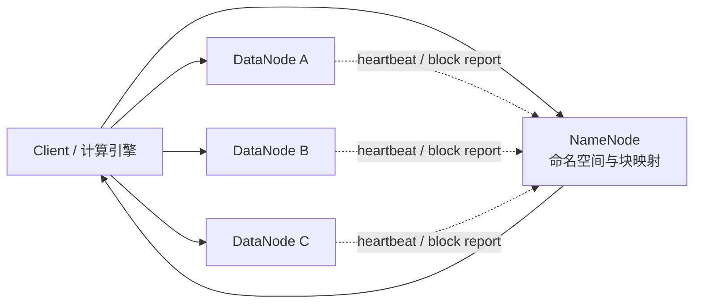

## HDFS 真正解决的不是“把磁盘拼起来”，而是大规模文件的可靠存取

HDFS 的官方设计前提非常明确：硬件故障是常态、数据集很大、访问模式以流式读取和批处理吞吐为主、系统愿意牺牲一部分 POSIX 语义来换取规模和吞吐。在这个前提下，HDFS 把问题拆成两层：由 NameNode 统一管理命名空间、文件到 block 的映射和副本决策；由 DataNode 保存真实数据块并直接与客户端传输数据。

这意味着，HDFS 的核心价值不只是“有副本”，而是把文件系统语义、块布局、故障恢复和计算本地性放进一个统一模型里。上层的 Spark、Hive、MapReduce 之所以能在 HDFS 上做大规模离线计算，依赖的正是这种“元数据集中管理、数据分散存放、客户端直连数据节点”的结构。

## 四个设计假设，决定了 HDFS 的能力边界

### 1. 硬件会坏，所以恢复必须自动化

HDFS 架构文档把“Hardware failure is the norm rather than the exception”放在最前面。这不是背景介绍，而是整个系统的起点。DataNode 会持续向 NameNode 发送 Heartbeat 和 Blockreport；NameNode 根据这些汇报判断节点是否存活、哪些 block 缺副本、哪些副本需要重新复制。

因此，面向 HDFS 的设计和排障，不能假设节点永远稳定，也不能把“丢一台机器”当异常事件。对 HDFS 来说，真正的异常不是某一台 DataNode 挂掉，而是挂掉之后系统无法基于剩余副本继续服务，或者元数据已经无法判断哪些副本还可信。

### 2. 高吞吐优先于低延迟

HDFS 官方明确强调，它更适合 batch processing，而不是交互式低延迟系统。它针对的是 GB 到 TB 级文件、顺序或流式访问，以及高聚合带宽，而不是频繁的小随机 IO。

所以，凡是下面这些期待，都不应该默认放在 HDFS 身上：

- 把它当本地文件系统那样做毫秒级小文件操作。
- 把它当数据库那样做高频随机更新。
- 把它当消息队列那样承担顺序消费和重放语义。
- 把它当对象索引系统那样直接做复杂条件检索。

### 3. 一次写入、多次读取，外加受限的 append/truncate

HDFS 的一致性模型不是完整 POSIX。官方长期强调的主线是 write-once-read-many；在现代版本里，文件在 close 之后可以被 append，且支持 truncate，但仍然不能像通用文件系统那样在任意偏移做原地更新。

这条边界特别重要，因为它直接决定：

- HDFS 擅长日志、数仓分区文件、离线训练样本这类“生成后反复读”的数据。
- HDFS 不适合做行级更新频繁的业务文件。
- 上层表格式、事务层和计算引擎必须自己处理更高层的提交和可见性语义。

### 4. 计算靠近数据，比搬数据更便宜

HDFS 设计文档把“Moving computation is cheaper than moving data”作为核心假设之一。也就是说，HDFS 不只是存文件，它还在为上层调度系统提供数据位置前提。MapReduce、Spark、YARN 等系统之所以强调数据本地性，本质上就是在消费 HDFS 提供的块位置信息。

如果把 HDFS 只理解成“远程磁盘池”，就很难解释为什么 block 大小、rack awareness、节点分布会直接影响上层作业吞吐。

## 不要把 HDFS 和相邻系统混成一类

| 系统 | 核心职责 | 不应该混淆成什么 |
| --- | --- | --- |
| HDFS | 大文件分布式存储、块复制、故障恢复、数据位置暴露 | 低延迟随机更新数据库 |
| Kafka | 事件流存储与顺序消费 | 通用分布式文件系统 |
| HBase | 基于 LSM 的低延迟随机读写 | 大文件批处理存储层 |
| 对象存储 | 扁平对象存放、超大规模容量、云原生接口 | HDFS 风格的数据本地性文件系统 |
| Hive / Spark | SQL 或计算引擎 | 底层持久化文件系统 |

最容易出现的误判，是把上层查询慢、分区爆炸、作业失败，一股脑归因为“HDFS 不行”。事实上，很多问题的根因并不在 HDFS 本身，而是在上层把它当成了不擅长的存储类型来用，比如制造大量小文件，或者依赖它承担细粒度事务语义。

## HDFS 的全局模型，至少要看清这五个对象

| 对象 | 它真正负责什么 | 为什么重要 |
| --- | --- | --- |
| NameNode | 命名空间、文件到 block 的映射、复制与放置决策 | 它是元数据权威来源，也是小文件问题和恢复成本的核心压力点 |
| DataNode | 保存 block replica，执行读写、复制、删除等数据面动作 | 真正的数据字节在这里，不在 NameNode |
| Client | 向 NameNode 请求元数据，再直接与 DataNode 传输数据 | 数据流是否绕过 NameNode，决定了扩展方式 |
| Block | HDFS 的基本存储与复制单位 | 并行度、恢复粒度、本地性都围绕 block 展开 |
| Replica | block 在不同 DataNode 上的物理副本 | 可用性、跨机架容灾和读取选择都依赖副本布局 |

理解 HDFS 时，不能只记名词，更重要的是知道“谁持有权威状态，谁只是汇报状态，谁只负责搬运字节”。

## 一条正常请求是怎样穿过 HDFS 的

读取路径和写入路径都遵循一个非常重要的原则：元数据查 NameNode，数据本身走 DataNode。

- 读文件时，客户端先向 NameNode 请求 block 位置，再优先从更近的 DataNode 读取副本。
- 写文件时，客户端先向 NameNode 申请文件和 block，再把数据按 pipeline 推给多个 DataNode。
- NameNode 不转发用户数据。官方架构文档明确指出，系统被设计成 user data never flows through the NameNode。

这个边界是 HDFS 能水平扩展数据面的关键，也是很多排障判断的起点。如果网络流量瓶颈发生在 DataNode 之间或客户端到 DataNode 的链路上，盯着 NameNode CPU 往往找不到根因。

## 适合放进 HDFS 的数据，通常满足三个条件

### 文件大

典型文件从 GB 到 TB 级，而不是成百万个 KB 级碎片。文件越碎，NameNode 要维护的目录项、文件条目和 block 映射越多，元数据成本越高。

### 读多写少，且写入偏追加

数据生成后会被反复读取、扫描、聚合，但不会被频繁随机修改。例如埋点日志、离线数仓明细、训练样本、批处理输出、归档结果。

### 更重吞吐，不极端追求单次响应时延

一次扫描很多数据、并行跑很多 task、靠整体吞吐完成任务，这是 HDFS 的舒适区；而“单用户点一下立刻返回 10 条记录”的体验，不是它的设计目标。

## 不适合放进 HDFS 的场景，也要说清楚为什么

### 小文件海量堆积

这类问题的本质往往不是 DataNode 磁盘不够，而是 NameNode 元数据和 RPC 被文件、目录、block 数量放大。也就是说，先爆掉的常常不是存储容量，而是元数据面。

### 高频随机写与覆盖写

HDFS 允许 append 和 truncate，但这不等于它适合做任意偏移原地更新。对经常更新中间字节、频繁重写小对象的业务，更合适的往往是数据库、KV 或对象存储结合上层索引。

### 需要完整业务事务语义

HDFS 提供的是文件系统语义，不是多文件事务、表级 ACID 或消息消费提交语义。真正需要这些能力时，要交给 Hive ACID、Iceberg、Delta Lake、Hudi 或消息系统来补齐。

## 生产里最先该看的不是“是不是 HDFS 挂了”，而是证据链

排障时最有价值的第一步，不是上来就改参数，而是确认问题落在元数据面、数据面还是外部依赖：

1. 看 NameNode Web UI 和 `hdfs dfsadmin -report`，确认整体容量、水位、活节点和异常节点。
2. 用 `hdfs fsck <path> -files -blocks -locations` 看路径级 block、副本和位置状态。
3. 区分是文件打不开、读取慢、写入失败，还是上层引擎在抱怨数据布局。
4. 确认最近是否有节点下线、磁盘故障、机架变化、小文件暴涨或上层批量写入模式变化。

只有把“对象、链路、状态、证据”串起来，HDFS 才不会被理解成一个抽象名词。

## 来源与事实边界

### 来源

`hadoop-hdfs-design`、`hadoop-hdfs-user-guide`、`hadoop-hdfs-permissions`、`hadoop-hdfs-ha-qjm`、`hadoop-hdfs-default-config`

### 事实声明

`bigdata-hdfs-claim-0002`、`bigdata-hdfs-claim-0006`、`bigdata-hdfs-claim-0021`、`bigdata-hdfs-claim-0001`、`bigdata-hdfs-claim-0003`、`bigdata-hdfs-claim-0004`、`bigdata-hdfs-claim-0005`、`bigdata-hdfs-claim-0007`、`bigdata-hdfs-claim-0008`、`bigdata-hdfs-claim-0009`
