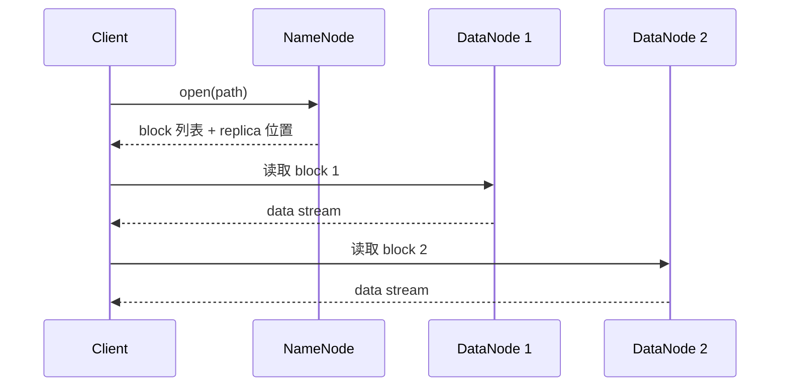

---
kb_id: bigdata/hdfs/read-path
title: HDFS 读取路径与可见性边界
description: 解释 HDFS 读取路径与可见性边界如何定位数据、裁剪扫描、并行执行和返回结果，并说明可见性、性能证据与排障入口。
domain: bigdata
component: hdfs
topic: read-path
difficulty: intermediate
status: reviewed
sidebar_position: 6
version_scope: Apache Hadoop 3.3.5 stable HDFS docs as verified on 2026-04-28
last_verified_at: '2026-04-28'
source_ids:
  - hadoop-hdfs-design
  - hadoop-hdfs-user-guide
  - hadoop-hdfs-permissions
  - hadoop-hdfs-ha-qjm
  - hadoop-hdfs-default-config
  - hadoop-filesystem-outputstream
claim_ids:
  - bigdata-hdfs-claim-0004
  - bigdata-hdfs-claim-0016
  - bigdata-hdfs-claim-0023
  - bigdata-hdfs-claim-0025
  - bigdata-hdfs-claim-0002
  - bigdata-hdfs-claim-0003
  - bigdata-hdfs-claim-0006
  - bigdata-hdfs-claim-0008
  - bigdata-hdfs-claim-0009
  - bigdata-hdfs-claim-0010
tags:
  - bigdata
  - hdfs
  - read-path
  - knowledge-base
  - production
---
## HDFS 读路径的核心不是“打开文件”，而是先解析 block 位置，再选择更近的副本

HDFS 读路径最重要的原理是元数据查找和数据传输分离。客户端不会像访问本地文件那样直接按路径去某台服务器拉字节，而是先向 NameNode 请求这个文件由哪些 block 组成、每个 block 当前有哪些副本，再按距离优先原则选择更近的 DataNode 读取。

这条链路之所以重要，是因为它同时解释了：

- 为什么 NameNode 不需要转发全部数据。
- 为什么数据本地性会影响上层计算吞吐。
- 为什么某些读故障只影响局部 block，而不是整个文件瞬间完全不可读。



## 第一步：路径解析与元数据定位

读路径的起点是 `open(path)`。NameNode 需要先回答几个最基本的问题：

- 路径是否存在。
- 调用者是否有权限读取。
- 这是文件还是目录。
- 文件由哪些 block 构成。
- 每个 block 当前有哪些副本位置。

所以，当读请求一开始就失败时，根因未必在 DataNode，也可能是命名空间、权限、文件状态或 NameNode 当前可用性问题。

## 第二步：客户端拿到的是 block 视图，不是“整文件下载地址”

很多人会把 HDFS 文件想象成 S3 那样一个对象地址，但对客户端来说，NameNode 返回的更接近“这个文件的 block 列表及其副本位置”。客户端后续要做的，是对这些 block 逐个建立读取流，并按顺序重新拼成完整文件内容。

这也是为什么：

- HDFS 并行度天然和 block 粒度相关。
- 上层引擎可以按 split 或 block 拆任务。
- 某个 block 的局部异常不会立刻等于整文件彻底损坏。

## 第三步：读取优先级首先看距离，而不是随机挑副本

官方架构文档说明，客户端会优先读取距离自己更近的副本。这里的“近”通常意味着节点本地、同机架、跨机架等拓扑距离差异，而不是简单随机。这个选择逻辑的意义非常大：

- 对离线计算引擎来说，它直接影响数据本地性收益。
- 对网络来说，它减少不必要的跨机架传输。
- 对吞吐来说，它让同一文件在不同客户端视角下可能走出不同性能路径。

因此，读慢不一定是“磁盘慢”，也可能是拓扑上没拿到更优副本，或者本地性被调度系统破坏了。

## 第四步：NameNode 不在数据流里，所以 DataNode 才是读吞吐中心

HDFS 的一个本质设计是：NameNode 返回位置，DataNode 传输字节。正常读路径下，NameNode 不转发文件内容。这意味着：

- NameNode 的压力更偏向 RPC、元数据和内存。
- DataNode 的压力更偏向磁盘、网络、并发连接和校验。
- 读路径瓶颈多半要在 DataNode 与网络链路上找，而不是先怀疑 NameNode 带宽。

## open 文件也能读，但要分清“可见数据”和“稳定长度”

输出流规范给了一个很容易忽略的边界：对于正在写的 HDFS 文件，如果 writer 调用了 `hflush()`，新打开的 reader 应该能看到新数据；但文件元数据中的长度可能还没完全同步到最终值。也就是说，读路径可以遇到这样一种对象：

- 内容层面已有更多字节可读。
- `FileStatus.getLen()` 看到的长度还没完全跟上。
- 文件整体仍处于 open 状态，不应被当成稳定完成产物。

这也是为什么很多数据平台消费 HDFS 时不会直接用“目录下有文件就读”，而是会额外依赖 marker、rename 发布或作业提交协议。

## 读路径失败时，通常是这四类问题

### 1. 元数据入口失败

路径不存在、权限不足、NameNode 不可用，或者当前 NameNode 状态异常。这类问题通常在发起 block 读取前就已经发生。

### 2. 局部副本读取失败

客户端已经拿到 block 位置，但某个 DataNode 无法返回字节、网络超时、磁盘损坏，导致当前副本读取失败。此时如果 block 还有其他健康副本，客户端通常会切换到另一个副本继续读。

### 3. 本地性差导致吞吐下降

文件能读，但总是跨机架、跨节点、远程拉取，导致整体吞吐低于预期。这更像性能问题，不是语义错误。

### 4. block 或副本健康度问题

如果某个 block 的有效副本数不足、存在坏副本或节点长期失联，读路径可能退化为高重试、局部失败甚至整段不可读。这时要回到副本健康和故障恢复链路看问题。

## 读性能为什么和 block 大小、小文件、本地性直接相关

HDFS 本身不做列裁剪或谓词下推，它提供的是文件和 block 级存储与读取。所以读性能的关键影响项通常是：

- block 大小是否合理。
- 文件数量是否过碎。
- DataNode 磁盘与网络是否饱和。
- 副本与计算任务之间是否具备良好本地性。
- 上层框架是否产生大量小范围打开和关闭。

其中小文件问题特别典型：即使每个小文件内容不大，也会带来大量 open、RPC、block 定位和任务调度开销。读放大并不一定来自单次扫描量太大，也可能来自“文件太碎”。

## 排障时，先建立路径 -> block -> replica 的证据链

最有价值的一类入口是：

```bash
hdfs fsck /warehouse/orders/date=2026-05-10 -files -blocks -locations
```

这能帮助你依次回答：

1. 这条路径下到底有哪些文件。
2. 每个文件到底分成了哪些 block。
3. 每个 block 当前落在哪些 DataNode。

再结合 NameNode UI、DataNode 日志和上层计算任务失败信息，通常就能判断问题更接近元数据、局部副本、网络还是上层访问模式。

## 一个最小示例

```bash
hdfs dfs -cat /warehouse/orders/date=2026-05-10/part-00000.parquet > NUL
hdfs fsck /warehouse/orders/date=2026-05-10/part-00000.parquet -files -blocks -locations
```

第一条命令验证“是否能从用户视角完成读取”；第二条命令验证“这个文件背后的 block 和副本布局到底怎样”。两者结合，远比只看一个报错字符串更有定位价值。

## 来源与事实边界

### 来源

`hadoop-hdfs-design`、`hadoop-hdfs-user-guide`、`hadoop-hdfs-permissions`、`hadoop-hdfs-ha-qjm`、`hadoop-hdfs-default-config`、`hadoop-filesystem-outputstream`

### 事实声明

`bigdata-hdfs-claim-0004`、`bigdata-hdfs-claim-0016`、`bigdata-hdfs-claim-0023`、`bigdata-hdfs-claim-0025`、`bigdata-hdfs-claim-0002`、`bigdata-hdfs-claim-0003`、`bigdata-hdfs-claim-0006`、`bigdata-hdfs-claim-0008`、`bigdata-hdfs-claim-0009`、`bigdata-hdfs-claim-0010`
