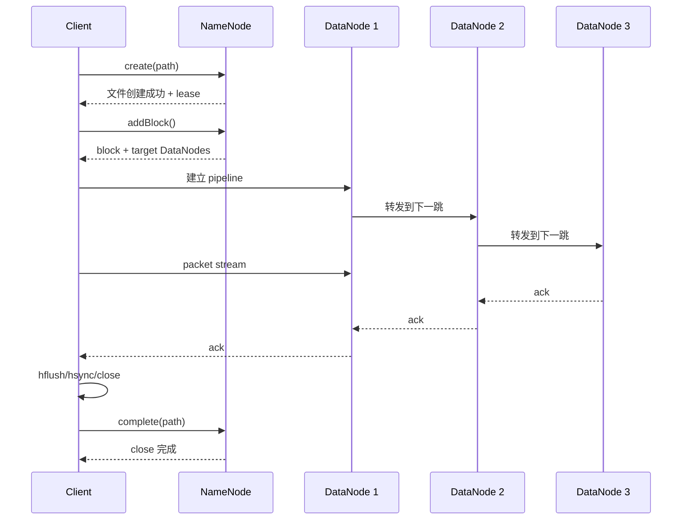

---
kb_id: bigdata/hdfs/write-path
title: HDFS 写入路径与提交边界
description: 解释 HDFS 写入路径与提交边界如何接收写入、更新状态、完成提交和暴露结果，并说明失败恢复与幂等边界。
domain: bigdata
component: hdfs
topic: write-path
difficulty: advanced
status: reviewed
sidebar_position: 5
version_scope: Apache Hadoop 3.3.5 stable HDFS docs as verified on 2026-04-28
last_verified_at: '2026-04-28'
source_ids:
  - hadoop-hdfs-design
  - hadoop-hdfs-user-guide
  - hadoop-hdfs-default-config
  - hadoop-hdfs-permissions
  - hadoop-hdfs-ha-qjm
  - hadoop-filesystem-outputstream
claim_ids:
  - bigdata-hdfs-claim-0005
  - bigdata-hdfs-claim-0010
  - bigdata-hdfs-claim-0017
  - bigdata-hdfs-claim-0022
  - bigdata-hdfs-claim-0023
  - bigdata-hdfs-claim-0024
  - bigdata-hdfs-claim-0025
  - bigdata-hdfs-claim-0026
  - bigdata-hdfs-claim-0002
  - bigdata-hdfs-claim-0003
tags:
  - bigdata
  - hdfs
  - write-path
  - knowledge-base
  - production
---
## HDFS 写路径的关键，不是“写三份”，而是元数据、pipeline 和提交边界怎样配合

很多人会把 HDFS 写路径概括成“客户端写到多个 DataNode”。这个说法只覆盖了最外层数据流，真正决定行为边界的是三件事：

- NameNode 如何创建路径并分配 block。
- 客户端如何建立 DataNode pipeline。
- 写入过程中 `hflush()`、`hsync()`、`close()` 分别把结果推进到什么阶段。

如果这三件事讲不清，就很难回答为什么 HDFS 有单写者约束、为什么 close 前后可见性不同、以及 pipeline 失败后系统到底在恢复什么。



## 第一步：create 先改命名空间，不先传真实字节

写路径的起点不是往 DataNode 发数据，而是客户端先向 NameNode 发 `create` 请求。NameNode 要先完成几件事：

- 检查路径是否允许创建。
- 检查权限、父目录、配额、是否允许覆盖。
- 在 namespace 中建立文件条目。
- 为这个文件建立 lease，保证当前只有一个 writer。

这说明，写路径从一开始就是“元数据先行”。也正因此，`create(path, overwrite=true)` 的语义不是把旧文件内容留到最后一刻再替换，而是旧内容会立刻失去可见性，路径转而表现为新的写入对象。

## 第二步：addBlock 决定写入落点，但不把数据经过 NameNode

当客户端需要新 block 时，会向 NameNode 申请。NameNode 会结合复制因子、机架感知和当前节点状况返回一组目标 DataNode。这里最关键的边界是：

- NameNode 负责挑选写到哪里。
- 真正的数据字节并不经过 NameNode。
- 客户端拿到目标后，自己建立数据面 pipeline。

这就是 HDFS 既能集中做元数据仲裁、又不至于让 NameNode 变成数据带宽瓶颈的根本原因。

## 第三步：pipeline 不是广播，而是有顺序的链式复制

在常见复制因子为 3 的情况下，客户端通常向第一台 DataNode 发数据，后者再转发给下一台，依次形成 pipeline。ack 也会按相反方向返回。这样做的好处是减少客户端同时向多台节点扇出写流的复杂度。

写路径里最重要的不是“复制因子等于 3”，而是 pipeline 带来的三个后果：

1. 写延迟受最慢链路影响，而不只是第一跳。
2. 跨机架布局会影响可靠性，也会影响写入成本。
3. pipeline 任一环节失败，都可能触发当前 block 的重建或恢复。

## packet、ack 和 local buffer 一起决定了写入推进速度

客户端不会每写一个字节就同步一次。真实过程是：应用先写入本地缓冲，客户端再把数据封成 packet，持续推送到 pipeline 中，等待多副本链路完成 ack。

因此，“应用程序调用了 write”并不等于“这批数据已经对外可见”；更不等于“已经安全持久化”。这也是为什么 OutputStream 规范把 `flush()`、`hflush()`、`hsync()`、`close()` 四者区分得这么细。

## `flush()`、`hflush()`、`hsync()`、`close()` 在写路径中的真实位置

### `flush()`

`flush()` 只能把 Java 或客户端侧缓冲尽量往前推，不提供 HDFS 级别的严格可见性或持久化保证。很多上层程序误以为 `flush()` 就等于“提交一批数据”，这是不准确的。

### `hflush()`

对实现了 `Syncable` 的 HDFS 输出流，`hflush()` 返回后，新打开的 reader 应该能看到新增数据。它解决的是“别人现在能不能读到”。

### `hsync()`

`hsync()` 在 `hflush()` 的基础上再推进到持久化边界。也就是说，它回答的是“这批数据现在能不能被当成已经持久化的结果”。

### `close()`

`close()` 负责最终收尾：剩余数据推进、元数据长度对齐、修改时间确定，以及把文件从写入态推进到稳定态。close 完成后，文件元数据必须与内容一致。

## 为什么 close 前后是两种完全不同的世界

HDFS 在文件打开写入期间，文件长度元数据可能落后于已经可见的数据长度。这不是 bug，而是官方规范明确允许的行为，因为若每次同步都强制 NameNode 更新长度元数据，会把元数据服务推到不必要的高开销路径。

因此，写路径要始终区分两种对象：

- open file：内容可能已经部分可见，但最后一个 block 仍可能在写，元数据长度也可能没完全对齐。
- closed file：元数据和内容收敛完成，可作为稳定结果被下游消费。

这也是为什么很多数据平台会要求“只消费 success marker 之后的已关闭文件”。

## overwrite 和 append 是两条不同的写路径分支

### overwrite

覆盖写的关键边界是：旧内容会立刻失去可见性，路径从一开始就转到新的文件对象上。它不等于“后台先保留旧数据，最后瞬时切换”。

### append

append 的关键边界是：文件重新进入受控写入态，最后一个 block 可能继续写或触发新的 block 分配。append 只允许尾部追加，不能当成通用随机更新。

## writer 失败时，恢复的不是“整个文件重写”，而是最后一个 block 的仲裁

客户端异常退出或失去 lease 时，写路径里最棘手的对象是最后一个 under construction block。恢复流程的重点不在于把全文件重新写一遍，而在于：

- 回收旧 writer 的 lease。
- 确认最后一个 block 实际有效的数据边界。
- 以新的 recovery 上下文压制旧 pipeline。
- 把文件推进到可 close 或可继续 append 的状态。

这也是为什么 HDFS 深度题经常会落到 lease recovery、generation stamp、last block recovery 这些点上。

## 写路径排障，先问五个问题

1. 失败发生在 `create`、`addBlock`、pipeline 建立、ack、`close` 还是 lease recovery？
2. 是 NameNode 元数据操作失败，还是 DataNode 数据面失败？
3. 是局部节点问题，还是跨机架网络问题？
4. 应用想要的是可见性、持久化，还是最终关闭提交语义？
5. 是否存在小批量高频写导致的 pipeline 与小文件双重放大？

这五个问题能帮助你把“写 HDFS 失败”从一个模糊现象拆成真正可定位的阶段问题。

## 一个最小示例

```java
import org.apache.hadoop.fs.FSDataOutputStream;
import org.apache.hadoop.fs.Path;

Path path = new Path("/tmp/hdfs-write-demo.log");
try (FSDataOutputStream out = fs.create(path, true)) {
    out.writeBytes("batch-1\n");
    out.hflush();

    out.writeBytes("batch-2\n");
    out.hsync();

    out.writeBytes("batch-3\n");
}
```

这段代码里最值得观察的不是 API 顺序，而是边界：

- `batch-1` 在 `hflush()` 后应对新 reader 可见。
- `batch-2` 在 `hsync()` 后应同时具备更强的持久化语义。
- 全文件的元数据长度与最终稳定状态，以 `close()` 完成为准。

## 来源与事实边界

### 来源

`hadoop-hdfs-design`、`hadoop-hdfs-user-guide`、`hadoop-hdfs-default-config`、`hadoop-hdfs-permissions`、`hadoop-hdfs-ha-qjm`、`hadoop-filesystem-outputstream`

### 事实声明

`bigdata-hdfs-claim-0005`、`bigdata-hdfs-claim-0010`、`bigdata-hdfs-claim-0017`、`bigdata-hdfs-claim-0022`、`bigdata-hdfs-claim-0023`、`bigdata-hdfs-claim-0024`、`bigdata-hdfs-claim-0025`、`bigdata-hdfs-claim-0026`、`bigdata-hdfs-claim-0002`、`bigdata-hdfs-claim-0003`
