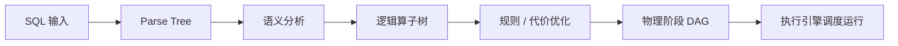

---
kb_id: bigdata/hive/architecture-compiler-optimizer-and-execution-pipeline
title: Hive 架构、编译器、优化器与执行链路
description: 解释 Hive 从 SQL 输入到物理执行的完整链路，重点区分解析、语义分析、优化和执行阶段的责任边界。
domain: bigdata
component: hive
topic: architecture-compiler-optimizer-execution-pipeline
difficulty: advanced
status: reviewed
sidebar_position: 10
version_scope: Hive design docs as verified on 2026-04-25
last_verified_at: '2026-04-25'
source_ids:
  - hive-design
  - hive-introduction
  - hive-docs-home
  - hive-language-manual
  - hive-language-manual-ddl
  - hive-managed-external-tables
  - hive-metastore-admin
  - hive-metastore-3-admin
claim_ids:
  - hive-claim-0003
  - hive-claim-0066
  - hive-claim-0067
  - hive-claim-0068
  - hive-claim-0069
  - hive-claim-0070
  - hive-claim-0071
  - hive-claim-0001
  - hive-claim-0002
  - hive-claim-0004
tags:
  - hive
  - architecture
  - compiler
  - optimizer
  - execution
  - knowledge-base
  - production
---
## Hive 的编译链路，本质是在把 SQL 变成可调度的阶段图

Hive 设计文档把系统架构概括为五个主要组件：用户接口、driver、compiler、metastore 和 execution engine。这个结构最重要的意义是告诉我们：Hive 并不是把 SQL 一把丢给执行引擎，而是先经过一条完整的编译与规划链路，才把结果交给后端执行。

因此，这一页真正要讲清楚的，不是几个术语，而是每一层到底负责改变什么、下一层为什么需要上一层的产物，以及哪里最容易出错。

## 先分清架构里的五个角色

1. 用户接口负责接收 SQL。
2. driver 负责驱动整个查询生命周期。
3. compiler 负责解析、语义分析、逻辑计划和优化。
4. metastore 提供编译所需元数据。
5. execution engine 负责执行阶段图并管理依赖。

只要这五个角色一混，后面关于“为什么元数据问题会变成编译失败”“为什么 EXPLAIN 里会看到 reduceSink”“为什么某些优化已经在逻辑计划阶段发生”这些问题就都容易答偏。

## Driver 为什么是这条链上的真正调度者

Hive 设计文档虽然把 driver 单独列为一个组件，但很多学习材料会不自觉地把它写淡。实际上，driver 的价值恰恰在于把“接收请求、调用编译器、生成执行任务、提交执行、回收结果与状态”串成一个完整生命周期。

这意味着：

1. compiler 不是独立面对客户端工作的。
2. execution engine 也不是直接接收原始 SQL。
3. 编译阶段和执行阶段之间一定有一个负责承上启下的生命周期控制者。

把 driver 讲清很重要，因为它能帮助读者理解为什么同一条 SQL 的问题有时表现成“编译失败”，有时表现成“提交成功但执行阶段抖动”，还有时表现成“结果集返回前已经在服务入口侧超时”。

## 从 SQL 到阶段图到底经历了什么

文档明确说明，compiler 会先把查询解析成 parse tree，再做语义分析：校验列名、展开 `*`、做类型检查和隐式转换、收集分区裁剪与采样表达式，然后才进入逻辑计划生成。也就是说，分区裁剪和很多“看起来像执行优化”的事情，其实很早就在编译过程中开始发生了。

## 语义分析阶段为什么比很多人想象得更重

很多工程师会把语义分析理解成“检查一下表名列名存在不存在”。这个理解太窄。Hive 在这一阶段已经开始做大量决定后续计划质量的动作：名字解析、类型检查、表达式改写、分区裁剪信息收集、采样语义整理、部分对象展开等。

这带来两个直接结论：

1. 语义分析出问题时，根因不一定是 SQL 拼写错误，也可能是对象定义、分区状态或类型前提不满足。
2. 很多后面看起来像“执行不够聪明”的问题，实际上在语义阶段就已经埋下了约束。

## Metastore 为什么站在编译主链路上

文档指出，compiler 会从 Metastore 获取元数据，并用这些元数据做表达式类型检查和基于谓词的分区裁剪。这条事实非常重要，因为它说明 Metastore 不是“后台管理系统”，而是编译主链路的一部分。

因此，Metastore 异常的后果不只是“管理命令不好用”，而是可能直接导致 SQL 无法正确编译、分区无法正确裁剪、执行计划从一开始就变差。

## 逻辑计划为什么是算子树

文档说明，Hive 的逻辑计划生成会产生一棵 operator tree；其中 `reduceSink` 是 Hive 特有算子，用来标记 map-reduce 边界，并携带在该边界上要使用的 reduction keys。

这条事实很有价值，因为它解释了为什么在 Hive 的 `EXPLAIN` 输出里，`reduceSink` 会频繁出现。它不是某个无意义中间节点，而是 Hive 明确标记“这里开始形成阶段边界”的方式。

## `reduceSink` 为什么经常成为理解计划的分水岭

如果把 `reduceSink` 只看成计划里的一个节点名称，就错过了它真正的诊断价值。它本质上在告诉你：数据将在哪个键上重新分发，下一阶段将围绕什么边界聚合、排序或 join。

因此，在看 Hive 计划时，`reduceSink` 往往是几个关键问题的入口：

1. 为什么这里会出现一次新的 shuffle。
2. 这次 shuffle 的键是什么。
3. 是否存在多余的阶段边界。
4. 倾斜是否会在这里被放大。

也就是说，很多执行代价并不是在最终 stage 页面里才第一次出现，而是在逻辑计划里就已经通过 `reduceSink` 暗示出来。

## 优化并不是只在 CBO 那一步发生

文档还说明，在逻辑计划生成阶段，Hive 就已经可以对 operator DAG 做一些重要优化，比如：

1. 把一串 join 转成单个 multi-way join。
2. 对 group-by 做 map-side partial aggregation。
3. 在分组键倾斜时，用 two-stage group-by 避免单 reducer 瓶颈。

这意味着 Hive 的优化不是简单地“先生成计划，再最后跑个 CBO”。很多优化在更早的逻辑阶段就开始了。理解这一点，才能把“规则优化”和“代价优化”区分开。

## 规则优化和代价优化为什么必须拆开理解

Hive 的计划改写里，有些优化依赖明确规则，有些优化依赖统计信息和成本估算。前者更像“只要命中某种模式，就可以安全改写”；后者更像“要比较不同方案的预估代价，再决定是否值得改写”。

这一区分很重要，因为它决定了排障顺序：

1. 如果某类逻辑改写根本没发生，先看规则前提是否满足。
2. 如果改写发生了但方案仍不理想，再看统计信息和 CBO 判断是否失真。

不把这两层拆开，很多人会笼统地说“优化器没生效”，但并不知道是规则层没命中，还是代价层选错了。

## 执行计划为什么是阶段 DAG，而不是一段代码

文档指出，Hive 生成的 execution plan 是一个阶段 DAG，每个阶段要么是一个 map-reduce job，要么是元数据操作，要么是 HDFS 操作，执行引擎负责管理这些阶段之间的依赖关系。

这条事实很重要，因为它告诉我们：Hive 最后交付给执行层的不是“一个统一黑盒任务”，而是一个带依赖的阶段图。也正因为如此，执行问题通常要从阶段边界、数据流向和依赖关系入手判断。

## 执行引擎边界为什么不能被 Hive 自身吞掉

Hive 自己负责生成阶段图，但不等于它自己完成最终计算。真正的 stage 运行、资源调度、容器分配、失败重试和 DAG 落地，还要继续依赖外部执行引擎和底层资源体系。

这条边界的现实意义在于：

1. 计划合理，不代表一定执行平稳。
2. 执行抖动，不代表编译器一定有问题。
3. 一条 SQL 的瓶颈可能在 Hive 计划层，也可能在 Tez/YARN/存储层。

只有把 Hive 负责的“计划生成”与外部系统负责的“计划落地”分开，执行类问题才不容易被误判。

## 这条链路最容易在哪些地方卡住

1. 解析阶段：SQL 本身有语法错误。
2. 语义分析阶段：表、列、函数、类型或权限不满足。
3. 元数据获取阶段：Metastore 异常或分区信息不一致。
4. 逻辑计划阶段：裁剪、聚合或 join 改写没有命中。
5. 物理执行阶段：阶段图过重、shuffle 过多、倾斜严重。

这个分层特别重要，因为它避免把所有失败都叫成“执行慢”或“SQL 不行”。

## 读计划时应该形成怎样的最小证据链

更稳的实践不是只看一份 `EXPLAIN` 输出，而是把三类证据并起来看：

1. SQL 与元数据：对象定义、分区、列、统计前提是否合理。
2. 计划与算子：逻辑树、`reduceSink`、join 改写、阶段切分是否合理。
3. 执行与结果：Tez DAG、stage 耗时、倾斜、shuffle、失败重试是否支持你的推断。

这条证据链能把“编译期问题”和“运行期问题”真正拆开。

## 观察证据应该落在哪里

更可复核的证据包括：

1. `EXPLAIN FORMATTED` 看逻辑和物理计划。
2. `EXPLAIN COST` 看代价判断。
3. `Metastore` 相关日志看编译期元数据获取是否正常。
4. 执行引擎 DAG 看阶段切分是否合理。

## 本页结论

Hive 架构里的编译链路，本质上是在把 SQL 一步步变成带依赖的执行阶段图。Metastore 不是旁路系统，而是编译主链路的一部分；优化也不是只在最后一步发生。只要把 parse、semantic analysis、operator tree、reduceSink 和 stage DAG 这几层连起来，Hive 的大多数“计划为什么长这样”问题就能讲清楚。

## 来源与事实边界

### 来源

`hive-design`、`hive-introduction`、`hive-docs-home`、`hive-language-manual`、`hive-language-manual-ddl`、`hive-managed-external-tables`、`hive-metastore-admin`、`hive-metastore-3-admin`

### 事实声明

`hive-claim-0003`、`hive-claim-0066`、`hive-claim-0067`、`hive-claim-0068`、`hive-claim-0069`、`hive-claim-0070`、`hive-claim-0071`、`hive-claim-0001`、`hive-claim-0002`、`hive-claim-0004`
