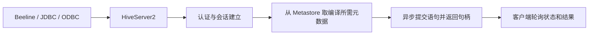

---
kb_id: bigdata/hive/hiveserver2-beeline-and-auth
title: Hive HiveServer2、Beeline 与认证
description: 解释 HiveServer2 作为服务入口时的连接、会话、认证和授权边界，以及 Beeline 作为客户端如何与服务端协同。
domain: bigdata
component: hive
topic: hiveserver2-beeline-and-auth
difficulty: advanced
status: reviewed
sidebar_position: 6
version_scope: Hive latest docs as verified on 2026-04-24
last_verified_at: '2026-04-24'
source_ids:
  - hive-language-manual
  - hive-hiveserver2-overview
  - hive-sql-standard-authorization
  - hive-docs-home
  - hive-introduction
  - hive-language-manual-ddl
  - hive-managed-external-tables
  - hive-metastore-admin
claim_ids:
  - hive-claim-0005
  - hive-claim-0023
  - hive-claim-0024
  - hive-claim-0025
  - hive-claim-0026
  - hive-claim-0027
  - hive-claim-0028
  - hive-claim-0029
  - hive-claim-0030
  - hive-claim-0031
  - hive-claim-0032
tags:
  - hive
  - hiveserver2
  - beeline
  - authorization
  - knowledge-base
  - production
---
## HiveServer2 是服务入口，不是执行引擎

HiveServer2 的职责，是把 JDBC、ODBC、Beeline 以及其他开放 API 客户端接入 Hive，并提供多客户端并发、认证和会话管理。它不负责持久化业务数据，也不是最终执行引擎。把 HiveServer2 说成“运行 SQL 的那个组件”并不算错，但远远不够准确。

更准确的定位是：HiveServer2 站在客户端和 Hive 内部编译执行链路之间，负责建立入口、维护会话、接收语句、返回句柄、暴露状态，而真正的编译和后端执行还要继续依赖 Metastore 与执行引擎。

## Beeline 为什么取代旧 CLI

文档明确把 Hive CLI 标为旧命令行接口，把 Beeline 标为新的命令行接口。这一事实背后真正的架构变化是：现代 Hive 访问路径更强调“客户端连服务端”，而不是“本地 CLI 直接把自己当成 Hive 运行环境”。

因此，Beeline 的价值不是“换了个命令行皮肤”，而是把访问入口统一到了 HiveServer2 这一服务端边界上。客户端本身不再假定自己就是执行环境的一部分，而是明确通过服务接口进入 Hive。

## 一条查询是怎么经过 HS2 的

文档说明，HiveServer2 的 `ExecuteStatement` API 是异步的，服务端会返回一个 `OperationHandle`，客户端再据此轮询状态和结果。这条链路解释了为什么很多场景下“连上了但结果还没回来”并不表示卡死，而只是异步执行尚未完成。

也正因为是异步模型，客户端超时、前端连接中断和后端执行失败不能混成一件事。是否已经建立会话、是否已经拿到句柄、句柄后续状态怎么变化，这些都属于不同层次的证据。

## HS2 进程里实际包含什么

官方文档指出，HiveServer2 是一个单进程实现，内部同时包含 Hive Thrift server 和用于 Web UI 的 Jetty web server。这个实现细节很有价值，因为它说明：

1. HS2 是标准的服务端进程，而不是某个轻量代理。
2. 它既承担客户端协议入口，也暴露自身管理界面。
3. 服务端问题不一定来自执行层，也可能来自接入层自身。

## 为什么 HS2 对 Metastore 高度依赖

文档明确说明，HiveServer2 会和 Metastore 通信，以获得查询编译所需要的元数据。这条依赖关系非常关键，因为它解释了一个常见现象：

1. HS2 端口是通的。
2. Beeline 也能连上。
3. 但一执行 SQL 就失败。

这种情况下，问题往往不在客户端，而是在后端元数据、权限或编译链路。也就是说，入口可用不等于查询完整可用。

## HTTP 模式什么时候是必须的

文档指出，当客户端和服务端之间需要代理中间层时，HiveServer2 应运行在 HTTP 模式。这是一个很典型的部署边界：如果企业网络、网关或代理拓扑要求走 HTTP，中间不能继续把 thrift 二进制模式当默认答案。

所以“HS2 该开什么模式”不是偏好题，而是网络架构题。选错模式，问题甚至还没进入 Hive 语义层，就已经在接入层被拦住了。

## 认证和授权要分开看

Hive 文档推荐 SQL standard based authorization，因为它更符合 SQL 标准安全模型且没有向后兼容包袱。但更重要的是要分清：

1. 认证回答“你是谁”。
2. 授权回答“你能做什么”。

在 SQL standard based authorization 下，`dfs`、`add`、`delete`、`compile`、`reset` 等命令会被禁用；`SET` 只能修改白名单里的参数；`TRANSFORM` 也会被禁用。也就是说，这套模型不只是“给表加权限”，而是在系统层缩小了可操作面。

## 权限对象范围为什么也要看清

SQL standard based authorization 还有一条容易被忽略的边界：它支持表和视图上的权限，但不支持数据库级权限。这个范围定义很重要，因为它决定了“为什么我以为给了库权限，结果对象操作还是不通”这类问题的判断方向。

也就是说，授权失败并不一定是“没配权限”，也可能是“权限理解层级错了”。如果把数据库、表、视图这几层权限边界混起来，HS2 相关问题会显得很随机，其实只是模型没分清。

## 为什么登录成功不代表一定能查

只要把上面几条连起来，就能理解常见误判：

1. 用户能连上，不等于有对象权限。
2. 有对象权限，不等于 Metastore 一定健康。
3. Metastore 健康，不等于执行层一定没有问题。
4. 拿到连接，不等于已经拿到可持续轮询的 `OperationHandle`。

所以 HS2 页最重要的排障价值，就是把入口、会话、元数据、授权和执行链路分层看，而不是把所有失败都叫“Beeline 连不上”。

## 观察证据应该落在哪里

排查这类问题时，最有价值的证据通常包括：

1. HS2 日志里认证和会话建立是否成功。
2. 客户端是否拿到了 `OperationHandle`。
3. 是否能从 Metastore 正常获得编译所需元数据。
4. 授权模型是否拦住了特定命令或参数设置。
5. 失败发生在连接建立前、语句提交后，还是轮询结果阶段。

## 本页结论

HiveServer2 的本质，是 Hive 的服务入口和会话控制面。它连接客户端，依赖 Metastore，异步提交语句，并在授权模型下限制可操作范围。只要把“入口能连”“元数据能取”“权限允许”“执行能完成”这四层拆开，HS2 相关问题就不会混成一句“服务挂了”。

## 来源与事实边界

### 来源

`hive-language-manual`、`hive-hiveserver2-overview`、`hive-sql-standard-authorization`、`hive-docs-home`、`hive-introduction`、`hive-language-manual-ddl`、`hive-managed-external-tables`、`hive-metastore-admin`

### 事实声明

`hive-claim-0005`、`hive-claim-0023`、`hive-claim-0024`、`hive-claim-0025`、`hive-claim-0026`、`hive-claim-0027`、`hive-claim-0028`、`hive-claim-0029`、`hive-claim-0030`、`hive-claim-0031`
