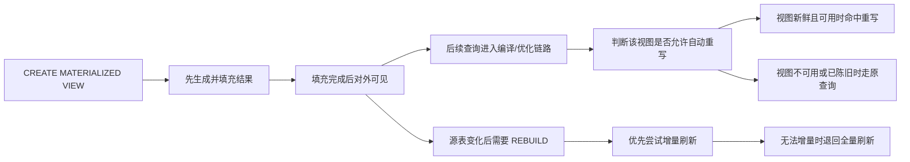

---
kb_id: bigdata/hive/materialized-views-and-rewrite
title: Hive 物化视图与查询重写
description: 解释物化视图如何保存中间结果，以及 Hive 如何判断能否把原始查询重写到物化视图上。
domain: bigdata
component: hive
topic: materialized-views-and-rewrite
difficulty: advanced
status: reviewed
sidebar_position: 9
version_scope: Hive latest docs as verified on 2026-04-24
last_verified_at: '2026-04-24'
source_ids:
  - hive-materialized-views
  - hive-docs-home
  - hive-language-manual
  - hive-metastore-admin
  - hive-transactions
  - hive-on-tez
  - hive-introduction
  - hive-language-manual-ddl
claim_ids:
  - hive-claim-0054
  - hive-claim-0055
  - hive-claim-0056
  - hive-claim-0057
  - hive-claim-0058
  - hive-claim-0059
  - hive-claim-0060
  - hive-claim-0061
  - hive-claim-0001
  - hive-claim-0002
tags:
  - hive
  - materialized-view
  - rewrite
  - rebuild
  - knowledge-base
  - production
---
## 物化视图不是“缓存一份结果”这么简单

Hive 的物化视图要同时承担两件事：第一，它保存一份已经算好的结果；第二，它允许优化链路在合适的时候把原查询改写到这份结果上。真正需要理解的，不是“有没有这张视图”，而是“这张视图现在是否可见、是否新鲜、是否允许参与自动重写，以及源表变化后它怎样恢复到可用状态”。

很多团队把物化视图当成普通表或普通视图来记忆，最后就会把两个关键边界混掉。普通表只有数据存储语义；普通视图只有逻辑定义语义；物化视图同时带有存储、刷新和重写三层语义，因此它的正确用法一定要放回“创建、可见、变更、刷新、重新命中”这条链路里看。

## 从创建到命中重写的主线



这条主线里最容易被忽略的是“可见性”和“新鲜度”是两个不同问题。文档明确给出的事实是：`CREATE MATERIALIZED VIEW` 是原子语句，结果填充完成前，其他用户看不到这张物化视图；而视图已经可见，并不等于它在后续任意时刻都还能继续参与自动重写，因为源表变化后它可能已经变成陈旧视图。

## 创建阶段真正保证了什么

Hive 3.0 引入物化视图能力，这意味着它不是早期 Hive 就稳定存在的基础语义，而是一个明确有版本边界的高级能力。创建阶段最重要的保证有两个：

1. 创建是原子的。
2. 结果填充完成之前，物化视图对其他用户不可见。

这两个保证解决的是“半成品能不能被看见”的问题。也就是说，外部调用方不需要担心在建视图时读到一半旧数据、一半新数据的中间状态。对于知识库理解来说，这一条比“创建语法是什么”更重要，因为它回答的是可见性边界，而不是语法细节。

## 自动重写默认开启，但不是无条件生效

文档给出的基线是：物化视图默认可以参与自动查询重写，但用户也可以通过 `DISABLE REWRITE` 显式关闭这项能力。这里要区分三层含义：

1. “有物化视图”不等于“允许自动重写”。
2. “允许自动重写”不等于“当前这条查询一定命中重写”。
3. “以前命中过重写”也不等于“源表变化后仍然继续命中”。

从原理上理解，自动重写是在查询编译和优化过程中发生的。是否真的命中，最终要以执行计划为准，而不是以“库里存在一张长得像的物化视图”来推断。对于使用者来说，最可靠的验证办法始终是比较 `EXPLAIN` 前后的计划是否改走了物化视图。

## 为什么“陈旧”会直接阻断自动重写

文档明确说明：默认情况下，陈旧的物化视图不会用于自动查询重写。这里的关键不是“重写后会不会慢”，而是“优化器默认不会拿已经失去新鲜度保证的结果替代原查询”。这是一条正确性边界。

因此，当你发现某张物化视图曾经能够命中、后来突然失效时，第一反应不应该是去怀疑 SQL 写法，而应该先问三个问题：

1. 源表最近是否发生了变化。
2. 变化之后是否完成了 `REBUILD`。
3. 该视图是否被显式关闭了自动重写。

这三个问题对应的是重写失效最核心的三类原因：结果已过期、维护未完成、能力被关闭。

## REBUILD 为什么既有增量，也有全量

源表变化后，物化视图的维护入口是 `ALTER MATERIALIZED VIEW ... REBUILD`。文档给出的刷新策略很重要：

1. 默认先尝试增量刷新。
2. 增量不可行时，自动退回全量刷新。
3. 目前只有源表变化是 `INSERT` 时，才支持增量重建。
4. 一旦涉及 `UPDATE` 或 `DELETE`，就必须执行全量重建。

这意味着“是否支持增量维护”不是一句抽象口号，而是直接受源表变更类型约束。很多人把物化视图想象成“像流式聚合一样持续追平”，这是不准确的。按照文档边界，Hive 当前对增量维护的支持是有明确范围的，不能把包含 `UPDATE`、`DELETE` 的维护场景也当成增量刷新来承诺。

## 刷新阶段的并发边界

物化视图重建会获取独占锁，因此同一时刻只能有一个重建在执行。这个边界非常关键，因为它回答了两个生产问题：

1. 为什么多个运维任务同时刷新同一张视图时会互相等待。
2. 为什么物化视图维护不能被当成“任意并行扩出去”的后台作业。

换句话说，物化视图的重建不是无锁的轻量动作，而是一个带明确串行化边界的维护过程。如果团队希望靠频繁重建来覆盖高频源表变更，就必须正视这条并发限制。

## 一次典型的失效链路该怎么判断

当查询没有命中物化视图时，不要只给出“可能语义不匹配”这种泛答案，更稳的判断顺序是：

1. 先看该物化视图是否允许自动重写。
2. 再看源表变化后是否已经完成 `REBUILD`。
3. 再看它是否已处于陈旧状态。
4. 最后再用 `EXPLAIN` 对比原查询是否仍走明细表。

这个顺序之所以重要，是因为前面三步是在判断“资格边界”，最后一步才是在验证“计划结果”。如果资格都不满足，后面就不需要再猜优化器为什么没选它。

## 观察证据应该落在哪里

物化视图问题最常见的误区，是只盯着结果表数据是否存在。更可复核的证据应该来自下面几类对象：

1. 物化视图定义本身是否开启自动重写。
2. 源表变化后是否执行过 `REBUILD`。
3. `EXPLAIN` 里是否已经改写到物化视图。
4. 重建任务是否因为锁而排队或串行执行。

如果只看“表里有数据”，很容易把“可查询”误判为“可重写”，把“曾经正确”误判为“当前仍新鲜”。

## 示例

```sql
CREATE MATERIALIZED VIEW mv_sales_by_day
AS
SELECT dt, shop_id, sum(amount) AS gmv
FROM dwd_sales
GROUP BY dt, shop_id;

EXPLAIN
SELECT dt, shop_id, sum(amount) AS gmv
FROM dwd_sales
WHERE dt = '2026-05-01'
GROUP BY dt, shop_id;

ALTER MATERIALIZED VIEW mv_sales_by_day REBUILD;
```

这段示例最值得关注的不是语法，而是三个动作分别对应什么语义：

1. 创建阶段先生成结果，再整体对外可见。
2. 查询阶段要用 `EXPLAIN` 验证是否命中自动重写。
3. 源表变化后，维护入口是 `REBUILD`，并且它可能走增量，也可能退回全量。

## 本页结论

物化视图在 Hive 里真正有价值的地方，不是“省一次计算”，而是“把一份已计算结果纳入可控的重写与维护体系”。判断它能不能用，必须同时看四件事：是否可见、是否允许重写、是否已经陈旧、刷新是否完成。只谈“建没建这张视图”，基本还停留在术语层。

## 来源与事实边界

### 来源

`hive-materialized-views`、`hive-docs-home`、`hive-language-manual`、`hive-metastore-admin`、`hive-transactions`、`hive-on-tez`、`hive-introduction`、`hive-language-manual-ddl`

### 事实声明

`hive-claim-0054`、`hive-claim-0055`、`hive-claim-0056`、`hive-claim-0057`、`hive-claim-0058`、`hive-claim-0059`、`hive-claim-0060`、`hive-claim-0061`、`hive-claim-0001`、`hive-claim-0002`
