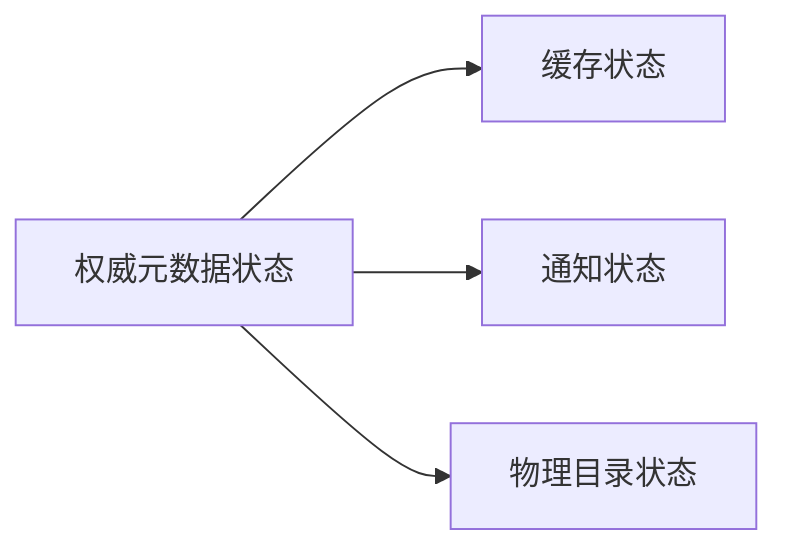

---
kb_id: bigdata/hive/metastore-and-catalog
title: Hive Metastore 与 Catalog
description: 解释 Hive Metastore 与 Catalog 中的权威状态、缓存状态、通知状态和物理状态，以及它们之间如何产生漂移和修复。
domain: bigdata
component: hive
topic: metastore-and-catalog
difficulty: advanced
status: reviewed
sidebar_position: 2
version_scope: Hive latest docs as verified on 2026-04-24
last_verified_at: '2026-04-24'
source_ids:
  - hive-metastore-admin
  - hive-hiveserver2-overview
  - hive-docs-home
  - hive-introduction
  - hive-language-manual
  - hive-language-manual-ddl
  - hive-managed-external-tables
  - hive-metastore-3-admin
claim_ids:
  - hive-claim-0019
  - hive-claim-0020
  - hive-claim-0021
  - hive-claim-0022
  - hive-claim-0026
  - hive-claim-0001
  - hive-claim-0002
  - hive-claim-0003
  - hive-claim-0004
  - hive-claim-0005
tags:
  - hive
  - metastore
  - metadata
  - schema
  - knowledge-base
  - production
---
## Metastore 是 Hive 的元数据权威面

Hive 之所以能把一堆文件当成“库、表、分区、列、统计信息”去管理，靠的不是目录自己会说话，而是 Metastore 维护了一份权威元数据视图。很多 Hive 问题表面像 SQL 问题，实际上先坏的是这份权威状态，或者是围绕它的缓存、通知和物理目录对齐关系。

## Catalog 在 Hive 里到底意味着什么

在 Hive 语境里，Catalog 不是一个抽象名词，它基本上就是“围绕 Metastore 这份权威状态展开的元数据体系”。这份体系至少包含：

1. 表、列、分区、位置等对象定义。
2. schema version 和兼容关系。
3. 供 HiveServer2 编译 SQL 所需的元数据查询能力。
4. 与文件系统真实状态的映射关系。

文档明确说明，HiveServer2 在编译查询时会向 Metastore 获取所需元数据。这条依赖关系非常重要，因为它说明没有健康的 Catalog，HS2 连编译 SQL 都做不完整。

## 为什么说 Metastore 是“编译前提”，不是“后台配套”

很多团队会把 Metastore 理解成一个后台管理数据库，只在建表或改表时才会用到。这个理解不够准确。只要 Hive 还需要知道表定义、列类型、分区边界、统计信息、权限语义或事务对象，Metastore 就站在编译主链路上。

这意味着 Metastore 的问题不只是“管理界面不好用”，而是会直接表现成：

1. SQL 无法完成语义分析。
2. 分区裁剪前提缺失。
3. 统计信息缺失导致优化器判断失真。
4. 事务和锁相关状态无法被正确解释。

所以对 Hive 来说，Metastore 不是外围支撑，而是查询生命周期的基础设施。

## 四类状态为什么必须分开看

这四类状态分别回答不同问题：

1. 权威状态：Metastore 当前登记了什么。
2. 缓存状态：服务端或客户端为了性能保留了什么副本。
3. 通知状态：元数据变更是怎样传播出去的。
4. 物理状态：底层 HDFS 或对象存储真实长什么样。

只要把这四层混在一起，后面所有“为什么查不到”“为什么看到旧分区”“为什么表结构变了但计划没变”的问题都会变得很难拆解。

## 状态漂移为什么是 Hive 元数据问题里最常见的真实根因

Hive 的元数据问题之所以容易显得“玄”，就在于表面看到的是一个统一表对象，但底下其实有多份不同层次的状态。只要其中一层先变化，而另外几层没有及时追平，就会出现使用者非常熟悉但又很难第一时间解释的现象：

1. 目录已经有了，但表里查不到。
2. 表结构改了，但服务端还在用旧缓存。
3. 分区 repair 之前，优化器和执行器看到的仍是旧边界。
4. 统计信息登记了，但最新分区还没完全纳入。

因此，Catalog 问题本质上不是“信息存不存在”，而是“多层状态有没有仍然对齐”。

## Schema version 为什么是第一条硬边界

文档说明，Metastore 会在自己的数据库里记录 schema version，并验证它是否和 Hive 二进制兼容。更进一步，Hive 默认不会隐式创建或修改 schema；如果发现 schema 版本过旧，会直接拒绝访问 Metastore，除非显式关闭 schema verification。

这说明 Catalog 的权威性并不只是“存了多少表”，还包括“这套元数据模式当前是否和运行时兼容”。也正因为这样，Metastore 的 schema 治理本身就是 Catalog 治理的一部分，而不是单独的运维细节。

## 版本兼容问题为什么会表现成“服务能起，但系统不能用”

Metastore schema version 这一层经常被低估，因为它不直接出现在用户写的 SQL 里。但一旦 schema 版本和 Hive 二进制不兼容，后果通常不是“某个高级功能偶尔不可用”，而是权威元数据层本身无法被运行时安全解释。

这也是为什么 schema verification 默认启用非常关键：它不是给你制造麻烦，而是在阻止一个更危险的状态出现，也就是服务表面还活着，但元数据解释规则已经错位。相比“先强行跑起来再说”，明确失败其实更安全。

## 为什么会出现“元数据是对的，但查询还是不对”

因为 Catalog 只是一层权威登记，并不自动保证缓存、通知和物理目录都瞬时一致。常见漂移包括：

1. Metastore 已更新，但缓存未失效。
2. 目录已变化，但元数据未 repair。
3. schema 已变更，但旧客户端仍在使用过时视图。
4. HS2 能连上，但编译时从 Metastore 拉取的对象已经不兼容。

这也是为什么 Metastore 总览页必须和缓存漂移页、部署治理页、repair 页互相呼应。

## `MSCK REPAIR TABLE` 这类动作为什么不能被当成日常万能修复键

很多团队一遇到 Hive 分区问题就习惯性跑 `MSCK REPAIR TABLE`。它当然重要，但不能把它理解成所有元数据异常的统一答案。因为它解决的重点是“目录变化后如何补齐分区元数据”，而不是服务缓存、通知延迟、schema 不兼容或统计信息失真这些别的层次问题。

更准确的理解应该是：

1. repair 主要修目录与分区登记的偏差。
2. 缓存失效问题要看缓存层。
3. schema 漂移问题要看 Metastore 治理层。
4. 统计问题要看分析和优化层。

只有把 repair 放回正确层级，它才不会被误用成“系统有点不对就先跑一下”的经验动作。

## schematool 为什么也属于 Catalog 治理的一部分

文档明确给出了 `schematool` 作为初始化和升级 Metastore schema 的离线工具。它的重要性在于：Catalog 的权威状态不是随服务启动自动演化的，而是需要显式治理动作来维护版本兼容。

所以，对 Hive 来说，“元数据治理”绝不只是建表规范，也包括底层 Metastore schema 版本演进。

## 排查时先问哪几个问题

比较稳的顺序一般是：

1. 这是不是一个 Catalog 权威状态问题。
2. 还是权威状态是对的，只是缓存或通知还没追平。
3. 还是物理目录已经变了，但 Metastore 没修复。
4. 还是 Metastore schema 自身已经和当前 Hive 二进制不兼容。

只要把问题先分层，大多数 Hive 元数据问题都会从“很玄”变成“具体哪一层没对上”。

## 生产上最值得长期治理的，不是修一次，而是降低漂移出现频率

从长期视角看，Hive 元数据治理最值钱的事情，不是把某次漂移救回来，而是减少以后再次漂移的概率。通常最有效的抓手包括：

1. 限制谁可以绕过 Hive 直接改目录。
2. 明确 external table 的目录责任边界。
3. 管好 schema 升级流程，不让 Metastore 版本漂移。
4. 对关键服务入口和缓存策略做统一治理。

也就是说，Metastore 与 Catalog 的问题，真正落点不只是“元数据解释”，也是平台治理能力。

## 本页结论

Hive 的 Catalog 本质上就是以 Metastore 为中心的元数据权威体系。真正需要理解的不是“Metastore 里有表信息”这么简单，而是权威状态、schema version、缓存、通知和物理目录之间如何协同，以及它们一旦失配会怎样影响 SQL 编译和结果可见性。

## 来源与事实边界

### 来源

`hive-metastore-admin`、`hive-hiveserver2-overview`、`hive-docs-home`、`hive-introduction`、`hive-language-manual`、`hive-language-manual-ddl`、`hive-managed-external-tables`、`hive-metastore-3-admin`

### 事实声明

`hive-claim-0019`、`hive-claim-0020`、`hive-claim-0021`、`hive-claim-0022`、`hive-claim-0026`、`hive-claim-0001`、`hive-claim-0002`、`hive-claim-0003`、`hive-claim-0004`、`hive-claim-0005`
