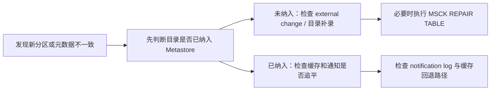

---
kb_id: bigdata/hive/metastore-cachedstore-notification-and-metadata-drift-boundaries
title: Hive Metastore 缓存与元数据漂移
description: 解释 Hive Metastore 缓存、通知和目录漂移如何产生短暂不一致，以及如何识别和修复。
domain: bigdata
component: hive
topic: metastore-cachedstore-notification-metadata-drift-boundaries
difficulty: advanced
status: reviewed
sidebar_position: 21
version_scope: Hive latest docs as verified on 2026-04-26
last_verified_at: '2026-04-26'
source_ids:
  - hive-metastore-3-admin
  - hive-synchronized-metastore-cache
  - hive-hcatalog-notification
  - hive-managed-external-tables
  - hive-docs-home
  - hive-introduction
  - hive-language-manual
  - hive-language-manual-ddl
claim_ids:
  - hive-claim-0014
  - hive-claim-0144
  - hive-claim-0145
  - hive-claim-0146
  - hive-claim-0147
  - hive-claim-0148
  - hive-claim-0149
  - hive-claim-0150
  - hive-claim-0001
  - hive-claim-0002
tags:
  - hive
  - metastore
  - cache
  - notification
  - msck-repair
  - knowledge-base
  - production
---
## 漂移不是一个故障点，而是一条失配链

Hive 里的元数据漂移，本质上是“目录状态、Metastore 记录、缓存副本和事件传播”没有在同一时刻对齐。于是同一张表会出现一种很难受的现象：目录里明明已经有新分区，某些查询仍然看不到；或者一个 HMS 节点已经返回新值，另一个节点还停在旧值。

要把这类问题讲清楚，核心不是背命令，而是先分清谁是权威来源、谁只是加速副本、谁负责传播变化、谁负责把目录重新纳入 Hive 视图。只要这四层没拆开，`MSCK REPAIR TABLE`、缓存刷新和通知机制就会被混成一团。

## 权威来源始终是底层 Metastore 数据库

Hive 3 的 `CachedStore` 会把对象缓存到内存里，多实例部署时按可配置频率刷新，官方文档给出的默认刷新周期是 1 分钟。这首先说明一个事实：缓存存在的首要目的是减轻 Metastore 压力、缩短读延迟，而不是把自己提升成新的权威元数据源。

真正重要的是同步缓存设计里那条边界：数据库仍然是最新元数据副本的 source of truth。也就是说，缓存命中只能说明“走了快路径”，不能说明“当前读取一定就是最新版本”。如果把这层边界忘掉，现场就会把延迟一致性误判成元数据损坏。

## 漂移通常来自四条不同链路

1. 目录已经变了，但 Hive 还没把新分区补录进来。
2. 底层 Metastore 已更新，但某个 HMS 实例的缓存还没追平。
3. 事件通知链路延迟、关闭或清理过快，导致下游没有及时感知变化。
4. 外部程序绕开 Hive 修改了表结构或分区布局，而调用方误以为 Hive 会自动感知。

这四类问题的表象可能都很像“查不到新数据”，但它们的根因层次完全不同。一个是目录发现问题，一个是缓存新鲜度问题，一个是事件传播问题，一个是外部修改治理问题。

## CachedStore 和 synchronized cache 分别在解决什么

`CachedStore` 解决的是“把对象放在内存里，减少每次都打数据库”的速度问题。官方同步缓存设计则更进一步：在多 HMS 实例部署中，后台线程会轮询 notification log 更新缓存条目，查询请求还会携带 `ValidWriteIdList`，用来判断某个 table 或 partition cache entry 是否已经过时。

这里要特别注意，这并不是“缓存每分钟刷一次”这么简单。更准确的链路是：

1. HMS 先尝试读取缓存。
2. 再结合 `ValidWriteIdList` 判断该缓存条目对当前查询是否仍然可见。
3. 如果条目还没追平对应提交，Metastore 不会强行返回旧缓存。
4. 此时会回退到底层 `ObjectStore` / 数据库路径读取。
5. 等 notification log 追平后，缓存才重新变成可读副本。

所以缓存一致性的核心不是 TTL，而是“当前条目对这次查询是否仍然有效”。

## 回退 ObjectStore 不是失败，而是正确性优先

很多人看到缓存没命中或读请求回退到底层，会下意识认为系统退化了。实际上在这个场景里，回退往往是正确性信号。官方文档明确说明：如果 Hive 判断缓存条目 stale 或暂时还不能安全读取，就会先从 `ObjectStore` 提供读取，直到 notification log 追上。

这意味着三件事：

1. 回退说明系统没有拿过期缓存冒充最新值。
2. 回退说明 source of truth 仍然掌握在数据库路径手里。
3. 真正危险的不是回退，而是“缓存虽然快，但已经和当前可见性不匹配”。

## 外部表为什么是更特殊的边界

同步缓存设计里有一条非常关键的限制：`write id` 不适用于 external table，因此外部表读取仍然使用原始的 eventual consistency cache 模型，而不是基于 `ValidWriteIdList` 的 freshness 检查。

这条边界的实际含义很重：

1. ACID 表和 external table 的元数据一致性能力不是同一等级。
2. 外部表更依赖目录发现、上游约束和人工修复。
3. 不能把事务表上的一致性推理，原样套到外部表上。

如果现场有人说“我们已经用了 synchronized metastore cache，所以所有表都是同样强的一致性”，这就是不准确的。

## 通知机制负责传播变化，但它也有生命周期

HCatalog notification 会在 `addPartition` 调用时自动发出消息；写入方还可以用 `markPartitionForEvent(..., LOAD_DONE)` 显式标记一组分区已经完整到达。这给下游调度、血缘或增量消费提供了一条事件驱动通路。

但这条通路不是永远可靠、永远存在的默认真空层。文档也明确写了：如果 `hive.metastore.event.listeners` 留空或从 `hive-site.xml` 中移除，就会禁用通知；同时通知表还有事件过期和清理属性。也就是说，通知机制本身也要运维，也可能被关闭，也可能因为保留周期太短而失去追溯性。

## `MSCK REPAIR TABLE` 修的是目录发现，不是缓存一致性

对于 external table，官方文档明确建议：如果表结构或分区是从 Hive 之外被修改的，需要运行 `MSCK REPAIR TABLE` 让 Hive 更新分区元数据。这里必须把它的适用边界说得很死：它修的是“目录和 Metastore 记录没有对齐”的问题，不是修缓存 stale，也不是修事务可见性。

因此，下面这三种场景要区别对待：

1. 新目录已经落到外部存储，但 Hive 根本没登记到分区：`MSCK REPAIR TABLE` 有用。
2. 多 HMS 节点短时间读到的元数据版本不一致：更像缓存追平问题，repair 往往无效。
3. 下游没感知到上游分区完成：更像通知链路或 `LOAD_DONE` 事件问题。

## 先分型，再修，不要看到问题就上 repair



这条链路的价值在于，把“元数据不一致”拆成两个完全不同的判断问题：

1. Hive 是否根本没发现这个目录或分区。
2. Hive 已经知道了，但某些读路径还没追上。

前者要修 catalog 视图，后者要修 freshness 和传播链路。两者都叫“repair”会让排障效率非常低。

## 证据要落在能复核的对象上

这类问题最值得看的证据通常有五类：

1. `DESCRIBE FORMATTED` 确认对象类型、位置和属性。
2. `SHOW PARTITIONS` 或分区元数据，确认 Hive 当前登记了什么。
3. 底层目录列表，确认真实文件和目录已经存在什么。
4. notification log 是否仍在推进，事件监听是否开启。
5. 某次读取是否因为 cache stale 回退到了 `ObjectStore`。

只有把这几类证据拼起来，才能判断问题发生在目录层、缓存层还是事件层。单看“这条 SQL 能不能查到数据”通常不够。

## 最容易误判的几个场景

1. 新分区过一会儿自己出现了：更像缓存或事件追平，不一定需要 repair。
2. 外部程序直接改了目录，Hive 长时间都看不到：更像 external table 的目录补录问题。
3. 多个 HMS 节点短时结果不同：更像多实例缓存新鲜度问题，而不是目录不存在。
4. repair 做完仍然读旧值：说明问题可能根本不在目录发现，而在缓存或通知链路。

## 示例

```sql
DESCRIBE FORMATTED sales_ext;
SHOW PARTITIONS sales_ext;
MSCK REPAIR TABLE sales_ext;
```

这三步分别是在回答三个不同问题：对象是不是 external table、Hive 当前知道哪些分区、是否需要把外部目录重新补录进 Metastore。它们不是一条“固定套餐”，而是分型后的证据入口。

## 本页结论

Hive Metastore 漂移问题真正难的地方，不在于命令本身，而在于它同时涉及权威元数据、缓存副本、通知传播和外部目录治理。只要先分清 source of truth、freshness 检查、notification 和 repair 各自负责哪一层，很多“看起来一样”的元数据问题就能迅速分型。

## 来源与事实边界

### 来源

`hive-metastore-3-admin`、`hive-synchronized-metastore-cache`、`hive-hcatalog-notification`、`hive-managed-external-tables`、`hive-docs-home`、`hive-introduction`、`hive-language-manual`、`hive-language-manual-ddl`

### 事实声明

`hive-claim-0014`、`hive-claim-0144`、`hive-claim-0145`、`hive-claim-0146`、`hive-claim-0147`、`hive-claim-0148`、`hive-claim-0149`、`hive-claim-0150`、`hive-claim-0001`、`hive-claim-0002`
