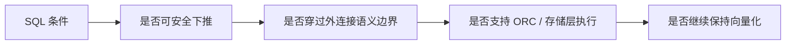

---
kb_id: bigdata/hive/predicate-pushdown-outer-join-storage-pushdown-and-vectorization-observability
title: Hive 谓词下推、外连接与向量化观测
description: 解释谓词下推、外连接语义和向量化为什么会共同影响 Hive 的扫描成本、可见性和执行效率。
domain: bigdata
component: hive
topic: predicate-pushdown-outer-join-storage-pushdown-vectorization-observability
difficulty: advanced
status: reviewed
sidebar_position: 17
version_scope: Hive latest docs as verified on 2026-04-25
last_verified_at: '2026-04-25'
source_ids:
  - hive-config-properties
  - hive-language-manual-joins
  - hive-outer-join-behavior
  - hive-explain
  - hive-vectorization
  - hive-language-manual-orc
  - hive-docs-home
  - hive-introduction
claim_ids:
  - hive-claim-0039
  - hive-claim-0045
  - hive-claim-0047
  - hive-claim-0048
  - hive-claim-0085
  - hive-claim-0086
  - hive-claim-0120
  - hive-claim-0121
  - hive-claim-0122
  - hive-claim-0123
tags:
  - hive
  - predicate-pushdown
  - outer-join
  - orc
  - explain
  - knowledge-base
  - production
---
## 三件事为什么要一起看

谓词下推、外连接语义和向量化看起来像三块不同能力，实际上它们共同决定了 Hive 扫描一条查询时会读多少、哪些条件能提前做、哪些条件不能越过语义边界，以及最后的执行是不是能保持列式批处理优势。只盯其中一个，很容易把性能问题诊断错。

更准确地说：

1. 谓词下推决定“哪些数据可以少读”。
2. 外连接语义决定“哪些过滤不能提前越过边界”。
3. 向量化决定“已经读到的数据能不能更快处理”。

## 下推不是无条件优化

Hive 里最重要的一条配置基线是：`hive.optimize.ppd` 和 `hive.optimize.ppd.storage` 默认都是 `true`，而且如果 `hive.optimize.ppd` 关闭，storage pushdown 也会被忽略；`hive.ppd.recognizetransivity` 默认开启，用来在等值连接上做谓词传递。

这说明谓词下推不是“写了条件就自动少读”的单一开关，而是一组受配置和语义共同约束的计划优化。真正需要判断的不是“有没有 WHERE”，而是“条件是否能安全落到扫描或存储层”。

## 为什么“条件写在 SQL 里”并不等于“条件已经提前执行”

SQL 文本只说明用户表达了过滤意图，并不说明优化器已经找到安全且可实现的提前执行位置。对 Hive 来说，至少还要继续判断：

1. 这个条件能不能越过语义边界。
2. 这个条件能不能被存储层理解。
3. 提前之后是否还能留在向量化快路径。

## 只有安全时才能提前过滤



这个链路里最关键的一步是“是否安全”。如果条件会破坏结果语义，就算能减少扫描，也不能随便下推。Hive 的外连接规则正是这里的安全边界。

## 外连接为什么会拦住一些过滤

Hive 文档明确说，连接先于 WHERE 执行，所以如果在外连接里引用了 null-supplying 一侧的列，WHERE 可能会把原本应该保留的未匹配行过滤掉，从而实际上破坏外连接语义。进一步地，Hive 还把外连接中的表区分为 preserved-row tables 和 null-supplying tables，并明确给出规则：

1. during-join predicates 不能越过 preserved-row tables。
2. after-join predicates 不能越过 null-supplying tables。

这不是“编译器喜欢这么做”，而是为了保持外连接语义正确性。换句话说，外连接不是性能细节，而是决定谓词能否下推的安全边界。

## `ON` 和 `WHERE` 为什么在外连接里不能随意互换

很多场景里两者看起来都在“写条件”，但在外连接里它们所处的语义阶段不同。把右表过滤写在 `WHERE` 中，往往是在连接已经补空之后再做筛选，这会直接把原本应保留的 unmatched 行过滤掉。因此这不是写法偏好问题，而是结果集定义问题。

## 规则是怎么被真正执行的

文档指出，这些 outer join 的谓词下推规则不是纸面原则，而是在计划生成时通过 `SemanticAnalyzer` 的 `parseJoinCondition`，以及在 `JoinPPD` 阶段通过 `getQualifiedAliases` 去执行的。

这个细节非常有价值，因为它说明：

1. 规则是在规划阶段落地的。
2. 不是到运行时才“碰运气”。
3. 计划里是否下推，背后有明确的语义分析和规则过滤逻辑。

因此，排查时应该关注的是“优化器为何没允许它下去”，而不是简单怀疑执行引擎没有看到 WHERE。

## ORC 的下推到底能做到什么

Hive 的 ORC 索引信息包含每列的最小值、最大值和行位置，作用是选 stripe 和 row group，而不是直接回答查询。Row index entry 还能在 stripe 内进行 row-skipping，默认每 10,000 行可以跳过一次。

这说明 ORC 的下推和索引能力是“减少扫描”和“跳过无效行”，不是“直接替你算出结果”。如果把它理解成数据库意义上的覆盖索引，就容易夸大能力。更准确的说法是：ORC 给扫描阶段提供了足够的统计和定位信息，让 Hive 能少读一部分 stripe 或 row group。

## 为什么逻辑下推成功了，扫描量也未必立刻理想

就算谓词已经安全地下到扫描阶段，最终扫描量还要继续看 ORC 结构本身是否给得出足够好的裁剪边界。如果 stripe 太大、row group 粒度不理想，或者过滤列本身不适合利用现有统计，逻辑上“已经下推”和物理上“真正少读很多”之间仍然可能有差距。

## 向量化为什么经常和下推同时出现

Hive 的向量化执行目前主要面向 ORC 文件，并且需要 `hive.vectorized.execution.enabled=true`。如果某个内置算子或函数不支持向量化，Hive 会自动回退到普通逐行执行。

这意味着向量化并不是“整条 SQL 开关”，而是“按算子和格式逐段生效”。因此，生产上经常会看到这样一种情况：

1. 下推生效了。
2. 但关键算子不支持向量化。
3. 整体收益就不如预期。

所以，看到向量化打开并不等于整条链路都已经高效；还要看具体算子是不是都在支持范围内。

## 观测时应该看哪些证据

`EXPLAIN` 可以验证三件事：

1. 下推条件是否真的进入了扫描计划。
2. 外连接相关的谓词是否被限制在正确边界内。
3. 向量化是否在计划里被标识出来。

也就是说，Hive 这部分问题不能只凭 SQL 语句表面判断，必须结合计划输出确认。最典型的错误就是：写了过滤条件，但它其实被外连接语义挡住了；或者 ORC 具备下推能力，但向量化因为函数不支持而回退。

## 哪些现象最像“过滤写了，但快路径没成立”

1. SQL 里条件很多，但计划里扫描范围并没有收紧。
2. 外连接两边的条件改一改位置，结果集立刻变化。
3. ORC 表上过滤看似成立，但计划里向量化标识消失。

这些现象说明问题不在“有没有写条件”，而在条件究竟停留在哪一层。

## 常见误判

1. 把“有 WHERE”误认为“必然下推”。
2. 把“外连接”误认为“可以随便把条件挪到 JOIN 前”。
3. 把“向量化开启”误认为“所有算子都在批处理路径上”。
4. 把 ORC 索引误认为“查询结果可以直接由索引返回”。

## 示例

```sql
EXPLAIN FORMATTED
SELECT a.shop_id, count(*)
FROM fact_orders a
LEFT OUTER JOIN dim_shop b
  ON a.shop_id = b.shop_id
WHERE a.dt = '2026-05-01'
GROUP BY a.shop_id;
```

这条 SQL 的重点不在业务含义，而在于你能不能判断：过滤条件是不是对左表安全下推，外连接是否保持 preserved-row 语义，计划里是否还保留了向量化路径。

## 本页结论

谓词下推、外连接和向量化本质上是同一条扫描链路上的三个闸门：先看条件能不能安全提前，再看语义边界允不允许，再看执行是否还能保持批量化。判断它们是否生效，最终都要回到 `EXPLAIN`、ORC 结构和外连接语义这三类证据。

## 来源与事实边界

### 来源

`hive-config-properties`、`hive-language-manual-joins`、`hive-outer-join-behavior`、`hive-explain`、`hive-vectorization`、`hive-language-manual-orc`、`hive-docs-home`、`hive-introduction`

### 事实声明

`hive-claim-0039`、`hive-claim-0045`、`hive-claim-0047`、`hive-claim-0048`、`hive-claim-0085`、`hive-claim-0086`、`hive-claim-0120`、`hive-claim-0121`、`hive-claim-0122`、`hive-claim-0123`
