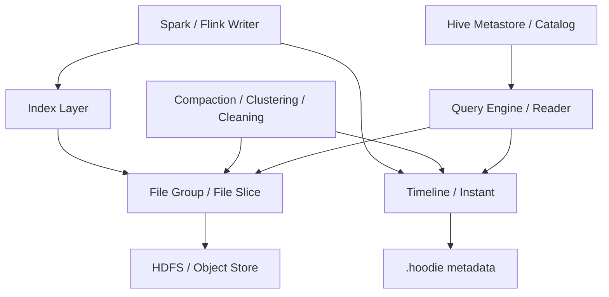

---
kb_id: bigdata/hudi/architecture-and-roles
title: Hudi 架构分层与角色协作
description: 解释 Hudi 读写链路中的角色分工，说明计算引擎、索引、timeline、文件布局、表服务和外部元数据系统如何协作。
domain: bigdata
component: hudi
topic: architecture-and-roles
difficulty: intermediate
status: reviewed
sidebar_position: 3
version_scope: Apache Hudi docs as verified on 2026-04-28
last_verified_at: '2026-04-28'
source_ids:
  - hudi-docs-overview
  - hudi-timeline-docs
  - hudi-file-layout-docs
  - hudi-writing-data-docs
  - hudi-table-types-docs
claim_ids:
  - bigdata-hudi-claim-0001
  - bigdata-hudi-claim-0004
  - bigdata-hudi-claim-0002
  - bigdata-hudi-claim-0003
  - bigdata-hudi-claim-0005
  - bigdata-hudi-claim-0006
  - bigdata-hudi-claim-0007
  - bigdata-hudi-claim-0008
  - bigdata-hudi-claim-0009
  - bigdata-hudi-claim-0010
tags:
  - bigdata
  - hudi
  - architecture-and-roles
  - knowledge-base
  - production
---
## Hudi 不是一个单体程序，而是一组围绕表状态协同工作的角色

理解 Hudi 架构，不能只看“客户端写入一张表”。真实链路里至少有六层角色同时参与：计算引擎发起读写、索引定位记录归属、timeline 记录状态推进、底层存储保存物理文件、table services 维护长期布局、catalog 暴露库表入口。只有把这些角色分开，后面才能准确判断某个问题到底属于执行层、表状态层，还是存储层。

## 先把角色分成三面：控制面、数据面、维护面

### 控制面

控制面负责决定“这次写入或维护动作在表层面如何成立”。核心对象包括：

- `timeline`
- `instant`
- `commit / deltacommit / replacecommit`
- 并发控制与锁

这一层的核心职责是组织状态，而不是搬运字节。也就是说，控制面决定某次动作是否是一个有效版本、是否与其他写入冲突、失败后要不要 rollback。

### 数据面

数据面负责真正承载记录内容。核心对象包括：

- `partition path`
- `file group`
- `file slice`
- `base file`
- `log file`

这一层决定的是物理布局。更新为什么会落到同一个 file group，MOR 为什么需要读 log 合并，小文件为什么会越积越多，本质都属于数据面问题。

### 维护面

维护面负责把“能写”变成“长期可用、长期可读、长期可控”。核心对象包括：

- `compaction`
- `clustering`
- `cleaning`
- metadata table 维护
- archive、restore、savepoint 等生命周期动作

如果没有这一层，表一开始可能还能跑，但随着 log 文件增长、文件分布变碎、历史 instant 变多，读写成本会越来越不可控。

## 每个角色各自负责什么

| 角色 | 核心职责 | 常见误判 |
| --- | --- | --- |
| Writer | 发起 insert、upsert、bulk_insert、delete 等动作 | 以为 Writer 自己就能决定最终可见性 |
| Index | 根据 key 定位记录所在 file group 或候选范围 | 以为索引等同于数据库 B+ 树点查索引 |
| Timeline | 记录动作类型和状态推进 | 以为目录里有文件就说明 timeline 一定完成 |
| File Group / Slice | 组织数据文件版本 | 以为每次提交都会新建完全独立的一套文件 |
| Table Services | 重写、整理、清理物理布局 | 以为只是附加优化，不影响主链路 |
| Reader | 根据 query type 解释当前表版本 | 以为所有查询读到的视图都相同 |
| Catalog | 暴露表定义和入口 | 以为 catalog 就是 Hudi 的版本真相来源 |

## 写链路里的角色协作顺序

1. 写入任务先根据操作类型和键设计决定是 `insert`、`upsert`、`bulk_insert` 还是 `delete`。
2. 索引层帮助定位已有记录可能归属的 file group。
3. 写入器在 COW 或 MOR 模式下生成新的 base file，或把增量变更追加到 log file。
4. 这次动作在 timeline 上形成相应 instant，并经历请求、执行、完成等状态推进。
5. 后台维护任务随后根据表类型和策略继续触发 compaction、clustering、cleaning。

这五步里，第二步和第四步最容易被忽视。前者决定写放大和路由准确度，后者决定语义是否成立。

## 读链路里的角色协作顺序

1. Reader 先识别当前要读取哪种 query view。
2. 再从 timeline 确定可见 instant 边界。
3. 然后枚举对应 partition 下可见的 file slice。
4. 如果是 MOR snapshot 查询，还要把 base file 与 log file 合并。
5. 最后再由执行引擎完成过滤、投影、聚合等计算动作。

这说明读路径不是“扫文件”这么简单，而是“先解释版本，再解释文件”。

## 为什么说 Spark、Flink 只是 Hudi 的执行外壳，不是 Hudi 本身

同一套 Hudi 表语义可以通过不同引擎落地，但并不意味着语义天然由引擎提供。Spark 和 Flink 负责的是作业执行、并行调度和数据算子；Hudi 负责的是表层面的版本组织、查询视图和文件维护策略。

所以生产里如果发生以下问题，要先分层：

- 任务 OOM、shuffle 过大、checkpoint 超时，更偏执行引擎问题。
- instant 卡在 inflight、rollback 频发、compaction backlog 积压，更偏 Hudi 状态与维护问题。
- 列表目录变慢、rename 行为异常、对象存储一致性表现不同，更偏底层存储问题。

## 架构设计时最重要的边界判断

1. 记录归属靠什么稳定标识：`record key` 是否可靠。
2. 查询主模式是什么：`snapshot`、`read optimized` 还是 `incremental`。
3. 是否接受后台服务持续占资源：尤其是 MOR 表的 compaction。
4. 是否有多写者：如果有，就必须提前定义并发控制和锁边界。
5. catalog 暴露给谁：Hive、Trino、Spark SQL 是否都要消费同一张表。

## 生产排障时的最小观察入口

- `timeline` 是否存在长时间停留的 inflight instant。
- 最近的 `compaction / clustering / clean` 是否成功完成。
- 某个 partition 的 file group 数量和单组 log 文件是否异常膨胀。
- catalog 中看到的表定义，和 .hoodie 元数据中实际状态是否一致。

## 来源与事实边界

### 来源

`hudi-docs-overview`、`hudi-timeline-docs`、`hudi-file-layout-docs`、`hudi-writing-data-docs`、`hudi-table-types-docs`

### 事实声明

`bigdata-hudi-claim-0001`、`bigdata-hudi-claim-0004`、`bigdata-hudi-claim-0002`、`bigdata-hudi-claim-0003`、`bigdata-hudi-claim-0005`、`bigdata-hudi-claim-0006`、`bigdata-hudi-claim-0007`、`bigdata-hudi-claim-0008`、`bigdata-hudi-claim-0009`、`bigdata-hudi-claim-0010`

